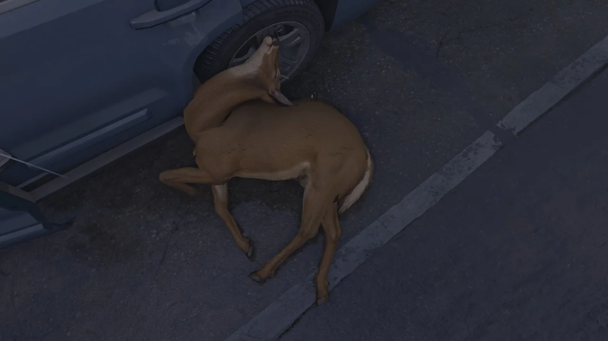
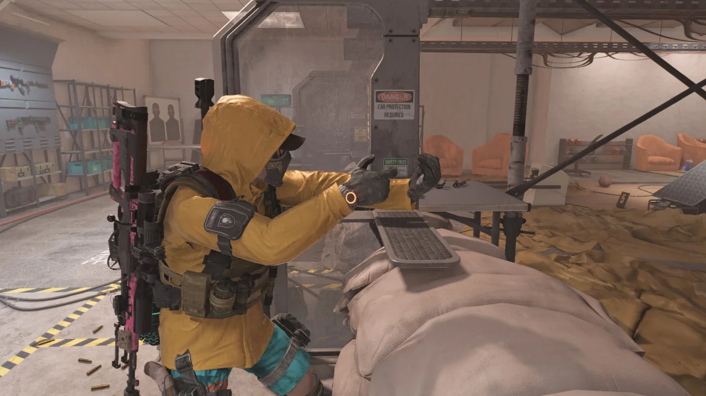
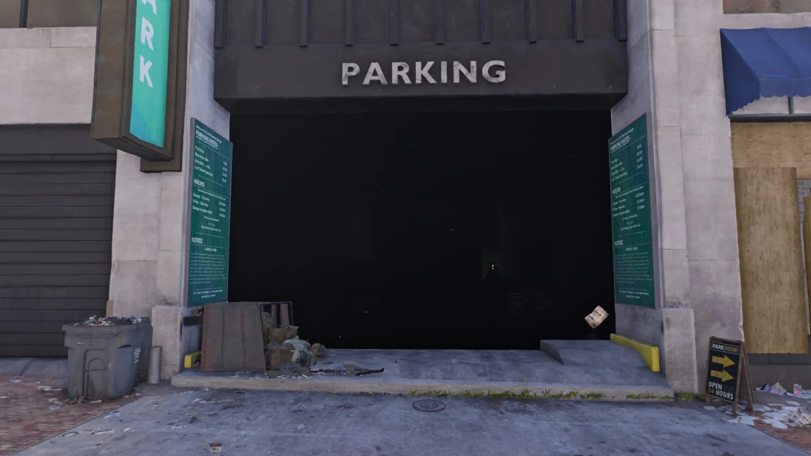
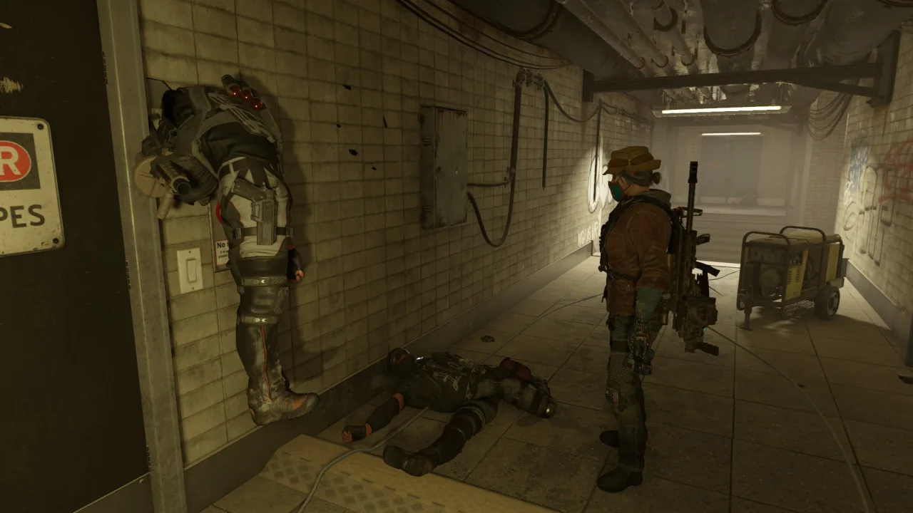

또 디비전 2 사진이 쌓였다. 그렇다면 정리해야지, 뭐.

PETA가 보면 기함할 짓거리를 하는 중이다. 바로 야생동물이 보이면 묻지도 따지지도 않고 권총으로 쏘는 것이다. 무슨 억하심정이 있다거나 그런 것은 아니고, 대충 '인수공통전염병을, 동물을 죽여서 방지한다'라는 얼토당토않는 이유를 대는 컨셉이다.

그런데 이 사슴, 목이 꺾여서는 안 될 방향으로 많이 꺾인 것 같다.

그나저나 동물의 털 표현을 정말 잘한 것 같다. 막 쓰다듬으면 엄청 부드러울 것 같아.



같이 플레이하던 사람의 총이 사라졌다.

본인은 정상적으로 총을 들고 있다고 말하는데, 내 시야에서는 전혀 그렇지 않다.

네메시스가 SVD와 한 몸이 되어 있고, 본인은 투명한 총을 들고 있다.

더욱 웃긴 것은 저 상태에서 총을 쏠 수 있다는 것이다.

에어 기타도 아니고 에어 건을 들고 쏘는 것인데, 총탄이 나간다니!



이 상태에서 사진 모드로 놀다가 알게 된 것인데, 디비전 2의 모델들은 전부 디테일이 훌륭하다.

저 사람이 입고 있는 우비를 사진 모드에서 최대로 확대해 살펴보았는데, 옷의 씨실과 날실이 선명하게 보인다.

물론 우비니까 옷을 거칠게 만들었고, 그래서 씨실과 날실이 그대로 다 보이는 것일 수도 있지만, 보통은 이 정도까지 자세하게 만들지는 않지 않은가.

난 여태까지 우비의 질감에 그냥 맨들맨들한 텍스처를 쓴 줄로 알고 있었는데...

광원 오류가 또 났다! 대낮의 평범한 창고형 주차장이지만 주차장 내부가 하나도 보이지 않는다.

문제는 이 공간에서 몹이 나온다는 것이다. 나는 적을 볼 수 없는데, 적은 저 안의 공간에서 날 보고 내게 총을 쏴댄다.

이게 게임이냐?

별건 아니고, 그저 이 블랙 터스크가 벽에 머리가 박힌 채 대롱대롱 매달려 있는 것이 웃겨서 찍었다.

&nbsp;

그런데 사진 모드에서 플레이어가 차렷 자세로 총을 멍하니 내리고 있는 것은 좀 바꿔주면 안 될까?

차라리 총을 정면에 겨누고 있는 자세나 로우 레디 자세로 총을 잡고 있으면 더 멋질 텐데.
