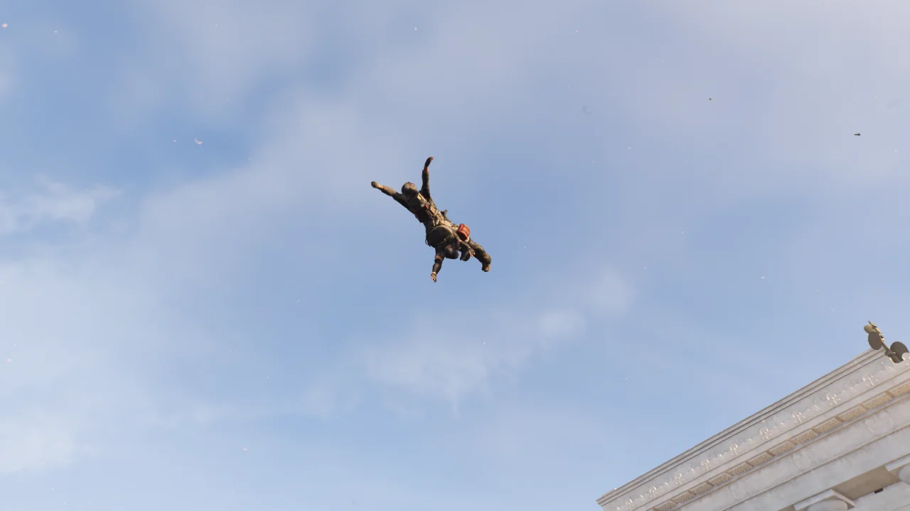

사진은 갈수록 쌓여만 가는데, 사진을 모은 글에 붙일 제목을 정하기 힘들다.

그래서일까, 사진이 쌓인 것을 보면 제일 먼저 '이번엔 무슨 제목을 써야 하나'라는 생각이 먼저 든다.

조금 큰 까마귀인 줄 알고 새를 쐈는데, 가까이 다가가 확인해 보니 독수리였다.

어... 그러니까 내가 미국의 정신을 쐈다.

그랜드 워싱턴 호텔 임무를 돌다가 발견한 것이 하나 있다.

&nbsp;

원래 이곳에서는 전장의 미래 형성에 대해 PMC가 어떤 역할을 할 것인지에 대해 연설(혹은 강연 같은 것)이 열릴 예정이었던 것으로 보인다.

의장은 당시 미국 하원의장이었던 앤드루 앨리스였으며, 연설자로는 '더글러스 & 하딩'의 공동 창립자인 찰스 더글러스와 PMC '라스트 맨 바탈리온'의 중령인 찰스 블리스가 있었다.

후원 기업에는 당연히 더글러스 & 하딩과 라스트 맨 바탈리온이 있었고, 거기에 추가로 MECH. ROBOTICS가 있었다.

MECH. ROBOTICS라는 이름을 가지고 추측해 보았을 때, 이 회사가 지금 블랙 터스크가 운용하고 있는 철댕이를 개발한 회사가 아닐지 생각된다.

&nbsp;

뭐, 달러 플루 때문에 이 연설은 무기한 연기되었겠지만.

특급 무기가 나올까 기대하며 돌았던 링컨 기념관 침입 임무 뺑뺑이.

전력맨 둘이 파티에 있으니, 이곳저곳에서 뻥뻥 터지고 아주 난리도 아니다.

&nbsp;

그 와중에 발견한, 헬리콥터 밑바닥에 들러붙은 블랙 터스크의 시체.

그런데 저 시체, 알고 보니 헬리콥터의 밑바닥에 들러붙은 것이 아니라 그냥 공중에 붕 뜬 것이었다.

게다가 자세히 확대해 보니 블랙 터스크 돌격병과 의무병이 서로 뒤엉켜 있다.



링컨 기념관을 계속 돌며 인상적으로 죽은 시체 사진을 찍었다.

두 번째 사진을 찍을 때는 시체들을 보자마자 '죽어서도 함께'라는 문구가 생각나 찍었다.
