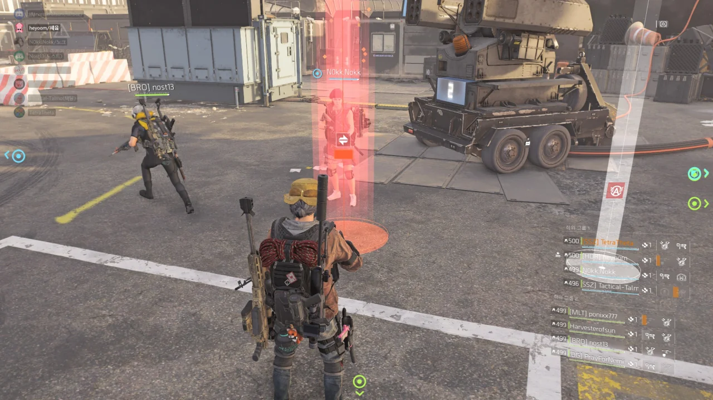

독수리를 얻은 지 두 달 반 정도 되었다.

이미 독수리를 얻은 다른 사람들은 자신의 상자에서 나온 독수리를 아직 독수리를 얻지 못한 사람에게 나눠주곤 한다. 그런 모습이 굉장히 멋지다고 생각하고 있었던 터라, 나도 언제 그런 멋진 일을 할 수 있을까 생각하고 있었다.

&nbsp;

그런데 오늘, 내 상자에서 두 번째 독수리가 나왔다. 다른 사람에게 나눠줄 수 있는 독수리가. 그것도 본캐에서 말이다.

같은 공대원인 놐놐님이 독수리를 아직 얻지 못하셨기에 흔쾌히 내 독수리를 드렸다.

&nbsp;

처음 독수리가 나온 걸 봤을 때, 레이드용 부캐에 이 독수리를 줄까 생각했었다. 하지만 레이드에 갈 때만 꺼내는 부캐에 독수리를 처박아두는 것보다 놐놐님에게 드리는 게 이 독수리가 더 알차게 쓰일 것 같아, 그냥 놐놐님에게 드렸다.

나중에 '아, 놐놐님 드리지 말고 내가 쓸 걸!'이라며 후회하게 될 수도 있겠지만, 행복은 나누면 두 배가 된다고 하지 않던가. 원래 독수리는 돌고 도는 법이다.

나중에 놐놐님도 자신의 상자에서 독수리가 나오면 오늘 일을 생각하며 아직 독수리를 얻지 못한 다른 사람에게 독수리를 흔쾌히 나누시겠지.

&nbsp;

19.08.29 두 번째 독수리 획득
