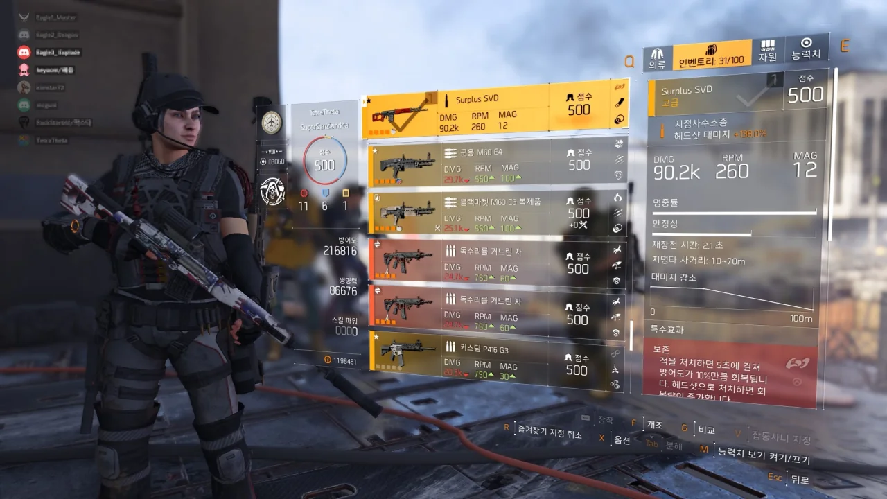
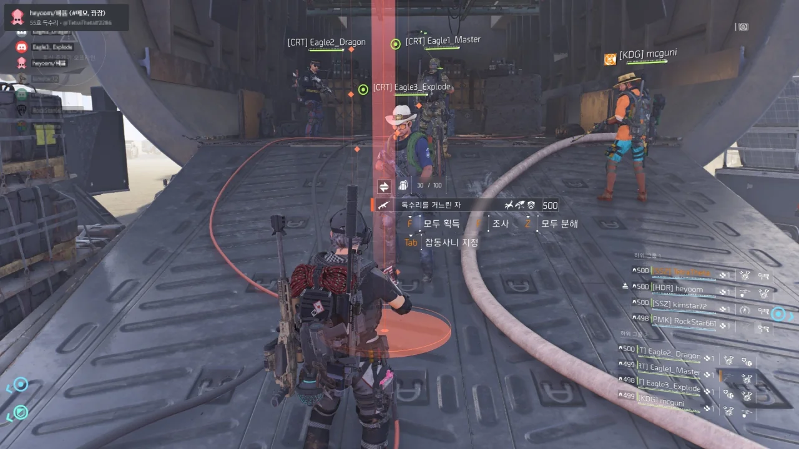

독수리가 또 나왔다.



두 번째 네임드에서 하나가 나왔고, 레이드 상자에서도 하나가 또 나왔다.

독수리가 무려 두 개! 와!

&nbsp;

지금껏 레이드 네임드 전리품에서 독수리가 나올 확률이 1%라고 알고 있었는데, 0.1%라고 하더라. 상자는 10%가 맞았고. 그러면 대체 이건 무슨 확률인 거지? ㅋㅋㅋㅋㅋㅋ

대충 계산기를 돌려보니 네임드 넷을 처치했을 때 전리품으로 독수리가 하나 나올 확률이 약 0.4%라고 한다.

하나는 내 부캐에 넘겨줄 예정이고, 다른 하나는 독수리를 아직 얻지 못한 사람에게 나눠주었다.

&nbsp;

19.09.12 세 번째/네 번째 독수리 획득. 동시에 두 번째 독수리 나눔.
