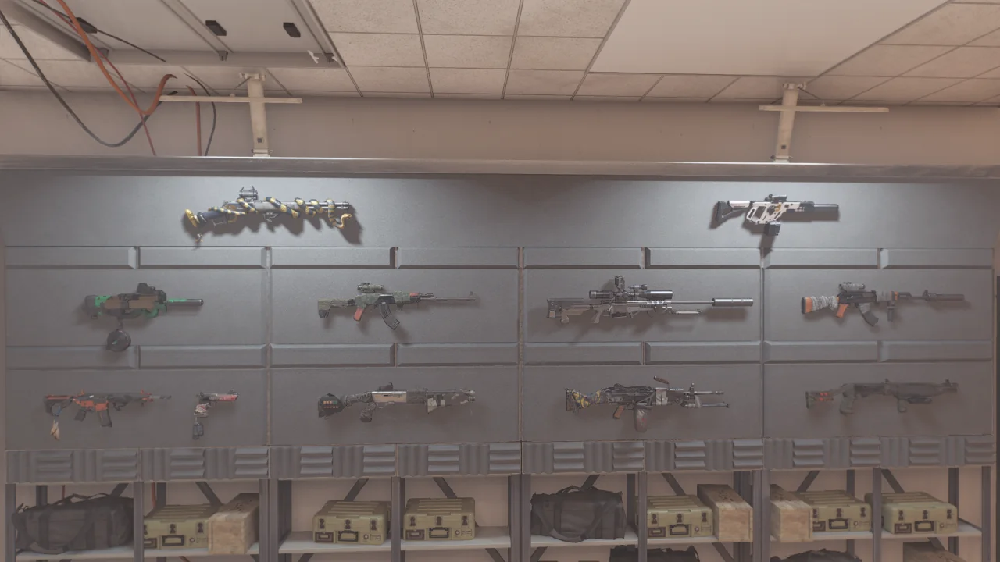

뭐 그렇게까지 오랜만이라고 해야 하나 싶긴 한데... 사실 그동안 놀거 다 놀고 즐길 거 다 즐기고 있었다.

이번에 디비전 2에 새로운 확장팩이 나온다고 하길래 예약 구매가 풀리자마자 바로 샀고, 3월 3일 정식 출시가 되기만을 기다리고 있다.

&nbsp;

본캐는 이미 모든 제작 재료를 모아두었고, 굳이 더 모을 것을 꼽자면 크레딧밖에 없다. 하지만 그건 할 생각이 전혀 없다.

부캐에 제작 재료를 더 쌓아둘 수 있긴 하지만, 굳이 그걸 위해서 새로운 부캐를 만들 필요성을 느끼지 못하고 있다.

&nbsp;

사실 친구와 함께 1레벨부터 같이 키워나가는 세 번째 캐릭터가 있긴 한데, 친구가 30레벨을 찍으면 곧바로 본캐를 들고 와 같이할 생각이다. 굳이 구린 장비의 부캐로 친구와 같이 놀 필요가 없으니까.

***

새로운 총, 카멜레온이 나왔다고 해서 별생각 없이 목표 전리품 시스템이 안내하는 대로 돌격 소총이 더 잘 나오는 국회 의사당 임무를 돌았다.

거기서 트루 썬 상자를 열었더니 카멜레온이 '쨔잔'하고 나타났다.

국회 의사당 임무를 돌다 보면 카멜레온이 나올 것이라고는 생각했지만, 이렇게 단번에 나올 줄은 전혀 몰랐는데 말이다.

&nbsp;

하지만 지금까지 모았던 모든 특급 무기는 3월 3일이 되어 새 확장팩이 나오는 날부터는 전부 휴지통에 들어갈 예정이다. 왜냐면 40레벨짜리 특급 무기들을 다시 파밍 해야 하거든...

정말 귀찮아질 것 같다. 어휴...
