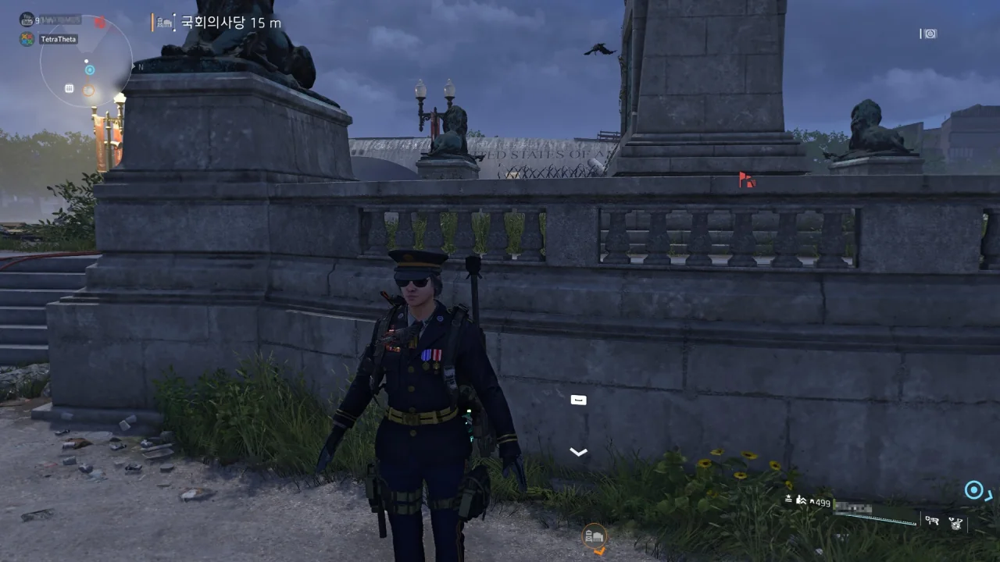

친구 초대 이벤트를 했다.

유비소프트 홈페이지를 통해 베테랑 플레이어와 신규 플레이어를 짝지을 수 있는데, 둘이 같이 2시간 이상 플레이하면서 임무 3개 이상을 완료하면 된다.

이렇게 하면 베테랑 플레이어는 말벌 헌터 의상을 얻게 되고, 신규 플레이어는 네임드 경기관총 설계도를 얻게 된다.

당연히 말벌 헌터 의상이 탐이 나서 이벤트에 참여했다.

&nbsp;

네이버 카페에서 사람을 구했는데, 두 사람을 만날 수 있었다.

하지만 한 사람은 이미 혼자 2시간 이상 디비전 2를 플레이한 터라, 베테랑 플레이어로밖에 참여할 수밖에 없었다.

다른 한 사람은 다행스럽게도 이제 막 디비전 2를 구매한 사람이라서 신규 플레이어로 나와 연결할 수 있었다.

&nbsp;

'2시간 이상 함께 플레이'와 '임무 3개 이상 완료' 이 두 조건을 모두 만족해야 보상을 주는 것으로 알고 있었는데, 그저 2시간 같이 플레이했다고 내게 말벌 헌터 의상을 준다.

아마 이렇게 되면 나와 같이 한 신규 플레이어도 네임드 경기관총 설계도를 얻었을 것이다.

&nbsp;

친구 초대 이벤트로 얻을 것을 다 얻은 두 사람이 얼른 만렙이 되고 싶다고 해서 내 본캐를 이용해 두 사람을 월드 랭크 5로 빠르게 올려주었다.

&nbsp;

한 사람을 월드 랭크 5로 만든 후, 그 사람의 플레이 시간 통계를 보는데 고작 26시간이 뜨는 것을 보니 그 사람에게 많이 미안해졌다.

그도 그럴 것이, 디비전 2에서 스토리가 주는 뽕이 만만치가 않기 때문이다. 그런데 빠르게 만렙을 만드느라 그런 감동 거리를 전부 놓치게 만들었으니, 죄책감이 들지 않을 수 없다.

정작 본인들은 '빨리 만렙을 찍고 싶다', '나는 스토리를 전혀 상관하지 않는다'라고 말하지만, 디비전 2의 스토리를 유튜브에서 보는 것과 직접 보는 것에는 큰 차이가 있을 수밖에 없지 않은가.

&nbsp;

그렇게 죄책감에 사로잡혀 자책하고 있다가 당사자와 주변 사람에게 '뭐 그런 걸로 자책하고 그러냐?'라고 말을 들었다.

결국 털어냈다.

***

이제는 없으면 섭섭한 디비전의 버그.

아까 말한 그 사람들과 같이 디비전을 하던 중, 갑자기 내 캐릭터가 T포즈로 굳어버렸다.

손에 들고 있어야 할 독수리는 가슴팍에 꽂혀있는데, 보통 본인에게만 보이거나 다른 사람에게만 보이는 이런 버그가 나뿐만 아니라 다른 사람에게도 보이는 중이다.

문제는 이렇게 된 상태에서 게임 메뉴 호출을 포함한 모든 키보드 조작이 고장 나버렸다는 것이다. 내가 할 수 있는 것은 그저 마우스를 이용해 시야를 돌리는 것뿐.

결국 `Alt` + `F4`를 이용해 게임을 강제로 종료하고 재실행했다.

&nbsp;

사실 이 모든 주절거림은 위의 저 사진을 올리기 위한 것이었다.
