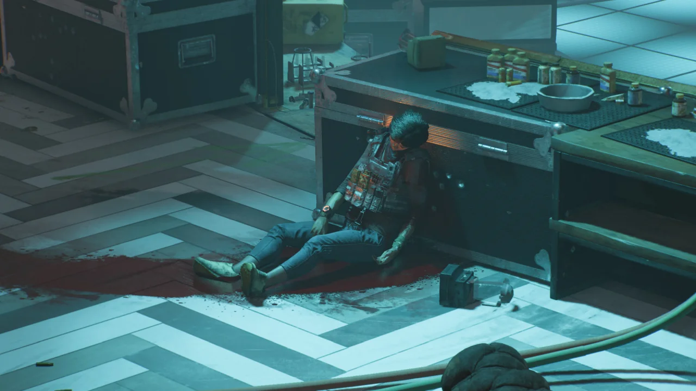

Year 1 패스도 이제 슬슬 끝물이다.

마지막 남은 기밀 과제들을 오늘에서야 끝내게 되었다.

사실 에피소드 3가 나올 때 공개된 기밀 과제들이었는데, '나중에 해야지'하고 미루고 미루다가 오늘 날을 잡고 끝을 내게 되었다.

&nbsp;

이제 3월 3일까지 딱히 할 것이 없다.

첫 번째 기밀 과제는 나이트클럽에서 진행되었다. 그 외에는 크게 인상 깊은 특징이 없었다.

여기서 다른 요원 NPC가 등장하길래 '오, 드디어 켈소 말고 다른 요원과도 다닐 수 있는 것일까?'라고 생각했는데, 어림도 없지, 곧바로 죽여버리더라.

아니, 그러게 좀 침착하게 플레이어와 함께 다닐 것이지 왜 혼자 나서서 뽈뽈거리며 돌아다니다 깩하고 죽어버리냐고.

&nbsp;

살아있을 때는 별 도움이 되지 않았는데, 죽어서는 의외의 곳에서 도움이 되었다.

시체의 어깨에 있는 펄스 장비를 매니가 원격으로 조작해, 나이트클럽에 매복한 적의 위치를 한눈에 볼 수 있도록 해주었거든. 이런 전개, 옛날에 어디선가 한 번 본 것 같은데...

&nbsp;

모든 기밀 과제 임무에는 수집 요소가 존재하는데, 여기에 있는 열쇠고리는 정말 찾기가 거지같았다.

내가 참고한 공략에 따르면, 제일 첫 번째 열쇠고리는 보스 방에 있다고 한다.

그런데 공략에 나온 형광등은 찾았는데, 문양을 전혀 찾을 수 없었다.  
분명 공략에는 기둥에 문양이 그려져 있다고 나와 있는데, 내 화면에는 아무리 찾아봐도 문양을 찾을 수 없었던 것이다.

문양을 찾기 위해 문양이 그려져 있다는 기둥에 가까이 붙어보기도 하고, 주변에 있는 모든 조명을 쏴 꺼트려 문양이 잘 보이도록도 해보았다.

결국 아무리 해도 문양이 나타나지 않자, 아무거나 찍었는데 다행스럽게도 그게 정답이었다.

&nbsp;

각자 문양이 나타나는 순서가 다르다고 하는데, 나는 [역삼각형 - 마름모 - X - 육각형] 순서대로 나왔다.

솔직히 말해, 역삼각형 부분은 그냥 감으로 때려 맞춘 것이었는데 단 한 번에 성공해서 매우 기분이 좋았다.



매시브가 얼마나 맵을 거지같이 만드는지 알 수 있는 사진이다.

사각형 모양으로 돌담이 처져 있는데, 이 돌담은 아스팔트 도로에 절반 정도 걸쳐있다. 실제라면 절대로 있을 수 없는 지형이다.

게다가 돌담 안에는 어떻게 가져다 놓은 것인지, 승용차 하나가 반파된 채 주차되어 있다. 게다가 그 차는 돌담과 겹친 채 주차되어 있어, 반대편에서 보면 벽 바깥으로 삐져나온 승용차의 일부분을 확인할 수 있다.

&nbsp;

아무리 생각해도 다른 곳에 있어야 할 돌담이 어찌 된 연유인지는 몰라도 이곳에 잘못 배치된 것 같다.

아무리 실수라고 해도 이건 좀 너무하지 않냐?

내 살다 살다 기밀 과제 입구가 지하 하수도 통로에 있는 것은 처음 본다.

물론 이런 식으로 도로 근처가 아닌 곳에 있는 입구가 없는 것은 아니지만, 적어도 그곳은 디비전 2 트레일러에 나온 장소였기에 비교적 찾기가 쉬웠다.

지상을 아무리 뒤져보아도 기밀 과제 입구가 보이지 않기에 혹시나 하는 마음에 지하 하수도로 내려온 것이었는데...
