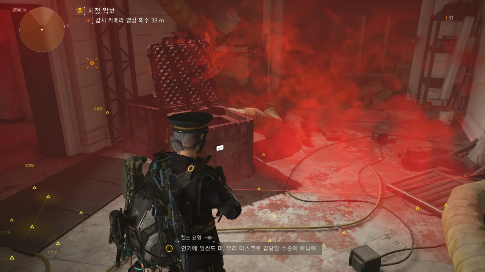
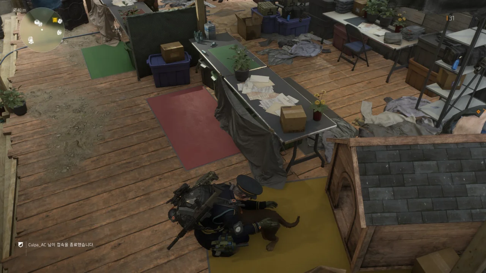
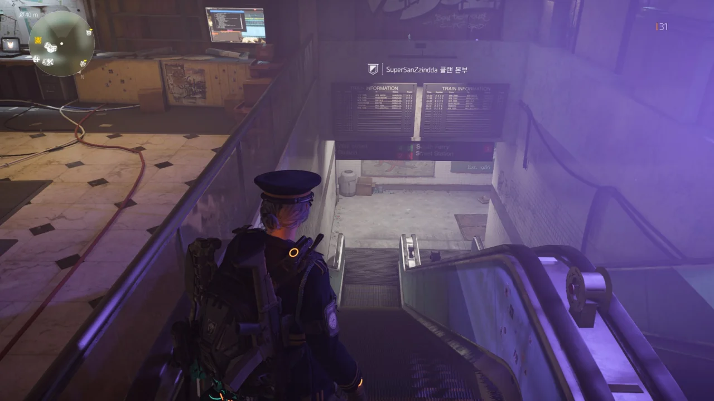
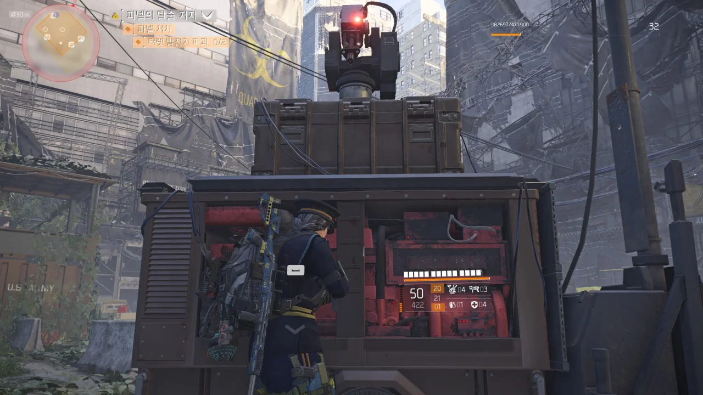
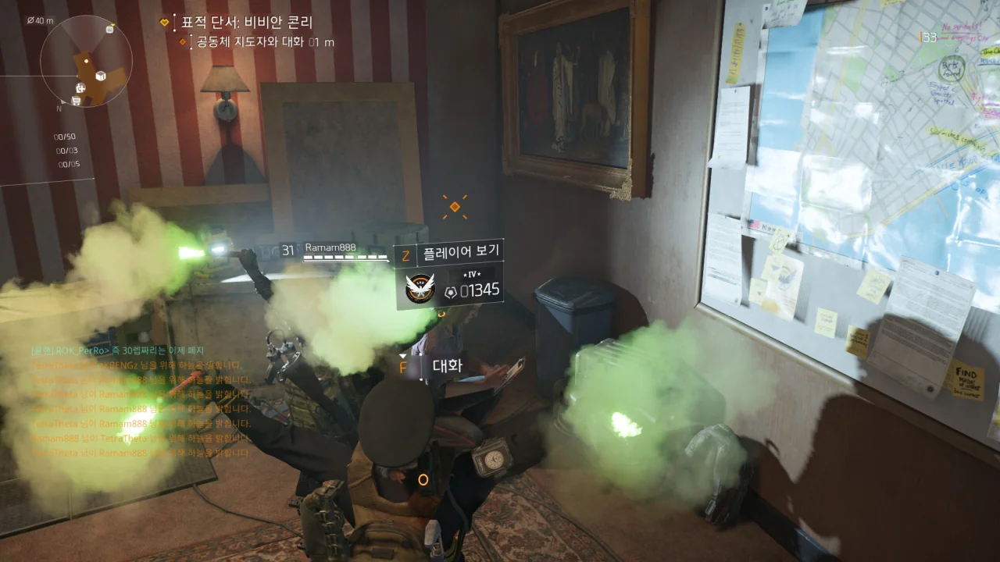

드디어 기다리고 기다리던 디비전 2의 새 확장팩이 출시되었다.

확장팩의 이름은 'Warlords of New York', 줄여서 WONY이다. 한국 출시명은 '뉴욕의 지배자들'이고.

3월 2일 오후 5시 30분에 점검을 시작하며 '오후 8시에는 끝낼게요'라고 말했는데, 오후 8시가 다 되어갈 때쯤 'ㅈㅅㅈㅅ 점검 30분 더 연장할게요!'라고 하더라.

그 30분이 다 되어 갈 때 또 '30분 또 연장할게요!'라고 했다.

결국 두 번의 연장 점검 끝에 서버가 열린 것은 오후 9시쯤이었다.

&nbsp;

그동안 내 컴퓨터도 굉장한 일을 겪었다.

NVIDIA에서 WONY에 대응하는 새 그래픽 카드 드라이버를 내놓았는데, 그걸 깔았더니 디비전 2의 프레임이 반토막이 났다!

게임을 시작하면 광과민성 관련 경고가 나오고 그 밑에 있는 가로줄이 점점 줄어드는데, 드라이버 업데이트 이후에는 그 선이 줄어드는 것이 부드럽게 줄어드는 것이 아니라 뚝뚝 끊기며 줄어들더라.

그걸 해결하기 위해 DDU로 그래픽 카드 드라이버를 완전히 삭제하고 새로 설치하니 이번엔 NVIDIA 제어판 프로그램이 작동하지 않는다.

&nbsp;

결국 예전에 백업해 둔 윈도우 이미지로 시스템을 통째로 복원하고 나서야 해결할 수 있었다.

뭐? 최신 드라이버? 내 좆이나 까라. 다음부터 NVIDIA 드라이버는 나오고 나서 최소 한 달은 묵혔다가 설치할 거다.



***

시작하자마자 뭔가 굉장한 것이 플레이어를 반겨준다.

저렇게 붉은색으로 표시된 영역은 디비전 요원의 바이러스 필터 마스크로도 걸러낼 수 없는 바이러스가 있는 것인지, 영역 안으로 들어가니까 플레이어의 체력이 독에 걸린 것처럼 쭉쭉 깎인다.

&nbsp;

난 이번 확장팩이 뉴욕을 배경으로 한다고 하길래 1편에서 가보았던 장소를 여름 배경으로 다시 방문할 수 있을 줄 알았다.

그런데 디비전 1편의 배경은 맨해튼섬 중부이고, 여기는 맨해튼섬 남부라고 한다. 아예 장소가 다른 것이다.

이곳 역시 1편의 작전 기지로 쓰였던 우체국이 아니라 뉴욕 시청이라고 한다. 1편 이후 작전 기지를 우체국에서 뉴욕 시청으로 옮긴 것일까?

&nbsp;

곳곳에 손목에 주황색 시계를 찬 시체가 널브러져있다. 설마 1편에서 맹활약한 내 요원도 이 바이러스에 죽은 건 아니겠지?

유비소프트가 1편과 2편의 플레이어 요원이 서로 동일 인물이라는 말을 절대 하지 않는 데다가, 2편을 시작할 때도 플레이어를 막 소집되어 활성화된 요원으로 설정한 1편과는 달리 이미 활성화되어 활동하고 있던 요원으로 설정했기 때문에 1편과 2편의 플레이어 요원의 관계에 대해 말이 꽤 많이 나왔다.

그래서 1편과 2편을 모두 플레이한 나는 '1편과 2편의 플레이어 요원은 동일 인물이다'라는 주장을 지지하고 있었는데, 시간이 갈수록 그런 생각보다는 '1편과 2편의 플레이어 요원은 별개의 인물이다'라는 주장이 더 그럴듯하게 보인다.

아니, 이 강아지가 어딜 핥고 있는 거야? ~~히토미 꺼라~~

작전 기지로 쓰던 뉴욕 시청이 새로운 바이러스로 인해 버려진 후 JTF는 '평화유지군'이라는 민병대의 근거지인 '헤이븐'에 얹혀살게 되었다. 이곳을 이끄는 것은 바로 1편에서 기술동을 맡았던 폴 로즈.

뭐가 그리도 불만이었는지, 폴 로즈는 몇 달 전 JTF를 나와 이곳에 새 정착지를 꾸렸다고 한다.

그런데 설정상, 1편과 2편의 시간은 고작 6개월밖에 차이가 나지 않는다. 즉, 1편이 끝나고 얼마 되지 않아 JTF를 뛰쳐나온 것.

&nbsp;

1편에서의 폴 로즈는 틱틱대기는 해도 정감이 가는 캐릭터였는데, 2편에서의 폴 로즈는 처음부터 비호감이다.

뭐? '디비전이랑만 엮이지 않으면 평화롭다'라고? 그냥 1편 때 클리너에게 산 채로 불타게 내버려 둘걸 그랬다. 아, 꼬우면 님이 직접 총 들라고요.

&nbsp;

헤이븐의 리더인 폴 로즈부터가 디비전을 못마땅해하니, 헤이븐 전체가 마지못해 디비전을 받아들이고 있는 모양새이다.

그런 것 치고는 헤이븐 작전 기지에서 이것저것 다 할 수 있지만.

&nbsp;

페이 라우 역시 하는 행동이 가관이다. 바로 앞에 폴 로즈의 사무실이 있는데 폴 로즈를 까대고 있다.

뭐지? 다시 길거리로 내쫓기고 싶다는 욕구를 표현하는 새로운 방식인가?

&nbsp;

&nbsp;

벌써 워싱턴이 그립다. 여기에는 멀쩡한 놈이 없어!

로그 요원이자 흑인 해커인 - 이렇게 쓰니까 굉장히 스테레오타입적인 캐릭터같이 보인다 - 테오 파넬이 다크존 터렛을 해킹해 떼어다 이곳저곳에 설치해 두었다.

그런데 이걸 어쩌나. 당신의 터렛, 이렇게 바로 밑에 서 있으면 병신이 된다, 이 말이오.

&nbsp;

터렛이 은근히 아파 곤란했었는데, 이렇게 발전기 바로 앞에 붙어있으면 터렛에게 맞지 않을 수 있다.

그러면 난 그저 클릭만 하면 될 뿐이다.

터렛이 눈에 불을 켜고 날 쏘고 싶어 하는데, 각도가 닿지 않는다. 에베베~ 약 오르지~

아, 그래. 버그가 언제 나타나나 했다. 유비소프트 게임에 버그가 없으면 섭섭하지.

임무 목표는 '안전 가옥 지도자와 대화하세요'인데, 정작 그 지도자와 대화하기 위한 프롬프트가 제대로 작동하지 않는다. 아무리 `F` 키를 눌러도 안전 가옥 지도자는 아무런 말도 하지 않는다.

&nbsp;

그래서 클랜은 지금 아주 난리가 났다. 대화가 가능한 안전 가옥 지도자가 있는 세션을 찾아 헤매는 것이다.

나? 난 하다가 화가 나서 그냥 게임을 꺼버렸다. 아, 매시브가 생각이 있으면 핫픽스를 내놓겠지.

&nbsp;

임시 해결책이랍시고 나오는 것이 몇 가지가 있긴 한데, 죄다 하나같이 어디 나사가 빠져있다.

* 안전 가옥에 아무도 없을 때 대화 시도하기  
  안전 가옥은 커뮤니티 공간이라, 아무도 없는 안전 가옥을 찾는 것이 쉬운 일이 아니다.
* 지역 해방 보조 임무를 전부 완료하고 대화 시도하기  
  통제 지점 담당관과 대화를 하려면 먼저 안전 가옥 지도자와 대화를 해야 한다. 이게 무슨 닭이 먼저냐 달걀이 먼저냐 하는 것도 아니고.
* 로그아웃, 로그인을 반복하며 대화가 될 때까지 시도하기
* 안전 가옥들을 빠른 이동으로 이동하며 대화가 될 때까지 시도하기

유비소프트 게임은 항상 트레일러와 개발자 방송 등으로 뽕을 극한까지 뽑아놓고서 정작 버그나 유비식 다운그레이드로 뽕을 다시 회수해 간다.

어휴...
