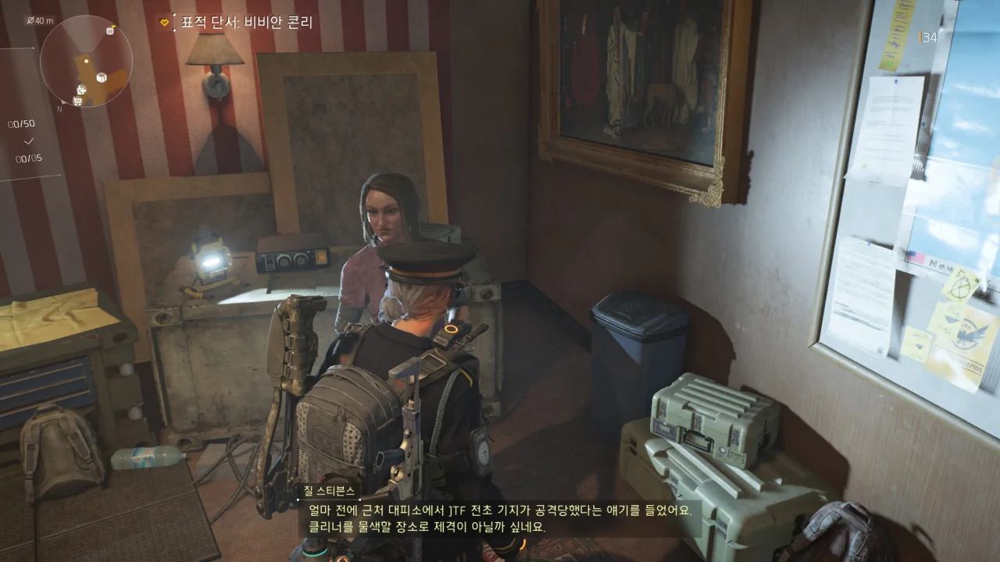
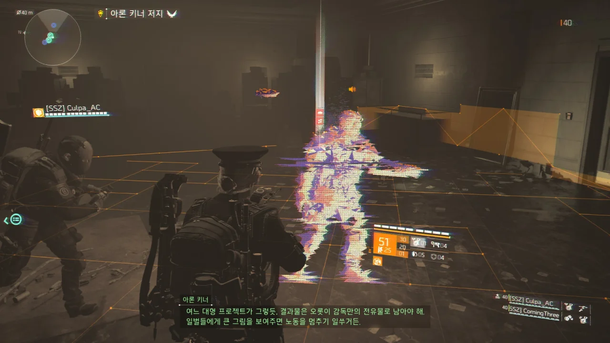
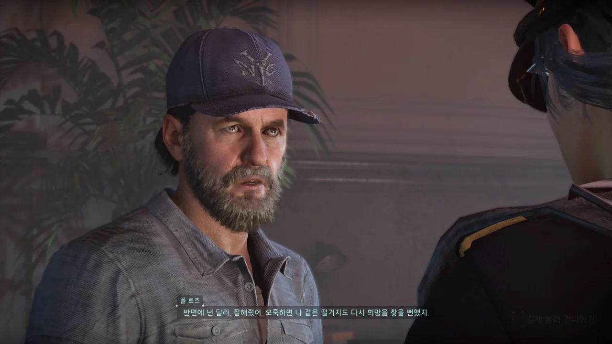
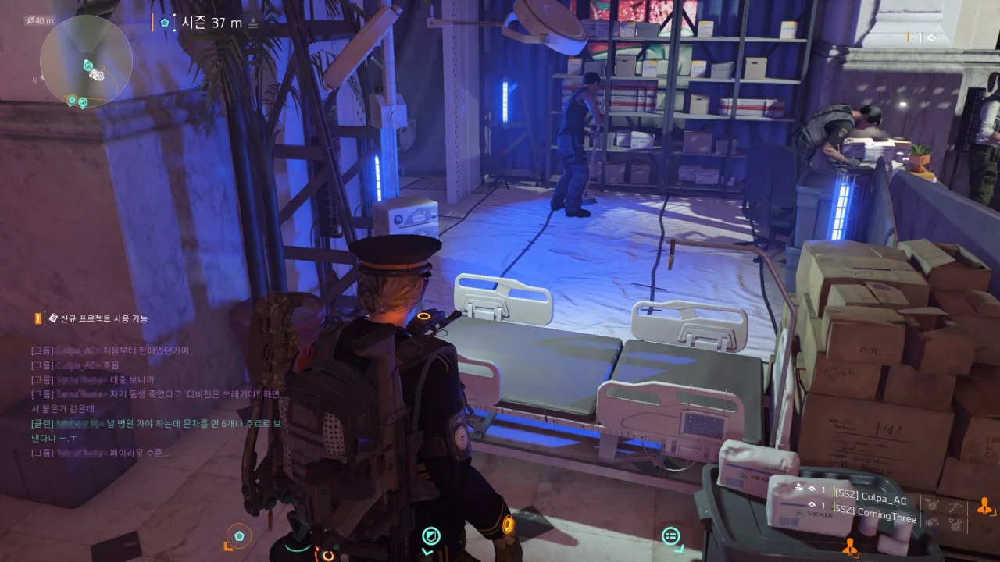
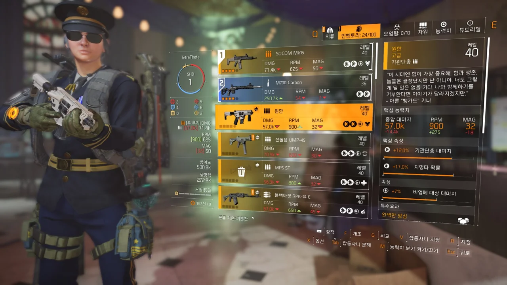
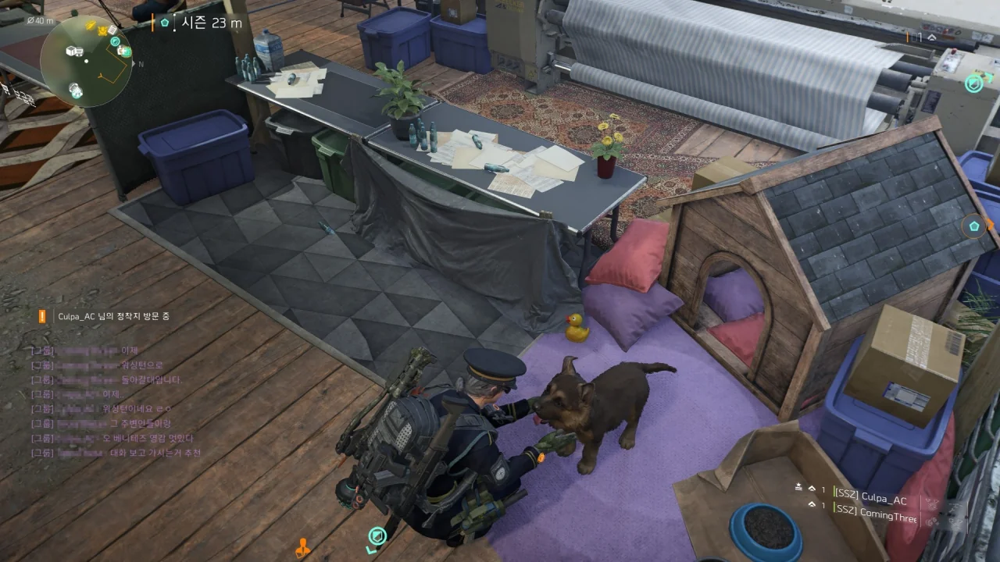

이 앞 '뉴욕의 지배자들' 확장팩에 대한 스포일러 있다.

디비전을 켜자마자 로그아웃과 로그인을 수도 없이 반복하면서 세션을 갈아치우길 30분. 드디어 나머지 세 안전 가옥의 지도자와 대화할 수 있었다.

이제 남은 것은 재미있는 임무를 즐기는 것뿐!

&nbsp;

하지만 어제 한 번 김이 팍 식어버린 탓일까, 나머지 로그 요원들에게서 깊은 인상을 느낄 수 없었다.

뭐, 어제 처리했던 테오 파넬도 해킹으로 플레이어에게 엿을 몇 번 먹였다는 것 빼고는 추한 모습을 자주 보여줬지만.

&nbsp;

일단 하비에르 카지카를 먼저 살펴보자.

하비에르 카지카는 이유는 잘 모르겠지만 디비전과 JTF에 대한 복수심에 가득 찬 상태이다.

그는 패스웨이 공원 지하에서 TBM[^1]을 이용해 헤이븐을 향해 지하 터널을 파고 있었다. 현재 JTF와 디비전이 있는 헤이븐을 파괴하기 위해서이다.

[^1]: 터널 보어링 머신(Tunnel Boring Machine)

하지만 플레이어가 TBM을 파괴하고 자신을 쫓아오자, 충격 덫을 잔뜩 깔아 놓은 방에서 플레이어를 맞이하게 된다.

&nbsp;

그런데 카지카가 임무 전반적으로 하는 행동이 굉장히 추하다.

'따라올 테면 따라와 봐'라고 말하듯 플레이어 앞에서 나타났다 사라졌다 하는 건 그런가 보다 할 수 있다. 허세를 좀 부리고 싶을 수도 있지.

TBM을 발견하기 전, 플레이어는 카지카와 한 번 직접적으로 전투를 하게 된다. 여기서 분명 플레이어가 카지카의 모든 체력을 다 깎았음에도 불구하고 카지카는 발밑에 연막탄을 던진 후 사라진다. 체력 게이지는 장식이냐?

TBM을 파괴하고 카지카를 죽이러 가는 길의 바닥에 잔뜩 깔아둔 충격 덫은 차라리 귀엽다고 할 수 있다. 자신에게 달라붙은 추격자를 충격 덫으로 방해하는 건 충분히 자연스러운 일이니까.

카지카와 마지막 전투를 하는 방의 설계가 아주 비열하기 짝이 없다.

바닥에서 올라오는 뜨거운 증기 때문에 플레이어의 체력이 실시간으로 떨어지는 와중에, 카지카는 2층 발코니의 엄폐물 뒤에 안전하게 엄폐한 상태로 플레이어를 소이 화살과 충격 덫으로 공격한다.
플레이어는 1층에 있기 때문에, 카지카가 일어서 공격하더라도 쏠 수 있는 부분이 많지 않다.

어찌해서 카지카의 체력을 다 깎더라도 카지카는 죽지 않는다. 아까처럼 발밑에 연막탄을 터트린 후 사라질 뿐.

뜨거운 증기를 내뿜는 물을 두어 번 정도 배수할 때마다 카지카는 다시 체력을 완전히 회복하고 나와 플레이어를 충격 덫과 소이 화살로 공격한다.

뜨거운 물을 모두 빼고 나서야 드디어 카지카와 진정한 한판 승부를 벌일 수 있다. 물론 카지카는 플레이어에게 찢긴다.

"으아아아!"하면서 달려오다가 그대로 픽 쓰러져 죽어버리더라.

&nbsp;

그다음은 비비안 콘리에 대해 알아보자.

비비안 콘리는 1편에서 조 페로가 죽은 이후 새 클리너의 리더로 추대되었다.

아무리 그래도 前 디비전 요원이지 않은가. 클리너와 같이 행동하는 것도 무언가 다른 속셈이 있어서 그런 것으로 생각했다.

하지만 내 예상과는 다르게 비비안 콘리는 완전히 클리너의 개똥철학에 매몰되어 있었다.

좌초된 유조선 임무를 진행할 때 콘리가 다른 클리너에게 이런저런 지시를 내리는 걸 들어보니 '아, 이 년 완전히 머리가 돌아버렸구나'라는 것을 확연히 느낄 수 있었다.

심지어 그 최후조차 제대로 미쳤다.

일반적으로 적의 체력이 완전히 0이 되면 그대로 쓰러져 죽는다. 하지만 콘리는 분명 체력을 0으로 만들었는데도 죽지 않았다.

버그인가 싶어 엄폐물 뒤에 숨어 콘리를 바라보았다. 아니 그런데 이 년이 제자리에 주저앉더니 품속에서 폭탄을 꺼내 자폭하는 게 아닌가.

지근거리에서 폭탄이 터졌으니, 당연하게도 콘리는 핏물이 되었다.

비비안 콘리에 대해 클랜원들이 클랜 채팅으로 이야기할 때 "어차피 님들 다 한 달만 지나도 콘리 시체에 권총 쏘고 놀 거잖아요"라고 했는데, 이렇게 죽어버리면 시체도 안 남잖아.

&nbsp;

제임스 드래고프 역시 콘리만큼은 아니더라도 미친 녀석이다.

아니, 이 녀석은 라이커를 제 가족으로 생각한다니까?

플레이어의 앞을 가로막는 더치스를 죽였더니 "I want them dead! Make those assholes suffer!"이라고 잔뜩 분노한다.

마지막에는 자기 똘마니 둘과 함께 진압 방패를 들고 덤비는데, 주변에 배치된 미니건을 이용하니 손쉽게 처리할 수 있었다.

게다가 나머지 로그 요원과 다르게 제대로 된 발악도 없이 그냥 픽하고 죽어버려서 시시했다.

아론 키너의 부하인 네 로그 요원을 모두 처리하고 이제 대장인 아론 키너를 족치러 가는 길이다.

괜히 1편과 2편 내내 자신의 존재감을 과시하며 온갖 떡밥을 던진 놈이 아니라는 걸 증명이라도 하듯, 자길 잡으러 온 블랙 터스크 병력과 플레이어 요원을 갖고 놀았다.

&nbsp;

내가 리버티 아일랜드 임무를 할 때 제일 놀란 게 뭐였는지 아는가? 블랙 터스크가 새로운 종류의 투견을 끌고 왔다는 것이다.

새로 추가된 투견은 '유탄 투견'과 '미니건 투견'이었다. 유탄 투견은 쉴 새 없이 유탄을 쏴대고, 미니건 투견은 이리저리 뛰어다니면서 플레이어에게 미니건을 갈겨댄다.

미니건 투견이 루시처럼 360도 상모를 돌리는 걸 보고 어이를 상실했다. 심지어 그거, 맞으면 죽을 만큼 아픈 건 똑같더라.

심지어 이 새로운 투견들은 이번 임무에서만 나오는 것이 아니라 일반 필드에서도 나타난다고 한다. 네? 뭐라고요?

&nbsp;

블랙 터스크는 정말 아론 키너를 잡기 위해 안간힘을 다한 것으로 보인다.

왜냐고? 이놈들, 레이저백까지 끌고 왔거든. 우리가 칠흑의 시간 작전에서 열심히 잡는 그 레이저백이 맞다.

다만 혼자 임무를 하더라도 레이저백을 잡을 수 있도록 이동식 미사일 포대는 삭제되었고 발전기 역시 한 대로 줄었다. 발전기를 충전하는 도중 발전기 영역 밖으로 나가도 충전이 초기화되며 유탄이 날아오지도 않는다.

하지만 그렇다고 하더라도 나머지 기믹이 쉬워진 것은 아니었다.

레이저백이 내뿜는 드론은 여전히 죽을 만큼 아팠고, 중간중간 블랙 터스크 병력이 나타나는 것 역시 동일했다. 레이저백의 약점을 격파해 레이더 탑의 약점을 드러내는 것 역시 동일하고 말이다.

&nbsp;

그래, 여기까지는 조금 어려울 뿐인 임무라고 이해할 수 있다. 그런데 그다음에는 습격자 쿼드콥터가 나타나더라? 게다가 아까 말한 투견의 모든 변종 여럿이 쿼드콥터와 함께 나타난다.

야, 이 미친놈들아, 이거 스토리 난이도라고!

&nbsp;

여기에 블랙 터스크 장갑병까지 있어 대체 어떻게 해야 이걸 돌파할 수 있을까 고민하던 찰나, 아론 키너가 블랙 터스크의 기계 병력을 전부 동시에 해킹해 자신의 것으로 만든다.

해킹된 쿼드콥터가 블랙 터스크 장갑병을 대신 처리해 준 것은 고맙지만, 이제 해킹당한 쿼드콥터와 투견 여럿이 플레이어를 노린다!

순간 이게 일반 임무인지, 레이드인지 분간이 안 가더라.

위에서는 쿼드콥터가 미니건과 로켓을 날려대질 않나, 땅에서는 투견이 대구경 저격 소총과 유탄, 미니건을 갈겨대질 않나... 아주 죽을 맛이었다.

&nbsp;

결국 모든 블랙 터스크 병력을 물리친 끝에 아론 키너를 만나러 가는 길.

아론 키너가 아까 블랙 터스크를 갖고 놀았다면, 이번엔 플레이어를 갖고 논다.

ECHO는 분명 과거에 있었던 일을 재연하는 기능이다. 그런데 아론 키너는 그걸 플레이어와의 대화 수단으로 쓰더라.

게다가 중간에 ANNA라는 것이 나오는데, 정황상 테오 파넬이 개발한 '로그 요원용 ISAC'인 것 같다.

아론 키너가 하는 말을 종합해 보면, ANNA는 ISAC 위에 얹혀서 작동하는 구조이다.

ISAC은 ANNA의 존재조차 알 수 없지만, ANNA는 ISAC의 모든 기능을 제한 없이 이용할 수 있는 사기적인 기술이다.

지금까지의 로그 요원은 ISAC의 공식적인 지원을 전혀 받지 못하며, 오히려 ISAC에 추적당하는 신세라는 것을 생각해 보면 이건 엄청난 수준의 빅엿이라고 할 수 있다.

&nbsp;

게다가 '프로젝트 이클립스'가 뭔지 보여주겠다면서 아론 키너가 한 것이 아주 놀라웠다. 바로 ISAC을 해킹한 것이다.

화면 왼쪽 상단의 임무 목표가 '폴 로즈를 죽여라!', '포기해라!', '아직도 페이 라우를 믿나?'와 같은 아론 키너의 메시지로 바뀌는 것이 아주 인상적이었다.

물론 단순히 장난을 목적으로 한 건 아니라서, 그와 동시에 주변에 있는 디비전 스킬 상자에서 해킹된 스킬 장비를 계속 뿜어내도록 만들었다.

아마 거기서 디비전 요원이 쓰는 스킬은 전부 나온 것 같다. 심지어 자주 쓰이지 않는 스킬까지도 말이다. 말벌 하이브, 화염 방사 터렛, 타격기 드론, 폭격 드론 등 공격 스킬이란 공격 스킬은 죄다 꺼냈다.

마지막에 밝혀진 '프로젝트 이클립스'의 정체는 뉴욕 전체에 이전에 뉴욕 시청에 살포했던 이클립스 바이러스를 뿌려 모든 사람을 죽이는 것이었다.

&nbsp;

지금까지의 로그 요원들이 전부 추하게 굴었듯이, 아론 키너 역시 자신의 계획이 파투나자 굉장히 추한 모습을 보였다.

이클립스 바이러스가 탑재된 미사일을 요원이 파괴하자, 요원에게 감전을 건 뒤, 내려와 직접 싸우더라.

그런데 플레이어의 스킬은 ISAC을 해킹해 쓰지 못하도록 만들어 놓고, 자신은 여유롭게 방어기 드론을 꺼내 쓰더라고. 주변에 수두룩하게 배치된 디비전 스킬 상자에서 튀어나오는 해킹된 스킬은 덤이고 말이다.

게다가 체력 역시 무식하게 많고 총도 잘 쏘고 방탄판도 잘 갈고 다니는 등, 본연의 전투력도 만만치 않았다.

&nbsp;

그래봤자 플레이어에게 발린 후, 플레이어에게 감전을 걸고 도망가다가 죽었지만.

대체 무슨 속셈인지는 모르겠지만, 자신의 시계를 이용해 '로그 네트워크'라는 것을 활성화하고 죽었다.

1편과 2편 내내 미친 존재감을 뽐냈던 빌런 치고는 초라한 최후였다.

와, 이런 미친. 아주 대박이다.

키너가 죽은 후 회수한 그의 시계에서 ANNA가 "적 통신 감청함"이라면서 어떤 무전을 들려준다.

&nbsp;

어깨에 빨간 불이 들어온 페이 라우가 블랙 터스크의 호버크래프트 안에서 바든 쉐퍼에게 '아론 키너가 죽었으니 이제 블랙 터스크 병력을 모두 후퇴시켜라'라고 말하는 무전이다.

이게 무슨 소리냐고? 페이 라우가 블랙 터스크에 붙어서 로그 요원이 되었다는 말이다!

그러면서 대놓고 '이제 디비전의 숨통을 끊을 수 있다'라고 말한다.

이전부터 페이 라우가 뭔가 심상치 않은 말을 하긴 했지만, 그래도 블랙 터스크에 붙어 로그 요원이 될 줄은 몰랐는데!

&nbsp;

이 소식을 들은 헤이븐의 사람들은 당연히 빡쳤다.

로이 베네테즈는 '이 년이 늑대의 본성을 드러냈으니, 우리가 늑대를 얼마나 잘 잡는지 직접 보여주겠다'라며 페이 라우를 죽일 각오를 단단히 세웠다.

폴 로즈는 '난 애당초 그년 안 믿었어 ㅎㅎ'라고 비아냥댄다. 이제야 디비전 1편의 그 폴 로즈가 되었다. 츤데레는 츤데레인데, 엄청 싸가지없게 츤츤대고 데레는 보여줄락 말락 하는 그 폴 로즈 말이다.

페이 라우가 있던 곳은 당연한 말이지만 이제 비어있다.

&nbsp;

페이 라우의 배신을 알게 된 클랜원들은 하나같이 '야호!'를 외쳤다.

왜냐고? 이제 페이 라우의 머리에 합법적으로 총탄을 박아줄 수 있어서이다.

안 그래도 페이 라우를 '디비전 시리즈 최고 미녀'라고 반어법으로 돌려 말하거나, 페이 라우를 까는 것이 밈이었는데, 아예 공식에서 페이 라우를 까라고 밀어주는 모습이지 않은가.

&nbsp;

누가 확장팩 초기에 '이것저것 터트리기 좋아하는 켈소가 아론 키너의 사상에 감화되어 디비전을 배신할 것이다'라고 추측했었는데, 정작 배신한 것은 켈소가 아니라 페이 라우였다.

&nbsp;

그래도 1편에서 동고동락한 페이 라우가 배신한 모습을 보니 착잡하기 그지없다.

ISAC이 ANNA를 역으로 먹어 버렸다.

아론 키너의 시계를 통해 ANNA의 관리자 권한을 획득한 ISAC이 ANNA의 각종 프로토콜을 자신에게 통폐합하는 방식으로 ANNA를 흡수했다.

그 결과가 지금 보이는 SHD 레벨이다.

솔직히 예전과 비교해 설정상으로 큰 차이는 없는 것 같다. 물론 SHD 레벨을 올리면 기본 체력이나 각종 패시브 스탯이 상승하긴 하지만 이건 게임적 요소로 봐야 한다.

&nbsp;

아론 키너가 들고 쏘던 네임드 기관단총, '원한'이다.

처음 볼 때 흰색이길래 카멜레온이라도 들고 쏘는 것인가 생각했었는데, 죽이고 나서 다시 확인해 보니 이 원한을 들고 쏘고 있던 것이었다.

물론, 이 기관단총은 그대로 갈아서 보정 라이브러리에 등록했다. 안 쓸 거거든.

마지막으로 귀여운 댕댕이.

&nbsp;

이제 슬슬 세팅을 맞춰야 할 시간이다.
