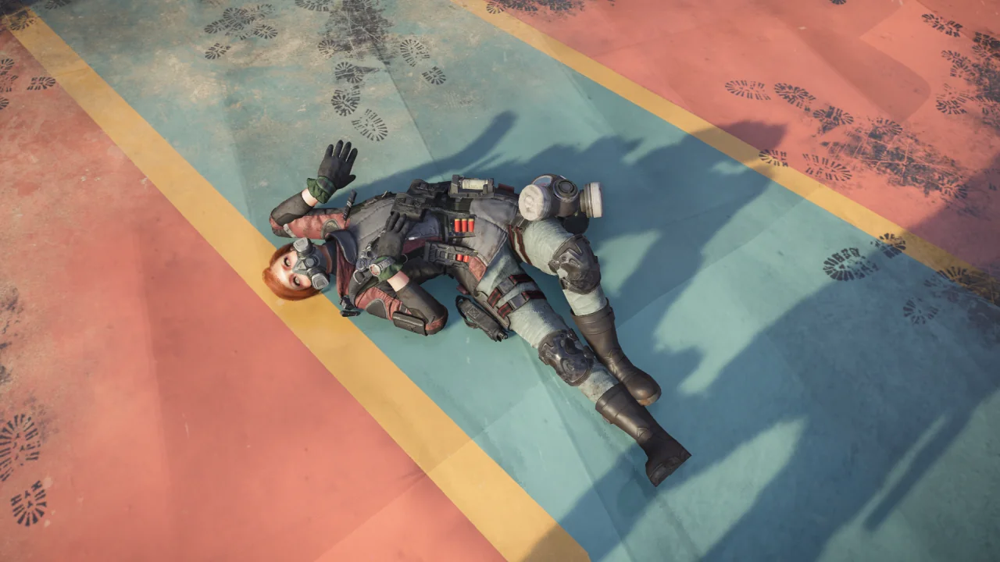

최근 디비전을 하면서 계속 느끼는 것이 하나 있다.

&nbsp;

너무 어렵다.

&nbsp;

솔플도 어렵고, 파티플도 어렵다.

차라리 파티플은 서로의 모자란 부분을 채워줄 수라도 있지, 솔플에서는 나 혼자 탱킹, 힐링, 딜링 모두를 다 담당해야 한다.

결국 내가 할 수 있는 거라곤 어디 한 곳에 짱박혀서 '니가와'를 시전하는 것밖에 없다.

새로운 특급 무기, 불릿 킹을 파밍 하기 위해 파티플을 하고 있다.

다른 파티원이 자신의 무기를 보정할 동안, 나는 다른 파티원들과 함께 기차놀이를 했다.

&nbsp;

기차놀이에도 나름대로 공략이 있다.

그냥 단순히 다른 사람의 뒤에 서서 감정 표현을 하면 앞사람과의 틈이 적잖게 벌어지게 된다.

이를 해결하기 위해서는 앞 캐릭터와의 간격을 더 좁혀야 한다.

앞 캐릭터의 등에 딱 붙은 후, `W` 키를 짧고 빠르게 몇 번 누르면 내 캐릭터가 앞으로 약간 더 전진하는데, 이때 감정 표현을 하면 앞사람과의 틈이 거의 없는 기차를 만들 수 있다.

이래 봬도 이런 캐릭터 겹치기를 디비전 1편 때부터 해온 몸이다.

드디어! 불릿 킹을! 얻었다!

내가 직접 얻은 것은 아니고, 같은 파티원인 페로님이 자신은 이미 불릿 킹이 있다며 불릿 킹을 주셨다.

그 당시 불릿 킹이 없던 사람은 나와 네기님 이렇게 둘 뿐이었고, 페로님이 이번에 얻은 불릿 킹은 하나이니 둘 중 하나만 불릿 킹을 가져갈 수 있는 상황.

페로님이 말씀하시길, "내가 하는 감정 표현을 가장 먼저 똑같이 따라 하는 사람에게 이 불릿 킹을 줄게요"라고 하셨다. 가위바위보로 누가 아이템을 가져갈지 결정하는 건 봤어도 감정 표현 따라 하기는 정말 처음 보는 내기였다.

결국 내가 페로님의 셀카 감정 표현을 가장 먼저 따라함으로서 불릿 킹을 가져가게 되었다.

&nbsp;

디비전에는 `/` 명령어를 이용해 빠르게 감정 표현을 할 수 있다. `/참선`이나 `/가위바위보`와 같은 식으로 말이다. 내가 페로님의 감정 표현을 빠르게 따라 할 수 있었던 것 역시 `/셀카` 명령어를 이용해서였다.

&nbsp;

나중에 네기님의 불릿 킹도 페로님이 얻어다 주셨다. 네기님의 불릿 킹의 수치가 조금 더 높아서 부러웠지만, 불릿 킹이 있는 것만 해도 어디인가.

네기님도 나도 오늘이 불릿 킹 파밍 5일 차였는데, 페로님 덕분에 파밍을 끝낼 수 있었다.

페로님이 말씀하시길 내가 네기님에게 줄 불릿 킹을 낼름 먹고 도망쳤다면 꽤 재미있었을 것 같다고 말하시지만, 나는 조금 전까지 같이 불릿 킹을 위해 머리가 멍해질 때까지 월 스트리트 임무를 돌았던 동료에게 그런 잔인한 짓을 할 정도로 나쁜 사람이 아니다.

물론 페로님이 말씀하신 것도 장난으로 먹고 네기님에게 다시 주는 것을 이야기하신 것이겠지만, 내 감성은 그런 사소한 장난조차 괴로워한다.

&nbsp;

아무튼 페로님이 주신 불릿 킹의 맛, 잊지 않겠습니다! 충성충성.

이번에 네기님이 달콤한 꿈이 나왔다며 "이거 쓸 사람 있어요?"라고 하시길래 냉큼 손을 들었다.

달콤한 꿈은 빨간색 몹과 보라색 몹에게 근접 공격을 하면 무조건 한 방에 죽이는 특수 효과를 갖고 있다.

이걸 어떻게 실용적으로 쓸지는 잘 모르겠지만, 전설 난이도에서 블랙 터스크 지원병이 설치하는 지원소가 터무니없이 사기적이기 때문에 지원소 설치를 미연에 방지하기 위해 지원병 암살용으로 달콤한 꿈을 들고 달려가서 지원병에게 냅다 근접 공격을 해 죽인 후 나도 주변 적의 집중포화에 죽는, 카미카제 전술이 있다고는 들었다.

저번 글에서 내가 '비비안 콘리의 머리를 권총으로 쏘고 놀지는 못하겠네'라고 했었던 것 기억하는가? 그 말 취소다.

오늘 좌초된 유조선 임무를 매치메이킹으로 했는데, 비비안 콘리가 폭탄으로 자폭하지 않고 그 대신 기묘한 자세를 취한 시체를 남겼다.
