파밍은 무한하다. 아니, 이 게임의 본질은 결국 '파밍 ㅈ망겜'이니 당연한 말이다.

<em>'조금만 더 좋은 옵션을!', '조금만 더 적합한 무기와 방어구를!'</em>라고 수도 없이 외치는 사람들을 구원해 준 것이 바로 '보정 라이브러리'였다.

보정 라이브러리의 도입으로 인해 지금까지 보정용 아이템으로 가득 찼던 사람들의 인벤토리와 창고는 구원받을 수 있었다. 이제는 더 좋은 수치가 나오면 그냥 보정 라이브러리에 등록하면 되니까.

하지만 이조차도 파밍 지옥을 완벽히 끊어내지는 못했다.



크스님의 방송에서 이런 버그를 보긴 했었지만, 내가 직접 보니 또 새롭다.

몹이 난데없이 조명 위에 올라선 채 굳어버렸다.

총을 쏘면 어떻게 반응하는지 알아보려고 발을 권총으로 몇 발 쐈더니 그만 죽어버리고 말았지만.

&nbsp;

NPC의 AI는 맵만 던져 줘서는 어디에 갈 수 있고 어디는 갈 수 없는지 판단하지 못한다.

그렇기 때문에 개발자는 맵 중간중간에 AI에게 '여긴 갈 수 있는 곳이다', '여긴 갈 수 없는 곳이다'를 알려주기 위한 특별한 점을 배치한다.

이러한 작업은 자동 처리가 가능하지만, 개발자의 의도에 따라 이런 점을 추가하거나 이동 혹은 제거할 수도 있다.

이런 점들을 AI가 이동할 수 있는 경로로 서로 연결해 보면 전체적으로 삼각형으로 이루어진 면 비슷한 것이 나온다.

바로 이것이 Navigation Mesh, 줄여서 NavMesh이다.

&nbsp;

아까 몹이 조명 위에 올라선 채 굳어버린 것도 몹이 조명 위에 올라감에 따라 NavMesh에서 벗어나 버려 어디로 이동할지 알지 못해 생긴 일이 아닐까?

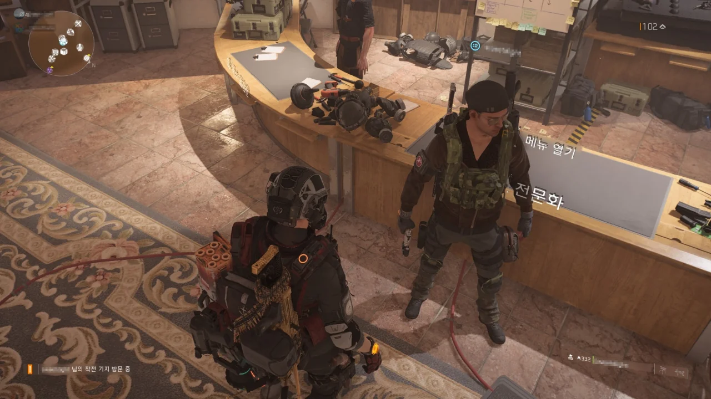

친구를 얼른 뉴욕으로 보내버리기 위해 친구의 월드 랭크를 신속하게 올리고 있다.

문제는 너무 빨리 올리려고 한 것인지, 3시간도 채 되지 않았음에도 피로를 호소한다는 것이다.

어쩔 수 없이 '다음에 마저 하자'라며 작별을 고했다.

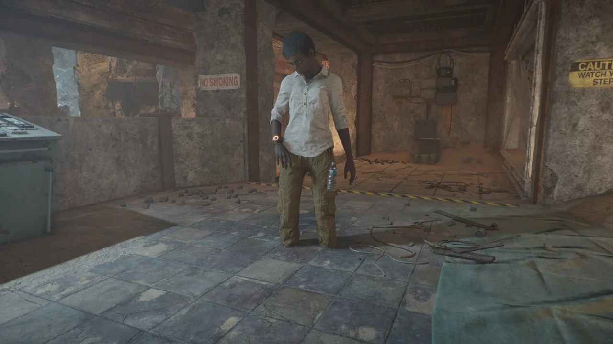

파밍을 위해 영웅 난이도로 연방 비상 방공호 임무를 돌던 중, NPC의 발이 바닥에 파묻힌 채 돌아다니는 것을 발견했다.

이런 버그는 인제 그만 볼 때도 된 것 같은데...

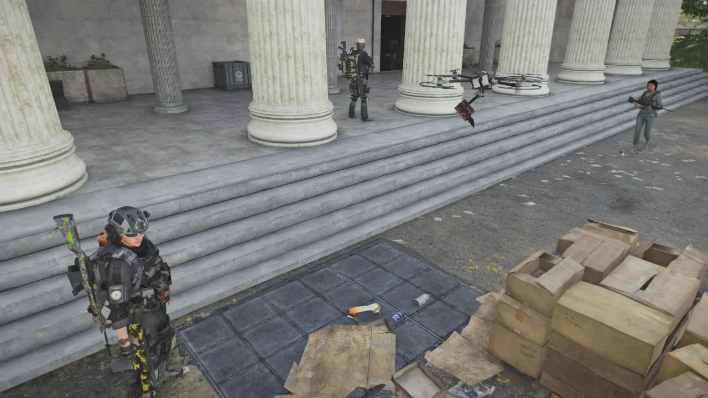

새 확장팩이 나오고 나서 드론에 이상한 버그가 생겼다.

내 시야 바깥에서 드론이 죽으면 드론이 부서진 채 바닥에 떨어지지 않고 멀쩡한 모습 그대로 공중에 남는다.

문제는 이 공중에 남은 드론이 총탄까지 막는다는 점이다.

이미 시체인 녀석이 죽지도 않고 총탄을 막으니, 불편한 것이 보통 불편한 것이 아니다.

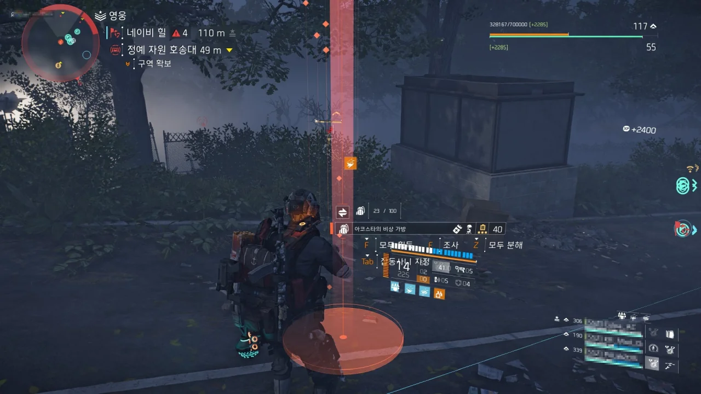

파밍 중 연 아웃캐스트 상자에서 '아코스타의 비상 가방' 특급 가방이 나왔다.

내가 갖고 있던 것보다 수치가 약간 낮기에 파티원에게 '이거 쓸 사람 있나요?'라고 물었는데, 다른 분이 아직 아코스타가 없었던 것인지 냉큼 가져가셨다.

이것이 바로 파티 플레이의 장점이다. 서로가 필요한 템을 주고받을 수 있으니까.

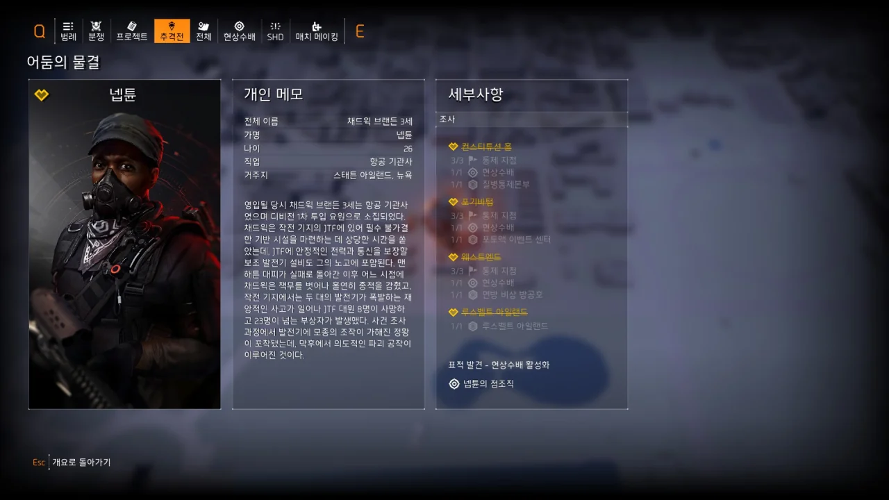

이번 주 추격전의 목표인 넵튠 사살 역시 같이 파밍 하던 분들의 도움 덕분에 영웅 난이도로 완료할 수 있었다.

사실 파밍이 끝나고 파티가 해산된 후 따로 넵튠 영웅 난이도를 할 사람을 구하려 했는데, 같이 파밍 하던 분들이 '그럼 지금 같이 갈래요?'라고 해주셔서 매우 수월하게 추격전을 끝낼 수 있었다.

지금껏 영웅 난이도로 추격전을 하다가 강력한 적에게 무참히 썰려 맨 처음으로 돌아갈 때마다 '내가 왜 이 고생을 사서 하는 거지?'라고 생각한 적이 한두 번이 아니었다.

그렇다고 난이도를 바꾸면 추격전이 완전히 초기화되기 때문에 이제 와서 난이도를 낮출 수도 없었고.

이제 알겠다. 그냥 남은 추격전도 파티 플레이로 끝내자.

***

네 명이 함께 영웅 난이도로 파밍을 하던 중 전설 난이도에 관해 이야기하게 되었다.

그 발단은 파밍 중 다른 클랜원 넷이 모여 전설에 도전하는 것을 발견한 것이었다.

"저 파티는 전설을 가네... 우리도 가고 싶다..."

"그러면 디스트릭트 유니언 경기장 임무를 전설 난이도로 해서 입구에서 맛만 한 번 볼까요?"

대충 이런 식으로 우리도 얼렁뚱땅 전설 난이도에 도전을 하게 되었다.

&nbsp;

경기장 앞마당에서 화이트 터스크를 죽이다 보니 다들 '어? 이거 왠지 할만한데?'라는 생각을 하게 되었고, 거기서 그대로 쭉 밀고 들어가니 어느새 보스 방 앞에 도착해 있었다.

그곳까지 갈 동안 그저 채팅으로만 의사소통했음을 생각해 보면, 이는 꽤 대단한 일이었다.

&nbsp;

보스 방 앞에서 다들 전열을 가다듬을 때, 그룹원 중 한 명이 "우리 이럴 게 아니라 디스코드로 대화하면서 하죠"라고 말했고, 그제야 우리는 디스코드를 켰다.

&nbsp;

하지만 전설 보스의 벽은 우리의 생각보다 높았다.

아무리 도전해도 보스를 잡을 수 없었고, 그래서 우리는 클랜 내에서 최초로 모든 전설 난이도 임무를 완료한 파티원 중 한 명이었던 탈모님에게 도움을 요청했다.

탈모님이 우리 그룹에 들어올 수는 없었기에, 내가 디스코드로 방송을 켜고 탈모님이 그걸 보면서 우리에게 '여기서는 이렇게 하면 좋다', '지금 상황이 이러이러하니까 저렇게 해라'와 같은 지시를 내리는, 탈모님 표현대로라면 '지통실 모드'로 도움을 주셨다.

&nbsp;

이후 탈모님의 지휘 덕분에 우리는 디스트릭트 유니언 경기장 전설 임무를 무사히 완료할 수 있었다.

사진을 찍어둘 걸 그랬다. 처음으로 전설 임무를 끝냈다는 것이 너무 기쁜 나머지 사진을 찍을 생각을 전혀 하지 못했거든.

&nbsp;

&nbsp;

그다음은 국회의사당이었다.

여기도 때로는 방어적으로, 때로는 공격적으로 나가며 단 한 번의 전멸도 없이 보스 방 앞까지 도착했다. 이게 바로 기적이지.

어려운 것으로 악명이 높은 국회의사당의 보스는 크스님의 방송에서 본 것을 따라 하기로 했다. 바로 이탈 방지의 법칙이 제대로 적용되지 않아, 일반적으로 플레이어가 가서는 안 되는 곳으로 가 거기서 농성하는 것이다.

다만 거기서 어떻게 해야 그곳으로 갈 수 있는지를 알지 못해 몇 번이고 죽어 나간 끝에 또다시 탈모님에게 도움을 요청했다.

&nbsp;

우리가 취한 전술은 그야말로 '니가와' 전법 그대로였다. 몹이 우리에게 가까이 다가오지 않으면 우리를 쏠 수 없는 곳에 숨은 채, 몹이 우리를 쏘기 위해 가까이 오자마자 집중포화를 쏟아부어 몹을 하나하나 제거하는 전법이었다.

이를 위해 우리는 EMP 수류탄, 속박 캠런처 등 적을 묶어둘 수 있는 스킬을 들기까지 했다.

그야말로 온몸을 비틀며 클리어한 것이다.

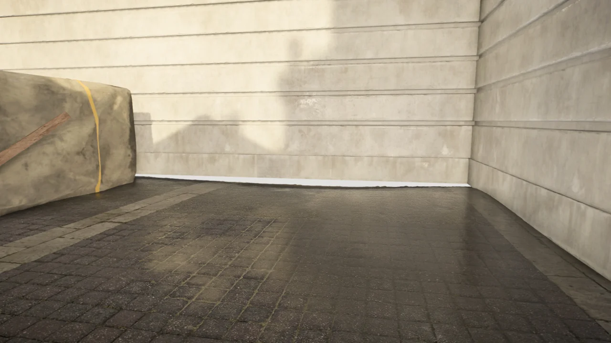

우리가 숨었던 곳이다.

일반적으로 플레이어가 이곳을 볼 일이 없기 때문에, 맵에 생긴 빈틈이 그대로 방치되어 있다.

저 틈 사이로 보이는 것은 스카이박스, 그러니까 하늘이다.

&nbsp;

아까 탈모님에게 도움을 처음 요청했을 때 켠 방송을 끄지 않고 있었기 때문에, 우리가 전설을 하는 것을 본 다른 클랜원들이 하나둘 '뭐야? 뭐야?' 하면서 음성 채널로 들어왔다.

그리고 우리가 어떻게든 전멸만은 면하기 위해 몸을 이리저리 비틀며 힘겹게 진행하는 것을 보고 다들 한마디씩 도움이 되는 정보를 건네주었다. 그게 매우 많은 도움이 되었다.

예를 들면 국회의사당 앞마당을 정리한 이후 세 개의 철망 문 중 가운데 문을 여는 것이 제일 효율적이라는 정보 같은 것 말이다.

반대로 우리가 어떻게든 적에게 맞지 않기 위해 문 뒤에서 머리만 빼꼼 내밀고 쏘는 것을 보고 "오, 우리도 앞으로 이렇게 하면 되겠다"라며 우리 나름의 전술에 대해 감탄하기도 했다.

&nbsp;

국회의사당에서 제일 도움이 된 무기는 바로 달콤한 꿈이었다. 15초마다 베테랑 이하의 몹을 근접 공격 한 방으로 처리할 수 있다는 것이 매우 큰 도움이 되었다.

고마워요, 달꿈맨!

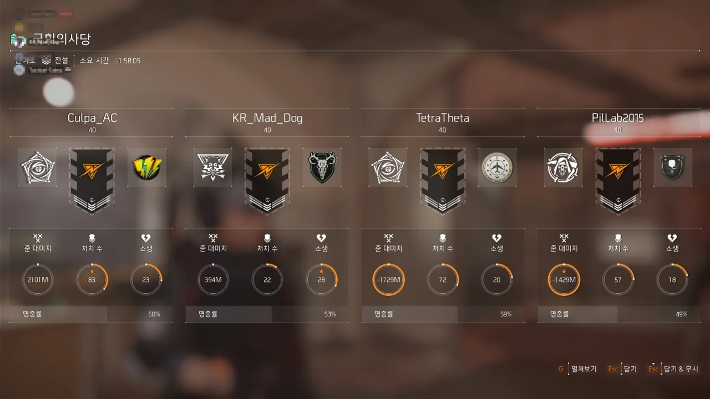

디스트릭트 유니언 경기장보다 더 고생한 것 같은 국회의사당이지만, 시간은 오히려 1시간 더 적게 걸렸다. 내 기억이 맞는다면 우리가 디스트릭트 유니언 경기장에서 쓴 시간이 약 3시간이었거든.

확실히 전설 임무를 할 줄 아는 사람이 옆에 있는 것과 없는 것은 큰 차이를 불러온다.

경기장은 우리끼리 고생하다가 마지막 보스 방에 가서야 도움을 요청했고, 국회의사당도... 어라, 국회의사당도 똑같은데...?

아무튼 도움이 되었다.

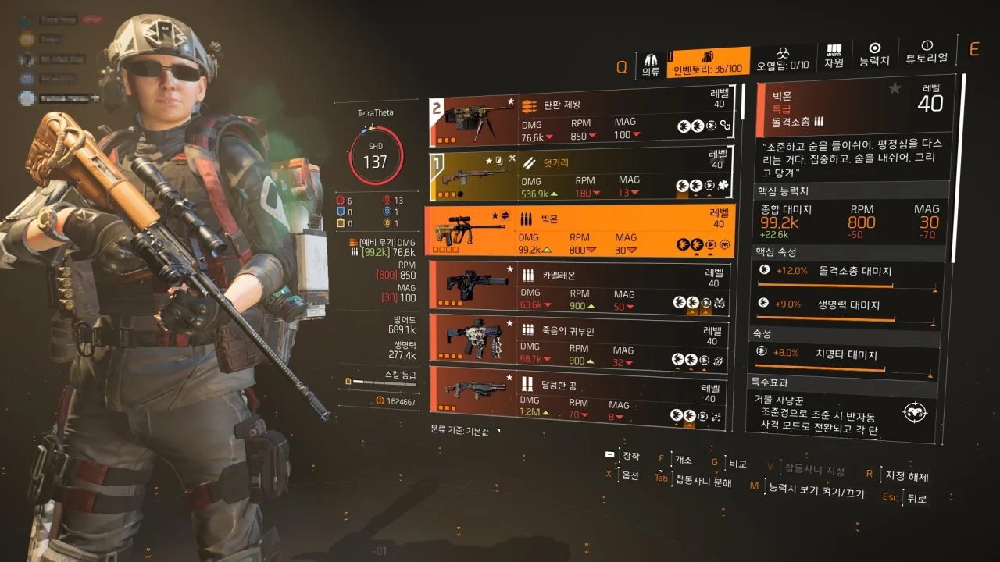

루스벨트 아일랜드의 보스, 쿼드콥터가 내게 선물한 '빅혼' 돌격 소총 되시겠다. 무려 전설 난이도에서만 나오는 특급 돌격 소총이다.

마침 우리를 '지통실 모드'로 도와주시던 탈모님이 말씀하시길, 본인도 빅혼을 얻었으나 크스님과의 가위바위보에 져서 본인이 얻은 빅혼을 '강탈'당했다고 한다.

그것 때문에 내가 빅혼을 얻은 걸 보고 "뭐야 XX 나도 줘요"라고 말씀하시더라.

&nbsp;

아무튼 좋았다.

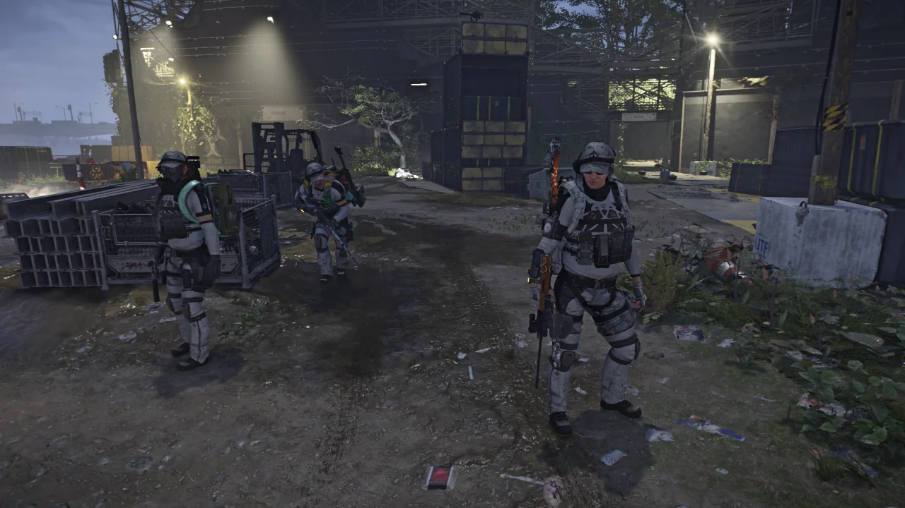

디스트릭트 유니언 경기장, 국회의사당, 루스벨트 아일랜드 세 전설 임무를 모두 완료하고 그 보상으로 얻은 화이트 터스크 의상을 즉시 입어보았다.

화이트 터스크 의상이 너무 멋져서 이걸 꼭 입어보고 싶었는데, 소원 성취했다.

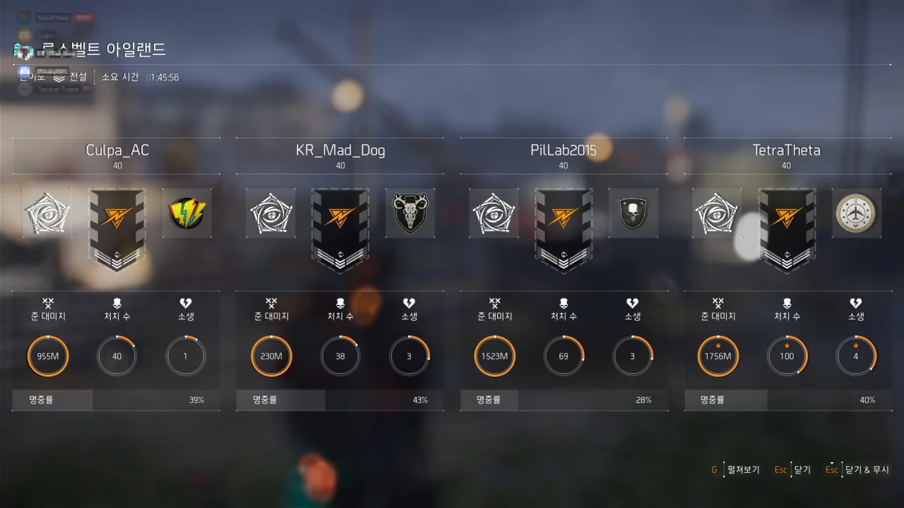

루스벨트 아일랜드에서 걸린 시간은 국회의사당과 비슷했다.

***



같이 전설 임무에 도전했던 쿨파님이 삽질 버그에 걸려 감정 표현 도중 자꾸 삽질하고 있다.

모션 버그 때문에 신호탄 막대기가 공중에 붕 떠있다.

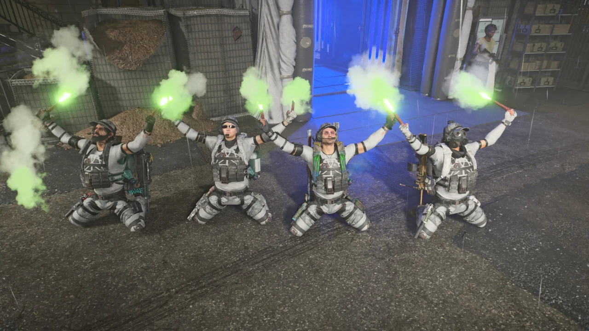

나름 괜찮게 사진이 나왔다.

그나저나 분명 사진을 찍을 때는 정중앙에서 사진을 찍고 있다고 생각했는데, 지금 글을 쓰며 다시 보니 약간 왼쪽으로 치우쳤다.

***



* 디스트릭트 유니언 경기장 (전설): 2시간 51분 23초
* 국회의사당 (전설): 1시간 33분 11초
* 루스벨트 아일랜드 (전설): 1시간 48분 43초

&nbsp;

여러분은 지금 찍먹이 부먹이 되고 퍼먹이 되어 6시간 동안 꼬박 밤을 새워버린 사람들을 보고 있습니다.

'전설 찍먹해볼까요?'가 전설 올 클리어가 될 줄은 나도 몰랐지.
