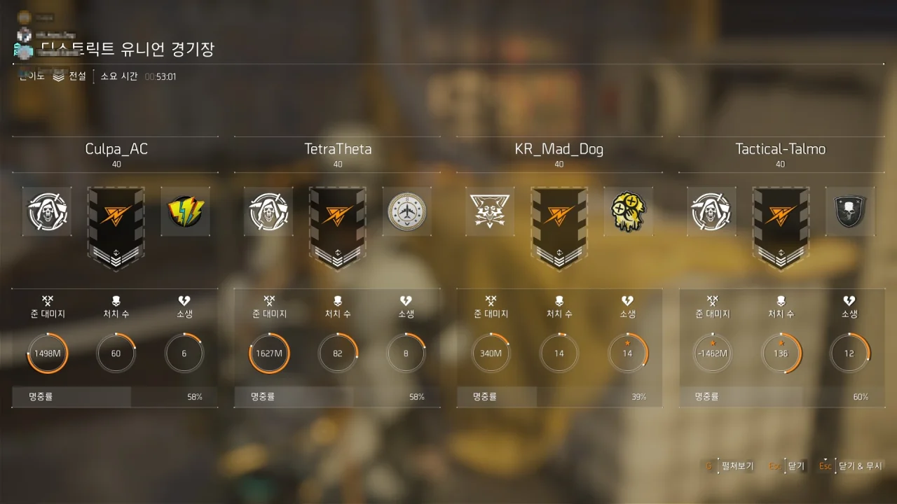
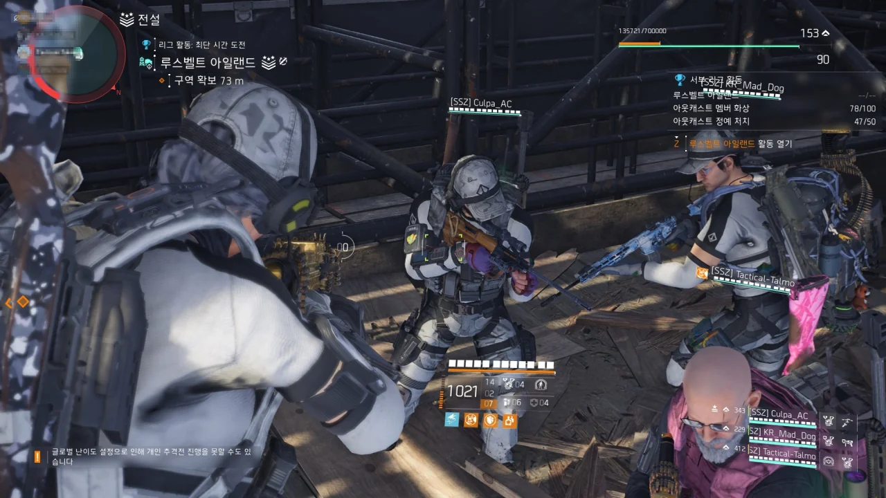
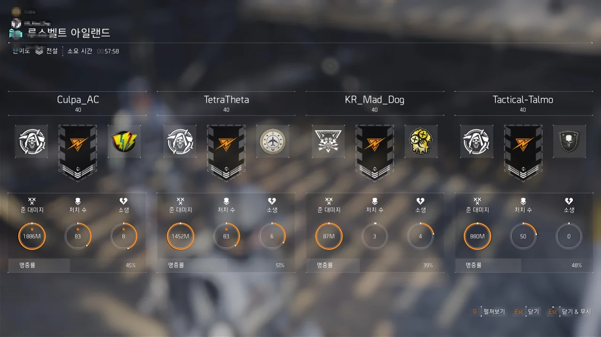
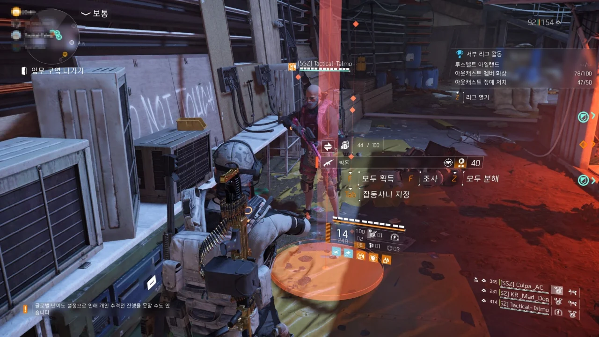
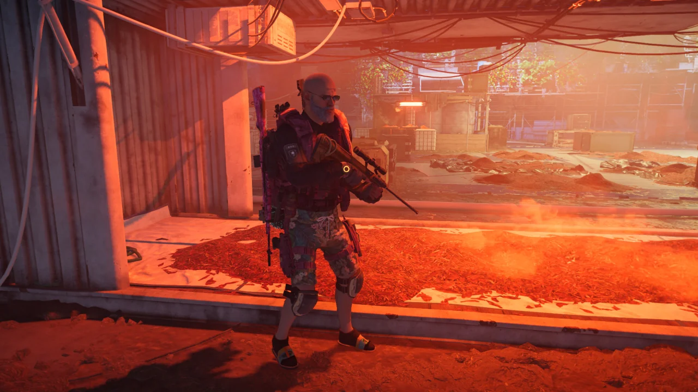
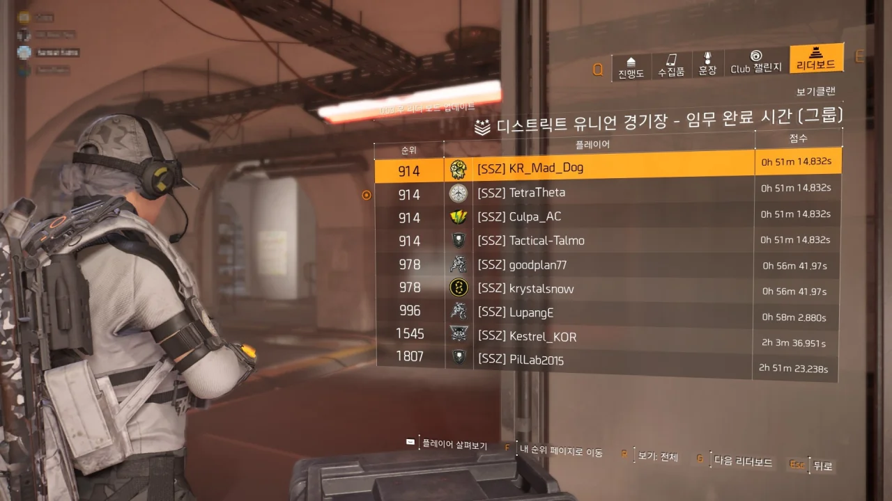
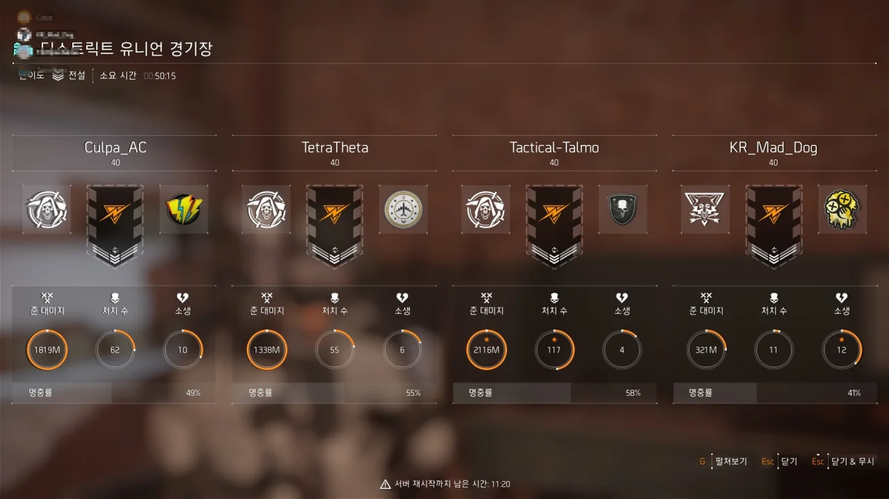
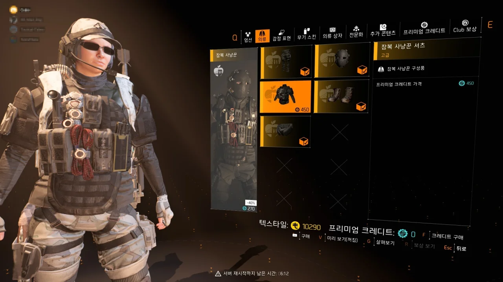

오늘은 시즌 2주 차가 되는 날이다.

'리그'라는 것이 새로 생겼는데, 임무 몇 개를 특정 난이도로 설정한 후 거기서 스피드런을 하거나, 아웃캐스트 정예를 많이 잡거나, 아웃캐스트를 불로 태우는 등의 활동을 통해 점수를 쌓는 활동이다.

&nbsp;

새로 나온 리그를 맛있게 뜯어 먹던 중, 뜻밖의 정보가 들어왔다.

글로벌 난이도를 보통으로 설정한 후 전설 임무를 하면 등장하는 몹이 보통 난이도로 나온다는 것이었다.

이걸 어떻게 참을까? 리그를 같이 하던 네 명은 곧바로 디스트릭트 유니언 경기장으로 향했다.

&nbsp;

결론부터 말하자면, 오보였다.

하지만 오늘 있었던 약 2.11GB의 패치에서 몹의 난이도를 조정하는 패치가 있었던 것인지, 전설에서 나오는 몹이 조금 약해졌다.

몹의 체력이나 공격력이 약간 낮아져, 영웅 난이도를 완료할 수 있는 파티라면 전설 임무 공략을 숙지했다는 가정하에 큰 문제 없이 전설 임무도 완료할 수 있을 정도의 수준으로 난이도가 낮아진 것 같다.

그 증거라면 증거랄까, 분명 저번에 2시간 51분 만에 완료한 디스트릭트 유니언 경기장을 이번엔 53분 만에 완료했다.

전설 임무를 1시간도 채 안 되는 시간 만에 완료할 수 있다는 것이 굉장히 대단해 보인다.

경기장을 완료한 후, 루스벨트 아일랜드에 갔다. 모든 적을 다 죽이는 게 아니라 보스만 죽이고 도망칠 계획이었다.

몹이 이전보다 덜 단단해졌기 때문에 이번엔 벽 너머에서 돌돌이를 굴려 적을 죽이는 방법이 아니라 그냥 냅다 벽 너머로 건너가서 적을 죽이는 방식을 취했다.

그리고 쿼드콥터를 터트리자마자 쿨파님이 빅혼을 드셨다. 이렇게 되면 파티 내에서 두 번째로 빅혼을 드신 것이 된다.

같이 하던 탈모님과 매드독님은 원인불명의 복통을 호소했다.

분명 우리는 보스만 죽이고 도망칠 생각으로 보스만 일점사한 것이었는데, 어째서인지 임무 결과 창이 뜬다.

아직 임무가 끝난 것이 아님에도 불구하고 소요 시간이 나타난다.

여기까지 오는 데 57분이라... 굉장한 시간 단축이다. 약 2/3 정도로 줄어들었으니.

루스벨트 아일랜드는 반복 파밍에 부적합하다고 생각해 경기장을 한 번 더 돌기로 했다.

그런데 경기장 마지막에 내게 또다시 빅혼이 나타났다.

&nbsp;

저번 주 금요일 크스님에게 빅혼을 '강탈'당한 후 빅혼을 볼 때마다, 전설 보스가 빅혼이 아닌 다른 특급 장비를 떨어트릴 때마다 원인불명의 고통을 호소했던 탈모님에게 빅혼을 드렸다.

&nbsp;

탈모님에게 디비전 장비 세팅부터 시작해 많은 도움을 받았기에 작게나마 은혜 갚기를 한 셈이다.

당장 기어 2.0 이전에 내가 쓰던 광분 클러치 세팅은 무기, 방어구, 모듈까지 모두 하나하나 탈모님과 임무를 돌면서 탈모님이 주신 아이템으로 맞춘 것이었다.

지금 입고 있는 딜러 세팅 역시 탈모님의 조언과 나눔 덕분임을 생각하면 탈모님께 빅혼을 드리는 것이 맞는다고 생각했다.

&nbsp;

물론 매드독님도 빅혼이 없는 것은 매한가지였지만, 아무래도 탈모님에게 먼저 드리는 것이 맞는 일이라 생각해 탈모님에게 빅혼을 드렸다.

매드독님 것은 다음에 곧 나오겠지...

&nbsp;

&nbsp;

&nbsp;

... 그렇게 생각하던 때가 제게도 있었습니다.

그다음 판부터는 나오는 아이템들이 죄다 노란색이더라.

아무튼, 빅혼을 자랑스럽게 들고 계신 탈모님의 모습이다.

아니, 왜 우리가 클랜 내 클리어 시간이 제일 짧은 거지?

분명 며칠 자고 나면 다른 사람에게 추월당할 기록이겠지만, 뿌듯한 것은 어쩔 수 없다.

또다시 경기장으로 출발하려는 찰나, 화면 하단에 '서버 재시작까지 남은 시간 59:00'이라는 메시지가 나타난 것을 본 우리는 '이거 막판으로 하고 끝내죠'라고 합의했다.

마지막으로 우리가 경기장 전설 임무를 완료하는 데 걸린 시간은 50분 15초.

주차장에서 우리가 조금만 더 적게 누웠다면 이보다 더 짧은 시간으로 임무를 끝낼 수 있었을 텐데...

열쇠 23개를 전부 의류 상자에 털어 넣었는데 이 망할 헌터 상의가 나오지 않는다. 지금 저 헌터 상의만 없는 상태인데!

아니다. 헌터 의상보다는 화이트 터스크 의상이 상징하는 의미가 더 크기 때문에, 헌터 상의가 나온다고 하더라도 한동안은 계속 화이트 터스크 의상을 입고 다닐지도 모르겠다.
