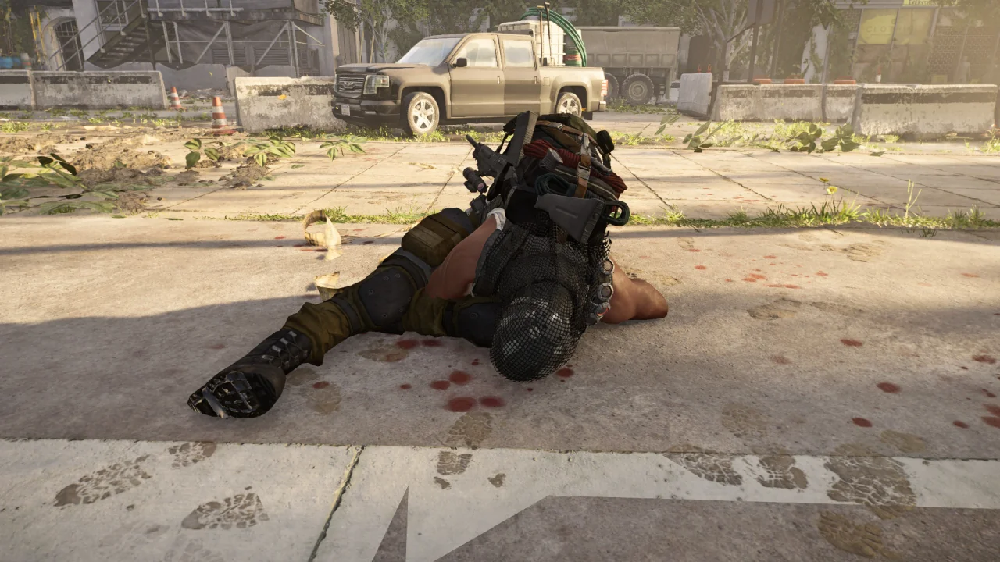
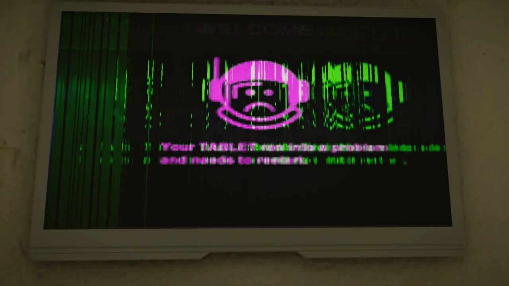

다시 클랜원끼리 힘을 뭉쳐 디스트릭트 유니언 경기장 전설에 도전했다.

3시간을 찍은 처음과 달리 43분이라는 고무적인 기록을 경신할 수 있었다.

&nbsp;

'전설 맛만 좀 볼까요'가 전설 올 클리어가 되어버렸던 그때와 비교하면 정말 감개무량할 따름이다.

그렇게 빅혼 파밍을 위해 몇 번이고 경기장을 돌던 중, 한 사람이 테이블에 몸이 끼어버렸다.

대체 거기에 어떻게 들어간 것이냐고 물으니, 그냥 테이블에 몸을 비비다 보니 테이블 위로 올라갈 수 있었고, 테이블 위로 올라가니까 몸이 테이블에 끼어버렸다고 한다.

&nbsp;

뭐야, 그게... 무서워...

***

이 아래는 흔히 '쇠질' 혹은 '헬스'라고 불리는, 플레이어의 총기 대미지가 비정상적으로 늘어나는 글리치를 사용하면서 찍은 사진이다.

만약 해당 글리치 사용이 불편하다면 다음 내용을 보지 않는 것을 권유한다.



나는 다른 사람에게 악영향을 끼치지만 않는다면 글리치의 사용 여부는 개인의 영역이라고 생각한다. 그렇기에 나는 그룹의 모든 인원이 쇠질에 동의할 때만 쇠질을 했으며, 모르는 사람이 있을 때는 쇠질을 하지 않았다.

&nbsp;

나만 글리치 사용을 긍정적으로 생각했다면 모를까, 이번에는 서로 앙숙처럼 으르렁대는 두 사이트인 R모 사이트와 D모 사이트 양쪽 모두에서 쇠질에 대해 긍정적으로 평가하는 글이 넘쳐나더라.

글리치를 사용한 채 레이드를 돌았다. 첫 번째 네임드가 있는 곳에 미니건에 두 대가 있기 때문에 가능한 일이었다.

보통 난이도에서 열쇠를 무한히 얻을 수 있는 글리치는 이번 글리치가 알려지기 전에도 이미 널리 알려져 있던 글리치였지만, 아직도 수정되지 않은 글리치이다.

&nbsp;

두 번째 네임드는 정말 순식간에 끝나버렸다.

A 지역에 두 명, B 지역에 여섯 명이 들어가서 스위치를 조작해 위즐의 두 부하를 소환한 후, 창문을 향해 달려오는 그들에게 무수한 총탄으로 따뜻한 환영 인사를 해준다.

그러면 그들은 창문을 깨자마자 죽어버린다.

&nbsp;

위즐 역시 크게 다르지 않다. 다만 위즐은 두 부하보다 체력이 조금 더 많기 때문에, 바닥으로 떨어지는 도중 죽어버린다.

하지만 위즐을 너무 빨리 죽여버리면 위즐이 떨어트린 아이템이 이렇게 공중에 붕 뜨게 된다.

즉, 너무 높은 곳에서 죽여버리면 보스가 떨어트린 아이템을 먹지 못하게 되는 것이다.

&nbsp;

이 경우에는 다행스럽게도 위즐이 떨어트린 아이템을 얻을 수 있었다.

하지만 이 경우에는 위즐을 너무 빨리 죽여 아이템을 얻을 수 없었다.

분명 전부 구린 아이템이었을 것이다.

며칠 전까지만 해도 공포의 대상이었던 화이트 터스크는 헬리콥터에서 나타나자마자 총에 맞고 죽어 땅바닥에 추락하는 신세가 되고 말았다.

이렇게 무수히 쌓인 시쳇더미는 정말 오랜만에 보는 광경이다.

무구님이 오셨기에 '한번 전설 돌아볼래요?'라며 꼬셨다.

그리고 화이트 터스크 의상을 준다는 핑계로 전설 3종을 전부 돌았다.

놀랍게도 무구님은 여기서 곧바로 빅혼을 얻어가셨다. 내게 빅혼이 나왔는데, 갖고 있던 것보다 속성이 0.5% 정도밖에 더 좋지 않아 그냥 무구님에게 드렸다.

이렇게 국회의사당에서 스폰킬을 하는 것이 대체 얼마 만인지... 이렇게 쌓인 시체를 보면 그저 쓴웃음밖에 나오지 않는다.

이런 광경은 글리치 없이는 앞으로 절대 보지 못할 테니까.

하이에나 상자를 열었더니 아코스타의 비상 가방이 나왔다. 내가 갖고 있던 것보다 수치가 조금 낮아 무구님에게 혹시 아코스타가 필요하냐고 물어보았다.

무구님은 자신이 갖고 있던 것보다 수치가 좋다며 가져가셨다.

오늘 새로운 발견을 했다.

그랜드 워싱턴 호텔에서 세인트가 나타나자마자 막대한 양의 대미지를 주면 세인트가 그대로 바닥에 엎드려 배를 부여잡고 헉헉댄다.

저 상태에서의 세인트는 무적이다. 체력이 존재는 하지만 체력이 0이 되는 순간 다시 체력이 완벽히 회복된다. 마치 사격장에 있는 무적 과녁판을 쏘는 느낌이다.

내가 보스 방에서 세인트를 보았는지 잘 기억나지 않는다. 왜냐면 옥상에서 내려온 후에도 세인트는 여기 엎드려서 여전히 헉헉대고 있었거든.

너무나도 편안히 탄약 상자 위에 앉아있는 화이트 터스크를 본 나는 사진을 찍지 않으면 안 된다는 충동에 사로잡혔다.

아직 확장팩을 사지 못해 30레벨인 사람을 돕고자 세션을 옮겼다. 글리치는 세션을 옮기면 사라지기 때문에, 다시 원래대로의 디비전으로 돌아간 셈이다.

그리고 글리치를 남용한 부작용을 곧바로 경험했다. 조금 전까지 하던 대로 플레이하니 곧바로 죽어버린다. 그야 플레이어의 대미지는 더 이상 막강하지 않으니까 당연한 일이다.

&nbsp;

이후 계속 플레이하다 보니 멀쩡히 표시되고 있던 텍스처와 모델이 사라져 버렸다. 죽었다 부활하니 다시 정상적으로 표시되긴 했지만, 컴퓨터에 무슨 문제가 생긴 것 같아 재부팅까지 했다.



헌터를 찾아 워싱턴 전역을 돌아다녔다. 일단 현재까지 공개된 워싱턴 헌터 다섯 마리를 전부 찾았다.

헌터를 잡는 것은 다른 사람과 함께 해서 그런지 그렇게 어렵지 않았다. 분명 혼자 할 때는 강적이었는데...

헌터를 소환하기 위한 퍼즐을 진행하던 와중 발견한 의미불명의 화면. 대체 무슨 뜻의 문장일까?

마지막 헌터를 소환하기 위해 스위치를 찾던 중, 몸이 바닥의 철판을 통과하는 현상을 발견했다.

나뿐만 아니라 무구님 역시 같은 현상을 겪는 것으로 보아, 또 다른 지형 버그인 것으로 추측된다.
