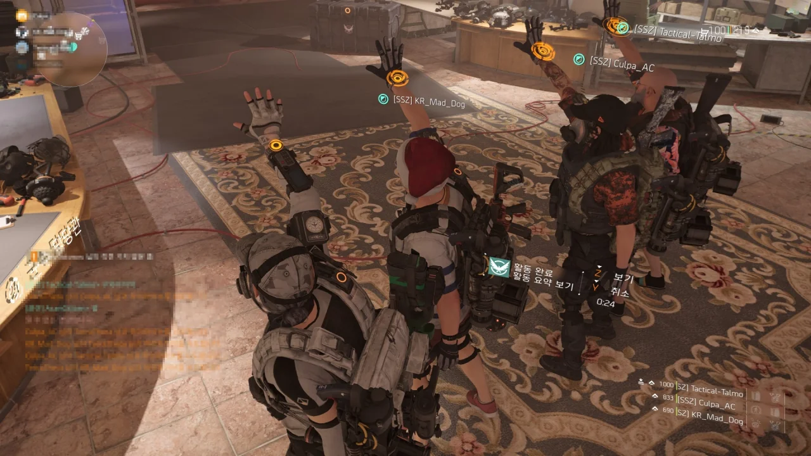
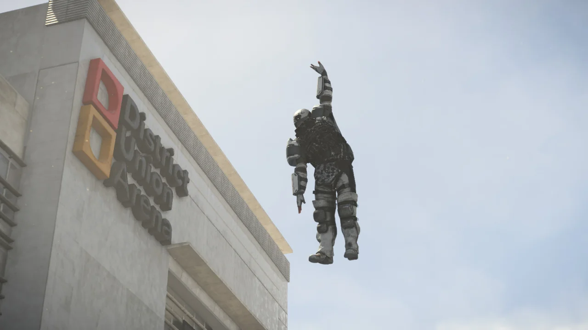
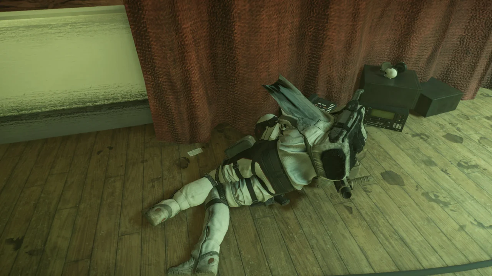
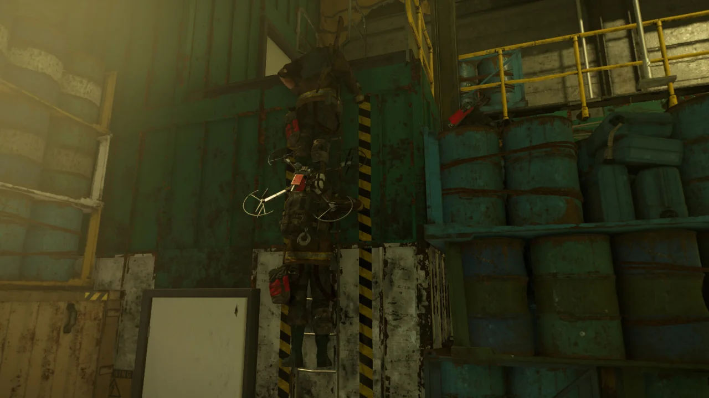
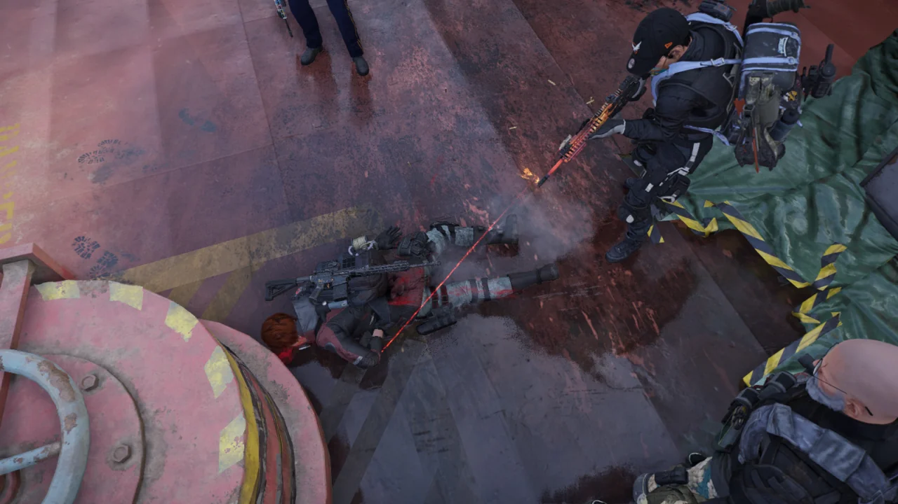

이번에도 역시 글리치와 관련한 글이다.

***

일단 지금으로선 글리치가 완전히 막힌 것 같다.

매시브가 글리치를 실행하는 방법을 막으면 이용자들이 다른 방법을 찾고, 매시브가 그것조차 막으면 또 다른 방법을 찾아내는 식으로 창과 방패의 싸움이 반복되었는데, 매시브가 기발한 방법으로 글리치를 막음으로써 쇠질 글리치는 막을 내리게 되었다.

&nbsp;

지금까지의 글리치 실행 방법은 '미니건을 쥔 상태에서 인벤토리를 연 후 장착 중인 아이템을 교체'하는 방식이었다.

여기에 대해 매시브는 두 가지 대응을 했다.

첫 번째. '미니건을 쥔 상태에서는 인벤토리를 열어 로드아웃을 바꿀 수 없음'이다.

두 번째. '미니건을 쥔 상태에서 장착한 아이템을 변경하면 DELTA 오류와 함께 클라이언트의 서버 연결을 강제로 종료시킨다'이다.

&nbsp;

첫 번째는 그렇다고 쳐도, 두 번째 방법은 글리치를 무식하게 막는 방법이다. 글리치를 막을 수 없으니 아예 클라이언트를 강제로 접속종료를 시키는 것이니까.

심지어 이건 공식 패치 노트에서도 'Please be aware that players will be disconnected when interacting with a mounted turret under certain circumstances.'라고 써두어, 이 DELTA 오류가 의도된 사항임을 밝혔다.

&nbsp;

뭐, 결과적으로는 잘된 일이기도 하다.

마지막에 발견된 글리치는 한번 죽었던 NPC가 다시 살아났다가 또다시 죽으면서 서버에 큰 무리를 줬으니까.

그런 구멍이 생기도록 여태껏 게임을 방치한 매시브도 전설이고, 아득바득 어떻게든 글리치를 실행할 방법을 찾아낸 이용자도 전설이다.

***

인제야 안 것인데, 시계 레벨이 있는 캐릭터의 시계는 빛이 난다.

그리고 그 시계에서 나오는 문양 같은 것은 시계 레벨이 높을수록 크고 아름다워진다.



쇠질을 통해 대미지를 올린 채 몹을 잡다 보니 이런 식으로 몹들이 헬리콥터에서 생성되자마자 죽어버려 저렇게 공중에 시체가 남기도 한다.

&nbsp;

이번에 유행한 것은 네크로런이었다.

이게 무슨 말이냐고? 죽은 NPC의 시체에 대고 총을 쏘면 NPC가 다시 살아나고, 거기에 총을 또 쏘면 NPC가 죽는다!

마치 네크로맨서가 시체를 되살리는 모습과 비슷하다 하여 네크로런이라는 이름이 붙게 되었다.

&nbsp;

그 원리도 알고 나면 상당히 어이가 없다.

무기에 붙는 특수 효과 중에는 '신중함'이라는 특수 효과가 있다.

탄창의 첫 절반의 발사 속도가 20% 상승하지만 대미지가 30% 하락하고, 나머지 절반의 발사 속도가 20% 하락하지만 대미지가 30% 상승하는 효과의 특수 효과이다.

그런데 이 특수 효과를 쇠질을 통해 중첩할 수 있는데, 이러면 무기 대미지의 증감 폭이 100%를 넘기게 된다.

-100%가 넘는 대미지를 적에게 줄 경우, 대미지가 마이너스 값으로 적에게 들어가게 된다. 이렇게 될 경우, 시스템은 적의 체력이 회복되었다고 판단하게 된다. 그러면 적이 '짜잔' 하고 되살아나는 것이다.

자세한 것은 나도 직접 해보지 않아 잘 모르겠다. 하지만 저 기본 원리를 듣기만 했음에도 불구하고 어이가 하늘 높이 날아가는 기분이었다.

디비전이 똥겜인 건 진작에 알고 있었지만, 이 정도였다고?



그다음은 광란의 네크로런이었다.

첫 번째 사진은 코요테 한 마리가 뱉은 아이템이고, 두 번째 사진은 카지카가 뱉은 아이템이다.

사람들이 나중에 가니까 '어떻게 해야 최대한 짧은 시간에 몹을 죽이고 살릴까?'를 연구하더라.

그 결과, ACS 샷건이 미친 듯이 납탄을 내뿜으면 보스가 그걸 맞고 죽었다 살아나는 것을 영원히 반복하게 되는 상황이 만들어졌다.

&nbsp;

이건 미쳤다.



아까 말했다시피, 이건 적의 종류를 가리지 않는다. 이 말인즉슨 블랙 터스크의 투견, 레이드 보스인 레이저백 역시 이와 같은 글리치의 대상이 될 수 있다는 말이다. 필드 보스 역시 예외는 아니고.

언뜻 듣기로는 진짜로 레이저백에 글리치가 적용된 ACS 샷건을 잔뜩 쏴 레이저백이 죽었다 살아나는 기괴한 장면을 연출한 사람이 있다고 한다.

헬리콥터에서 나타나자마자 ACS를 비롯한 수많은 탄환의 세례를 맞고 넝마 짝이 되어버린 화이트 터스크 중갑병이다.

***

결국 어찌 되었든 간에, 이용자들 입장에서는 2주일가량의 달콤한 꿈이었다.

그걸 즐겼던 무시했던 그저 한 때의 해프닝으로만 여겼으면 좋겠다.

&nbsp;

물론 글리치의 남용이 절대로 옳은 일은 아니기 때문에, 나중에 서로 '왜 그때 글리치 안 썼음? 바보임?'이나 '그때 글리치 왜 씀? 바보임?'이라는 말이 나오지 않기를 바랄 뿐이다.

글리치가 완전히 사라진 후, 다시 전설 요새에 도전해 보았다.

플레이하면서 '아, 내가 글리치를 통한 딜뻥에 너무 익숙해져 버렸구나'라는 것을 느꼈다. 이제 앞으로 딜뻥같은 건 없을 예정이니, 예전처럼 방 하나하나 조심스럽게 처리하는 방법을 다시 몸에 익혀야 한다.

&nbsp;

처음 전설 요새에 도전했을 때와 다르게 전술이 발전했다. 그 단적인 예가 원래 '북스'라는 네임드 하이에나 엔지니어를 처치하던 '백화점' 구역에서의 전술이다.

예전에는 백화점 입구 앞에 있는 컨테이너 안에서 '니가와'를 시전하며 다가오는 적만 죽이는 식으로 플레이했다면, 이제는 문을 열고 들어가자마자 왼쪽에 있는 건물의 계단으로 올라가 건물 2층에 진지를 구축하고 거기서 싸운다.

사람들의 장비 수준이 높아지니까 가능한 일이었다.

예전처럼 다시 우스꽝스럽게 죽은 시체 사진을 찍기 시작했다.

좌초된 유조선 임무를 영웅 난이도로 하던 중 찍었다.

예전에 비비안 콘리의 시체가 남았을 때는 콘리가 자폭할 새도 없이 콘리를 죽여서 시체가 온전히 남았다고 생각했었다. 하지만 오늘 다시 콘리를 잡아보니 아니었다.

분명 콘리가 "으아아아~!"라고 외치며 자폭하는 것을 눈앞에서 봤는데, 콘리의 시체가 멀쩡히 남아있다.

&nbsp;

그리고 내가 예전에 말했던 대로, 콘리의 시체를 쏘며 노는 사람이 있었다. 거 봐. 내 말이 맞지?
