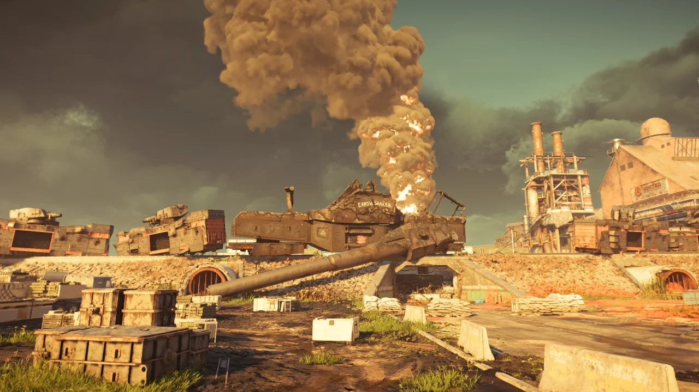

철마 레이드가 나온 지 50시간 만에 처음으로 깼다. 와...

레이드를 하면서 제일 퍼즐이 어려웠던 곳은 두 번째 네임드였다.

다른 사람들은 지통실 암호를 말하기가 어렵다고 말하지만, 적어도 나에게 있어 지통실 암호 부르는 역할이 제일 쉬워 보였다.

다른 역할은 너무 어려워 보인다.

* 내부조: 난 화염 저항 빌드가 없다.
* ABC조: 몹을 잘 잡지 못한다. 몹을 잡는 와중에 물 밸브를 돌리고 RPG를 배달할 자신이 없다.
* 로밍: 몹도 잘 잡지 못하는데 무슨 로밍인가. 몹에게 잡히지만 않으면 다행이다.

그에 비해 지통실 암호는 사람들이 불러주는 숫자에 대응하는 그림을 설명하고, 중간중간 나타나는 중갑병과 돌격병을 제거하고 물 펌프의 압력이 충분하면 밸브를 돌려주면 되는 간단한 역할이다.

지통실 위에 있는 에러 코드는 전혀 쓸모가 없었다. 중요한 것은 바로 이 이미지였다.

모니터에 나오는 아이콘은 이 도형들이 조합되어 나온다. 가령 '움직이는 빈 도가니 컨베이어 벨트'라던가 '빈 도가니 갈고리 각각 두 개씩' 이런 식으로 말이다. 이걸 불러주면 된다.

경력 있는 사람 5명이 경력 없는 사람 3명을 캐리해 철마 작전을 2시간 만에 완료했다.

내 생각에 두 번째 네임드와 세 번째 네임드에서 1시간 이상을 쓴 것 같다. 그 두 네임드는 너무 어려워...



마지막 네임드인 이 무장 열차는 생긴 것이 완전히 내 취향이다.

가운데에 있는 거대한 대포를 보면 구스타프 열차포가 생각난다.

&nbsp;

아아, 이 아름다운 무장 열차를 내 손으로 직접 부숴야 한다니... 정말 안타깝다.

하지만 이 무장 열차를 부수지 않으면 백악관이 날아가는걸.

오늘 탐식자를 먹은 사람, 어제 탐식자를 먹은 사람.

부럽다. 난 언제 탐식자를 얻을 수 있을까?

어스셰이커어어어어!!!!
