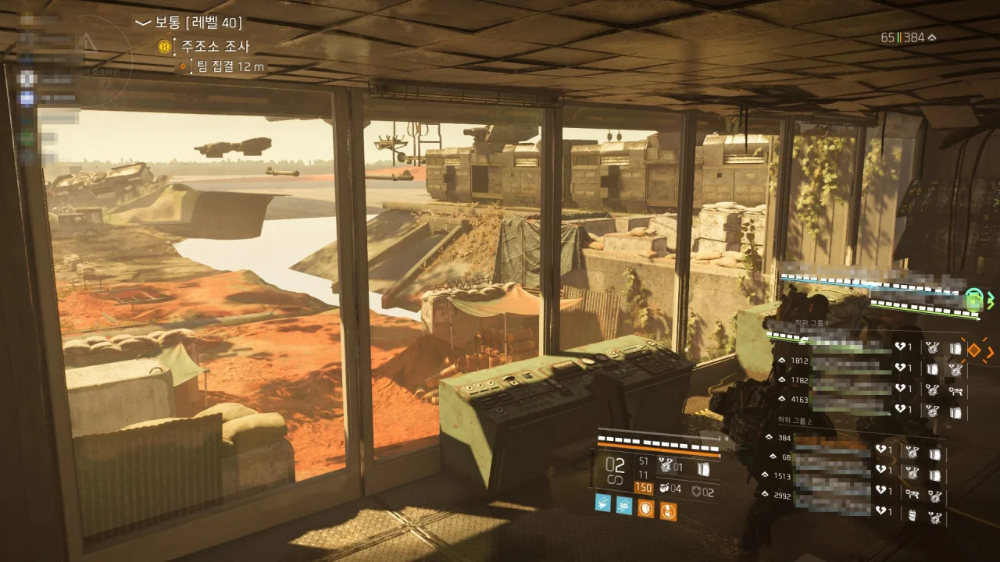

철마 작전을 직접 공격대를 파서 갔다가 호되게 혼나고 멘탈이 깨졌다.

하기야 공대장인 내가 모든 역할에 대한 공략과 각종 상황 대처법을 제대로 숙지하지 못하고 갔는데 공격대가 잘 굴러가면 그것이야말로 기적일 것이다.

두 번째 네임드가 그야말로 통곡의 벽이라고 할 수 있는데, 거기에서 제대로 앞이 막혔다.

&nbsp;

마지막에 '전반적인 딜 부족인 것 같아요'라는 말이 나오긴 했는데, 그런 것은 결국 다 공대장의 잘못으로 귀결되지 않은가?

그렇지 않아도 첫 번째 네임드 바로 직전에 디비전이 한번 튕기고 첫 번째 네임드 직후에는 컴퓨터가 블루스크린 때문에 강제로 꺼진 터라 멘탈에 심각한 타격을 입은 상태였기에, 그 말을 들은 내 멘탈은 그야말로 산산이 조각났다.

사람들이 계속 남은 시간이 없다고 말하는데 내가 그들의 시간을 잡아먹은 꼴이 되었으니.

&nbsp;

그래서 마음을 좀 추스를 겸, 그동안 쌓인 사진을 정리하기로 했다.

이번 레이드가 아닌 다른 사람이 공대장을 맡은 레이드를 갈 때, 출발하기를 기다리다가 우연히 백악관 허브에서 만난 다른 사람과 신호탄 감정 표현으로 삼각형을 만들었다.

별다른 이유는 없고, 그냥 재미있어서였다. 서로 일언반구도 없이 이렇게 삼각형을 만든 걸 보면 사람 사는 곳은 다 비슷한가 보다.

철마 작전에서 마지막 네임드와 싸우는 장소에는 한 번 들어가면 나오지 못하는 곳이 있다.

여기 이 공간 안에 들어가면 다시는 바깥으로 나올 수 없다. 레이드에 처음 온 사람을 낚아 가두기에 정말 좋은 곳이다.

&nbsp;

그 위에서 수류탄으로 자살했더니 내 시체의 상체가 그 공간에 처박혔다.

디비전이 게임 미만의 코드 덩어리라는 생각을 한 적은 많지만, 이번처럼 강하게 느낀 적은 별로 없을 것이다.

의류 상자를 여는데 위 사진처럼 '열기' 화면에서 화면이 멈추더니 잠시 후 '서버와 연결할 수 없습니다'라는 오류 메시지가 나타나며 상자 열기가 취소되었다.

디비전 1편을 할 때도 이런 식의 오류는 없었는데, 대체 디비전은 어떻게 된 것일까.

또 다른 레이드에서 갑자기 게임이 튕긴 사람을 기다리며...

이 사람은 윈도우 업데이트 때문에 게임이 튕겼으며, 윈도우 업데이트 때문에 게임을 다시 켜지도 못하고 있다. 오직 재부팅만이 그를 구원할 수 있는 것이다.

&nbsp;

진짜 윈도우 업데이트는 병신이 다 되었다.

윈도우 7까지만 해도 이런 문제가 없었는데, 유독 윈도우 10에서 윈도우 업데이트와 관련한 문제가 자주 발생하고 있다.

만약 윈도우가 백그라운드에서 업데이트를 준비한다면 높은 확률로 게임이 불안정해지거나 튕긴다.

만약 당신의 게임이 갑자기 바탕화면으로 튕기거나 버벅댄다면 게임을 끄고 새로운 윈도우 업데이트가 있는지 확인해 보라. 분명 새로운 업데이트가 있을 것이다.

새로운 업데이트가 있다면 마이크로소프트를 힘껏 욕한 후 업데이트를 완료하고 컴퓨터를 재부팅 하면 모든 문제가 해결될 것이다.

내 기억이 맞는다면 이런 문제는 윈도우 10에서 새로 생긴 것이다.

&nbsp;



&nbsp;



디시콘 중에 '아론 키너 저지'를 '아론 키너 지지'로 편집한 이미지가 있던 것으로 기억한다.

그것처럼 나도 '아론 키너 지지' 이미지를 만들기 위해 스크린샷을 찍어두었다.

&nbsp;

하지만 내가 이걸 과연 편집해서 쓸 날이 올까? 잘 모르겠다.

옛날에도 이런 식으로 사진을 일단 찍어놓고 결국 아무것도 안 하다가 사진을 지운 적이 있었거든.

철마 작전에서 제일 인상 깊은 것이 무엇이냐고 묻는다면 나는 단 한 치의 망설임도 없이 저 무장 열차를 고를 것이다. 너무 이쁘다.

&nbsp;

아래로 내려가기 전, 방 한쪽 구석에 있는 상자 위에 올라가면 이렇게 바깥 풍경이 망가진다.

제작진도 플레이어가 이런 각도로 바깥을 볼 것이라고 미처 생각하지 못한 모양이다.

불편한 건 절대 아니고, 그냥 재미있어서 찍었다.
