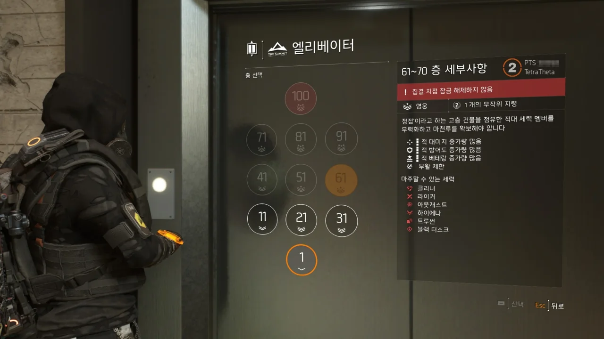

평소라면 '아, 테스트 서버는 무슨! 이런 건 전부 본 서버에 적용된 이후에나 의미 있지!'라고 생각하며 PTS를 시도해 볼 생각조차 하지 않았을 것이다.

하지만 디비전 2가 가면 갈수록 지루해지는 시점이라서 나에게는 새로운 자극이 필요했다.

그리고 이번 PTS에서 새로운 콘텐츠인 '마천루(가칭)'을 시험해 본다고 하였으니, 거절하지 않을 수 없었다.

오후 11시에 열린 PTS 서버는 들어가는 것부터가 고역이었다.

&nbsp;

유플레이에서 실행 버튼을 누르자 2초가량 백그라운드에서 뭔가를 하더니 그냥 픽하고 꺼져버린 클라이언트.

결국 재부팅까지 하고 나서야 제대로 실행이 되었다. 그리고 들어가 보니 이렇게 대기열이 날 반겨주고 있었다.

접속 이후에도 세션을 이동할 때마다 대기열에 빠져버리는 곤욕을 치렀다.



PTS는 테스트 서버인 만큼, 정식 서버와 별도로 플레이어 데이터를 관리한다.

PTS에서 쓰는 플레이어 데이터는 PTS가 열리기 얼마 전 정식 서버에서 복사한 플레이어 데이터를 활용한다.

&nbsp;

PTS가 끝나면 다시 삭제될 데이터이기 때문에, 이렇게 원하는 빌드를 이용해 보라는 의미에서 모든 수치가 꽉 찬 무기와 방어구를 말 그대로 퍼준다.

보라, 이것들이 전부 상점에서 1 크레딧에 파는 상자에서 나오는 것들이다.

누가 말하길, PTS에서 제일 곤욕인 것은 상자를 깔 때마다 하나하나 나오는 아이템들을 기다리는 것이라고 한다.

&nbsp;

여기서 모든 수치가 가득 찼다고 해서 그냥 그대로 써도 되는 것은 아니다. 영 엉뚱한 옵션이 붙어 있는 경우가 있기 때문에, 결국 보정을 해야 한다.

대체 왜 협상가에 스킬 가속이 붙어 있는 건데?

도시경찰님과 함께 최정상에 올랐다.

그렇다. '마천루(Skyscrapper)'라고 불리던 그 콘텐츠의 정식 명칭은 '최정상(The Summit)'이다.

차라리 원래 이름이 더 마음에 들었는데... '최정상'이라는 이름은 영, 입에 붙질 않는다.

아직 PTS라 그런 것인지, 몹들이 죽었는데 바닥에 쓰러지지 않고 선 채로 죽었다.

이때에는 그냥 '오 신기하네'라고 생각하며 지나쳤는데, 나중에 가보니 이런 일이 매우 자주 발생하더라.

옛 버릇 못 고치고 사진을 한 장 찍었다.

분명 아무것도 없던 벽이었는데, 총을 쏘자 파지직 하는 소리와 함께 없던 배전반이 갑자기 생겨났다.

배전반의 위치조차 벽을 뚫고 튀어나와 있다.

&nbsp;

본 서버에도 아주 극히 드물게 있던 일이긴 한데, 이렇게 갑작스럽게 나올 줄이야...

이 건물에는 층마다 별개의 난이도가 있으며, 이는 바깥의 난이도와 전혀 상관이 없다.

약 20층 단위로 난이도가 바뀐다.

* ~10층: 보통
* ~20층: 어려움
* ~50층: 매우 어려움
* ~80층: 영웅
* ~100층: 전설

물론 위로 올라갈수록 지령이 하나둘 붙기 때문에, 모든 층의 난이도가 같지는 않다.

층마다 나오는 적 세력도 정말 다양하다.

저기 쓰여있는 여섯 세력 말고도 언더그라운드나 라이오터도 출몰한다.

전설에서는 블랙 터스크 대신 화이트 터스크가 나오고.

광원 버그에 걸려 엘리베이터 안이 환하게 변했다.

다른 때에는 엘리베이터 안에 비가 주룩주룩 내리기도 했다.

이런 버그는 오픈 베타 때에나 볼 수 있었던 버그인데... 잠시 추억에 젖어보았다.

창문 바깥은 분명 환한 빛이 비치고 있지만 건물 안은 암막이라도 친 듯 온통 어둠뿐이다.

이것 역시 광원 버그이다.

PTS는 클랜 시스템이 비활성화 되어있다. 그래서 클랜원들끼리 파티를 짜려면 먼저 서로 친구 추가가 되어 있어야 한다.

그런데 클랜 공간에 아예 들어가지 못하게 막아놓았을 줄은 전혀 몰랐는데...

이번에도 꼿꼿이 선 채로 죽은 적을 발견했다.

아, 이렇게 벽의 틈 사이로 스카이박스를 보는 건 정말 오랜만이다. 마지막으로 봤을 때가 국회의사당 첫 전설 도전 때였나?

뭐, 이런 걸 고치라고 PTS를 여는 것 아니겠는가.
