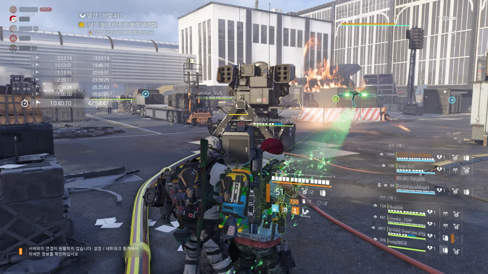

처음 보는 해괴한 버그에 걸렸다.

칠흑의 시간 레이드의 마지막 네임드, 레이저백은 마지막 발악 패턴으로 미사일 포탑 발사를 시전하는데, 미사일이 발사되기 전에 포탑의 컨트롤 패널을 파괴해 미사일을 레이저백 방향으로 발사해야 한다.

네 곳의 미사일 포탑이 모두 레이저백에게 발사되면 레이저백의 레이더 탑이 쓰러지며 레이드가 끝나게 된다.

&nbsp;

그런데 이제 막 미사일 포탑을 세 개 발사했는데 레이저백의 레이더 탑이 쓰러진다.

순간 상황 변화를 받아들이지 못하고 멍때리고 있다가, 내 앞의 마지막 미사일 포탑 컨트롤 패널에 불이 들어오자 사진을 찍은 후 서둘러 패널을 부쉈다.

&nbsp;

아니, 왜 미사일이 다 발사되지도 않았는데 레이저백이 죽냐?

&nbsp;

&nbsp;

이와 별개로, 오늘 레이드는 정말 환장의 레이드였다.

&nbsp;

첫 번째 네임드부터가 혼돈, 파괴, 망가의 현장 그 자체였다.

네임드의 등에 있는 붉은색 패널을 부수기 위해선 보스가 미니건을 등지도록 유도해야 하는데, 이걸 아는 사람이 나를 제외하고 단 한 명밖에 없었다.

나머지는 전부 무한히 리젠되는 잡몹만 열심히 잡고 있거나, 그마저도 제대로 잡지 못해 바닥에 눕고 있더라.

보스 어그로는 내가 자신 있으니, 몹 정리라도 차라리 잘해주었더라면 나았을 텐데...

&nbsp;

그런 것치고는 두 번째와 세 번째 네임드는 정말 수월하게 깨더라. 숙련자도 방심하면 전멸할 수 있는 세 번째 네임드 역시 루시의 상모돌리기에 한 명이 바닥에 누운 걸 제외하면 아무도 죽지 않았다.

&nbsp;

그런데 마지막 네임드의 공략을 아는 사람이 제대로 없는 것 같더라.

발전기를 충전하던 사람이 미사일 포탑 컨트롤 패널을 작동시키려는 중갑병을 아무도 막지 않자, 부리나케 달려가 중갑병을 잡기도 하고, 레이저백의 환풍구 덮개를 깨고 그 안에 수류탄을 넣어야 하는 걸 아무도 몰라 발전기에 엄폐한 채 멍때리고 있기도 하더라.

결국 레이저백 기믹은 나와 다른 한 사람이 전부 도맡아 하게 되었다.

발견 난이도인 만큼 아무리 똥을 싸도 받아줄 수는 있는데, 그래도 최소한 레이드 공략 정도는 읽어보고 와야 하는 것 아닌가?

환풍구 덮개를 아무도 쏘지 않은 것이 제일 기가 차더라. 심지어 레이저백이 뿜어대는 드론조차 잡지 않고 멍하니 있더라고.
