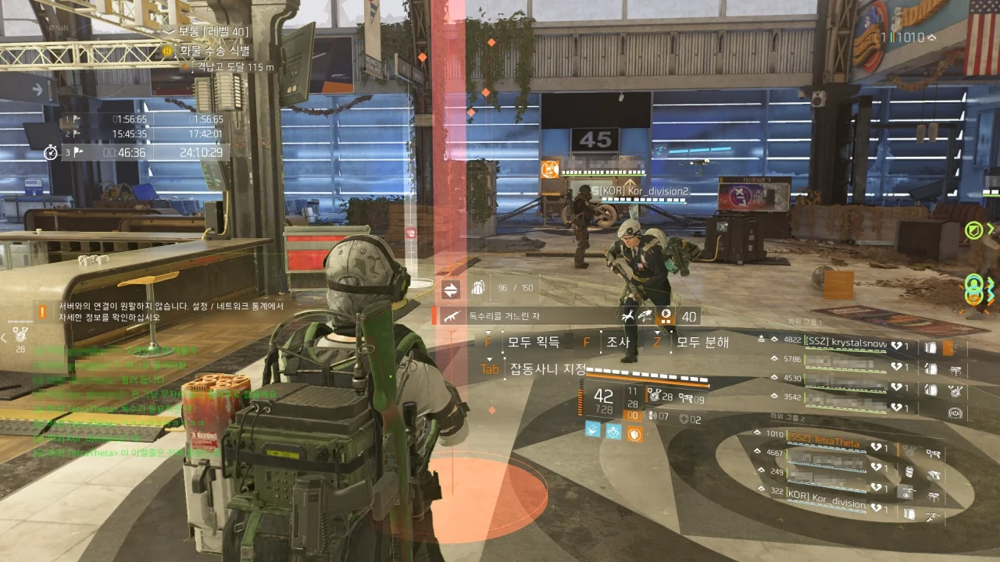
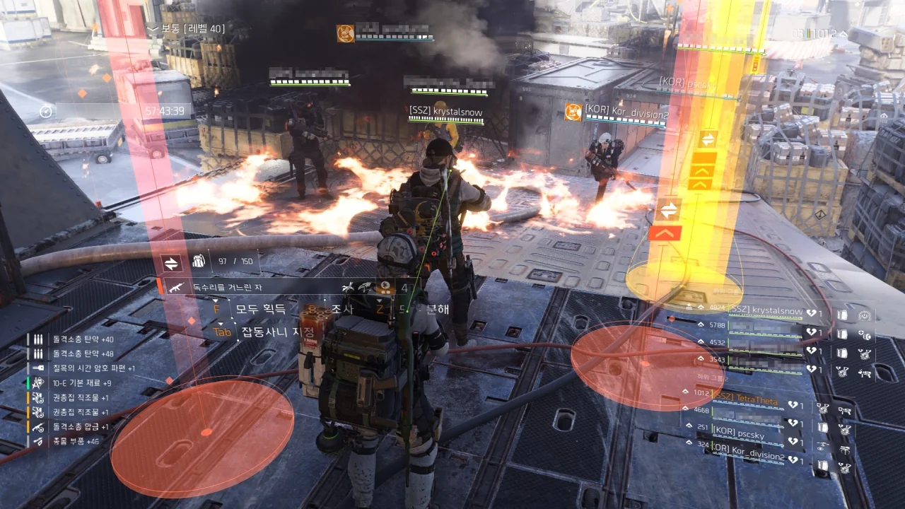

사실 이 글을 쓰는 시점에서 이미 좀 된 이야기이다. 스크린샷을 찍어놓고 그동안 글을 안 썼거든.

&nbsp;

레이드를 갔다. 칠흑 철마 둘 다 한 번에 가는 풀코스로.

레이드를 처음 하는 사람이 둘이었다. 나머지는 다 고인물이었고.

그런데 칠흑에서 아주 대박이 터졌다.

첫 번째 네임드를 잡으니, 독수리가 나왔다. 다른 사람이 세 번째 네임드에서 독수리를 먹은 건 봤어도, 내가 첫 번째 네임드에서 독수리를 얻고 나눔을 할 줄은 정말 꿈에도 예상하지 못했다.

심지어 마지막 네임드를 잡고 나서도 다른 사람들이 독수리를 두 개 먹었다고 한다. 저 특급 아이템이 전부 독수리라고!

&nbsp;

그런데 정작 철마에서는 탐식자가 안 나오더라.

&nbsp;

대충 오후 10시부터 새벽 2시까지 했는데, 우와. 머리가 빠개지는 거 같다.
