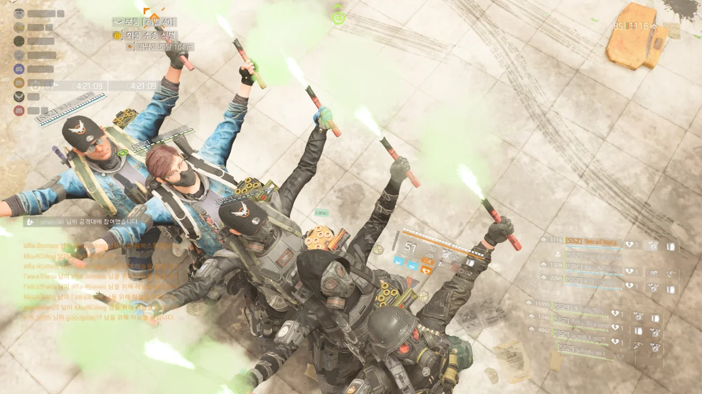

별 건 아니고, 그냥 게임이 튕겨서 공격대에서 제외된 사람을 다시 공격대에 초대하기 위해 기다리는 동안 기차놀이를 했다.

&nbsp;

이 기차놀이에 중요한 것이 두 가지가 있다.

* 얼마나 서로 가까이 붙었는가
* 얼마나 일직선으로 섰는가

다섯 명이 이렇게 훌륭한 기차를 만드는 건 매우 드문 일이다.

&nbsp;

그래... 사실 이런 거라도 하지 않으면 너무 심심했기에 그랬다.
