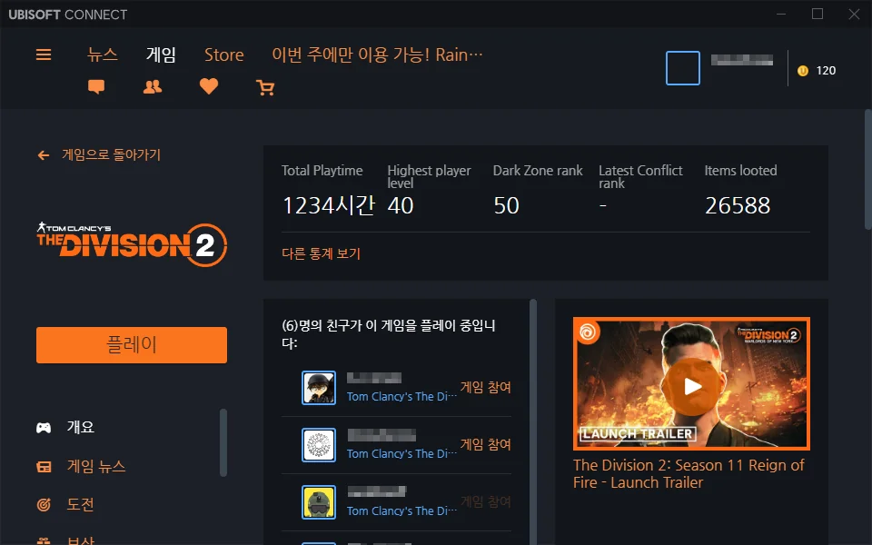

지금까지 디비전 2를 플레이한 시간이 1,234시간이라고 한다.

이걸 자축하고는 싶은데, 오늘 있었던 일을 생각하니 그럴 생각이 싸악 가신다.

***

3옵이 비엄폐와 방댐인 하얀 사신을 파밍 하기 위해 카운트다운을 열심히 돌았다.

그중 무사히 탈출한 세션은 손에 꼽을 정도였다.

&nbsp;

제일 많았던 경우는 주 임무까지 모두 끝마치고 '이제 헌터를 잡으러 가볼까' 하며 탈출 지점으로 이동하려는데 게임이 그대로 굳어버리는 경우.  
이 경우에는 작업 관리자에서 게임을 강제 종료하거나, Alt F4를 눌러야만 했다. 땅바닥에 떨어져 있던 수많은 아이템들이 증발하는 것은 당연한 일이었다.

그다음으로 많았던 경우는 카운트다운을 로딩할 때 로딩원이 미친 듯이 펄떡 펄떡이는 경우였다.  
이 경우에는 로딩 화면에서 전환이 되지 않거나, 전환이 되더라도 후술 할 버그 세션이 될 가능성이 매우 높기에, 그냥 빠르게 Alt F4로 탈출해야 한다.

그다음이 버그 세션이었다. 세션에 버그가 걸려 보조 임무 및 주 임무가 완전히 사라져 있으며 적 또한 나타나지 않는다.  
이 세션에서는 할 수 있는 것이 전혀 없기 때문에 카운트다운 그룹에서 나가는 것 만이 유일한 방법이었다.

&nbsp;

4시간도 안 되는 시간 동안, 게임이 굳기를 7번, 로딩원이 펄떡이기를 5번, 버그 세션이 3번 발생했다. 일이 이렇게 되니까 템 파밍이고 자시고 그냥 게임 자체를 하기 싫어지더라.

&nbsp;

그래서 대망의 1,234 플레이 시간을 맞이했음에도, 이를 기념할 기분이 영 아니다. 
