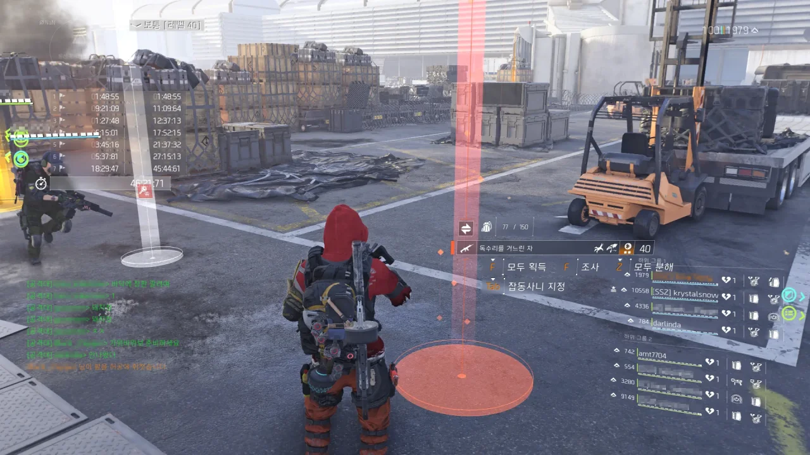
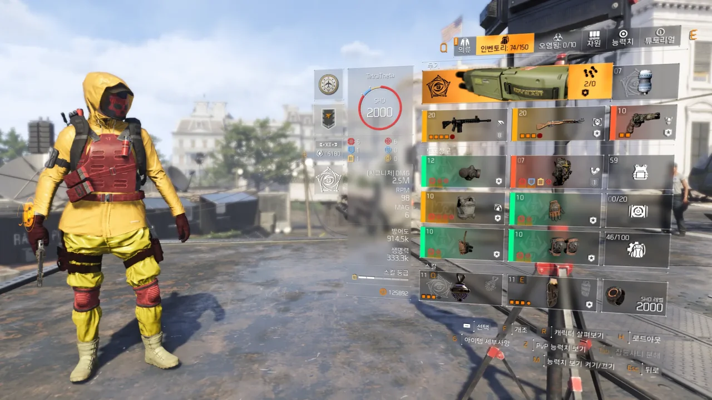

디비전이라는 게임은 대체 뭘까? 늘 같은 패턴의 반복이다.

1. 아, 무슨 게임하지? 디비전이나 할까?
2. (몇 번의 반복 노가다 후) 아, 재미없다. 끄자.
3. 아, 무슨 게임하지?

참 애매한 녀석...

평소 자주 보는 스트리머와 함께 레이드를 갔다. 당연히 칠흑과 철마 둘 다 갔다.

오랜만에 한 레이드라서 그런가, 이번에 처음 레이드를 도는 사람이 둘 있었는데, 두 명 모두 다 레이드 전용 특급 무기인 독수리와 탐식자를 하나씩 챙겨갔다.

탐식자를 얻은 사람은 레굴루스 제작 프로젝트 때문에 2주가량 철마 레이드를 더 다녀야 했지만, 탐식자가 나온 것이 어딘가. 나도 여태껏 내가 깐 상자에서 탐식자를 먹어보지 못했는걸...

그리고 드디어 2,000 레벨을 달성했다.

처음 1,000 레벨을 달성했을 때에는 '분명 2,000 레벨이 되면 엄청 기쁘겠지?'라고 생각했었는데, 2,000 레벨을 찍을 때에는 별 생각이 들지 않더라. 그냥 '아, 2,000 레벨이네.' 딱 이 정도의 소감.

옛날에 쓴 글을 뒤져보았다. 21년 크리스마스에 1,000 레벨을 달성했으니, 1,000 레벨을 올리는 데에 약 1년 하고도 3개월가량이 걸린 셈이다. 음, 그러면 3,000 레벨은 25년 6월 즈음에 달성하려나? 그때 즈음이면 아마 이미 디비전 3편의 이야기가 한창 풀리고 있을 것만 같은데...

&nbsp;

매일 기동타격대만 입고 다니니 게임이 조금 지루해진다.

그래서 새로운 세트를 하나 맞췄다. 사냥꾼 레굴루스 헤드헌터 세팅인데, 이게 아주 재미있다.

헤드샷 킬로 스택을 조금만 쌓아도 적들의 머리를 맞출 때마다 적들의 머리가 펑펑 터져나가는데, 이러니까 총 쏘는 맛이 아주 찰지더라고.

그래서 내친김에 단호함 탤런트를 이용한 핫샷 빌드도 만들었는데, 아쉽게도 단호함이 곧 너프 될 예정이다. 단호함이 연속으로 발동되는 게 버그라고 한다.

매시브 이 녀석들, 플레이어들이 재미 보는 꼴은 절대 못 봐요, 아주. 그럴 시간에 산화제 런 때문에 서버 곱창 나는 것부터 먼저 고칠 것이지...
