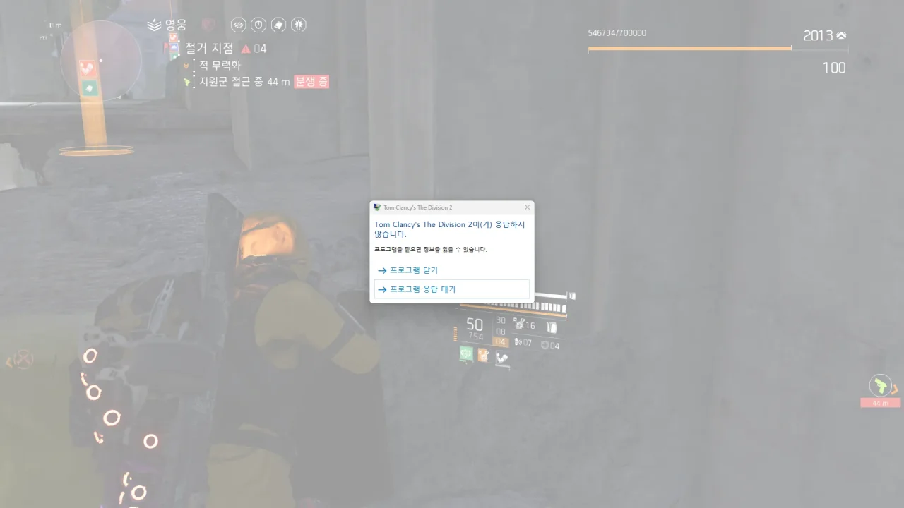
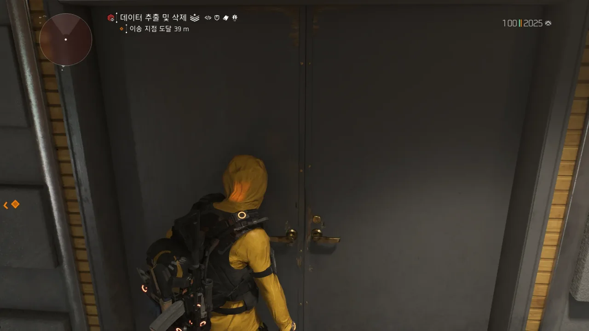

옛날만큼은 아니지만, 디비전은 정말 잘 튕기는 게임이다.

그 옛날의 디비전은 게임이 아니라 그냥 코드 덩어리였다. 그때에는 2시간 만에 9번이나 튕기는 사람도 있었을 지경이었으니, 말 다 했지.

&nbsp;

하루는 '오늘 하루 디비전이 어떻게 튕기는지 한번 기록이나 해보자'라는 생각을 먹었다. 최근의 디비전은 잊을만하면 튕기는, 상당히 거슬리는 빈도로 튕기고 있었기 때문이었다.

통제를 도는데 게임이 갑자기 멈춘다. 잠시 후 응답 없음 상태로 변한다.

놀랍게도, 이 건 예전에 비하면 상당히 나아진 것이다. 그 옛날, 코드 덩어리라고 불리던 시절의 디비전은 여기서 한술 더 떴거든. 그 당시에는 게임이 멈추면 컴퓨터를 재시작해야만 했다. 다른 방법은 없었다.

게임이 굳어도, OS가 게임의 응답 없음 상태를 감지하지 못했기 때문에, 위 사진처럼 '프로그램 꺼볼래?'라고 묻는 창을 띄우지 않았다. 작업 관리자로 게임을 강제 종료하려고 해도, 커널 모드로 작동 중인 안티 치트 프로그램, EAC가 게임 프로세스의 종료를 막았다.

그래서 그 당시에는 EAC가 Easy Anti Cheat가 아니라 Easy Anti-Game Crash의 두문자어인 게 아니냐며 욕을 했었던 적도 있었다.

게임이 굳는 것보다는 훨씬 덜하지만, 이렇게 문이 열리지 않아 길이 막히는 경우도 종종 발생한다.

로그 요원이 등장했다고 안내 메시지도 나오고, BGM도 로그 요원 등장 시 BGM으로 바뀌었지만, 정작 로그 요원이 있는 방으로 향하는 문이 열리지 않는다.

이 버그의 경우, 정말 다행스럽게도 해결책을 찾아내었다. 바로 그 자리에서 디비전을 강제 종료하는 것이다.

아무래도 로그 요원이 미처 생성되기도 전에 방에 진입해 데드락이 걸린 것으로 보인다.

하지만 게임을 강제 종료하고 재접속해야 버그가 풀린다는 것도 어찌 보면 웃긴 일이다. 그런 버그는 아예 생기지 않는 게 정상 아니던가?
