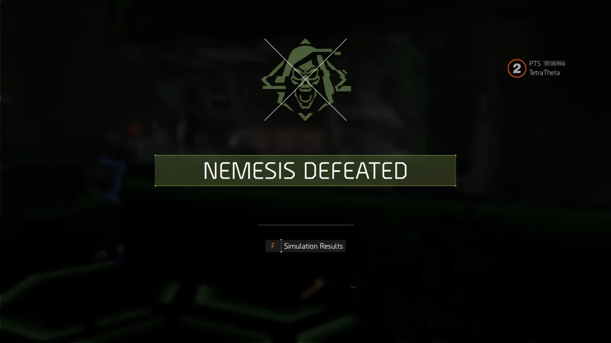
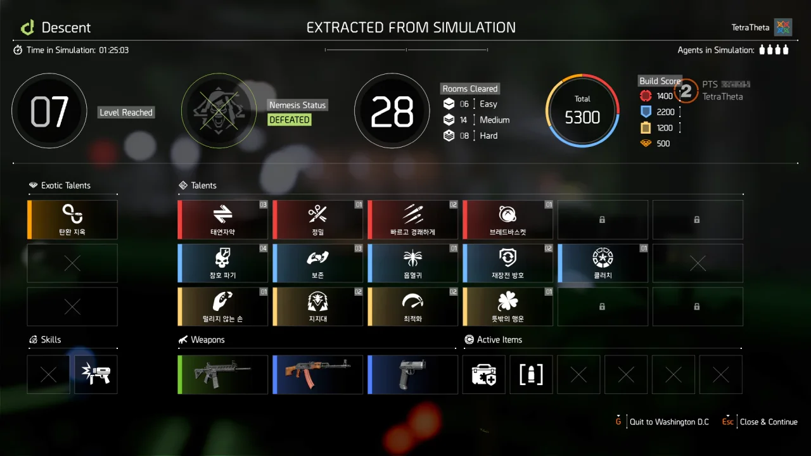

오늘, 아니 어제 새벽에 디비전 2 PTS가 열렸다. 곧 있을 Year 5 Season 1의 테스트 서버였다.

여태까지는 시즌 1부터 11까지 끊임없이 순서대로 진행되었지만, 곧 있을 Year 5부터는 시즌 숫자를 초기화하고 다시 1부터 시작해, Year 5 Season 1이 된다.

지금 진행 중인 시즌 11이 5월 말 끝나면, 지금 테스트 중인 Y5S1가 시작되게 되는 것이다.

&nbsp;

이번 PTS에서 제일 기대되는 것은 '하강(Descent)' 모드였다. 그래서 저녁에 클랜 사람들과 함께 하강 모드를 달렸다.

&nbsp;

몇 번이고 레벨 5에서 전멸한 끝에 우리가 내놓은 결론은 레벨 5가 레벨 4에 비해 난이도가 급격하게 상승한다는 것이었다.

레벨 5까지 가는 데에 약 50분 정도가 걸렸기 때문에, 빠르다고 하면 빠르고, 늦는다고 하면 늦은 발견이었다.

그래서 레벨 4까지는 '무조건 고난도!'를 외치며 영웅이나 매우 어려움 난이도를 고르다가, 레벨 5에 도착하자마자 '안전이 최고!'를 외치며 보통이나 어려움 난이도를 선택했다.

그래도 팀이 전멸할 위기가 끊임없이 찾아오더라.

&nbsp;

그렇게 계속 도전하다가, 레벨 7에서 '네메시스(Nemesis)'로 헌터가 나온다는 정보를 들었다.

헌터를 맞이하기 위해, 우리는 특수탄까지 구매해 장전하면서까지 헌터를 맞을 준비를 했다.

그리고 헌터를 전부 다 잡았다.

&nbsp;

보통 헌터는 현재 그룹의 인원수보다 1마리 더 나온다. 현재 그룹에 3명이 있다면, 헌터는 4마리가 나오는 것이다.

그런데 하강에서 나오는 헌터는 어째서인지 현재 그룹 인원수와 동일하게 나오더라.

아마 하강 모드에서 플레이어의 장비나 무기 상태가 별로 좋지 않기 때문에 난이도 조절을 위해 한 마리를 뺀 것 같다.

하지만 헌터가 한 마리 덜 나온다고 해서 게임이 쉬워지는 건 아니었다. 욕이 나올 정도로 헌터가 단단한 건 여전했고, 헌터의 공격에 한 번 스치면 그대로 생과 사의 경계선에서 헉헉대야 하는 것 역시 여전했다. 그 탓에 우리 파티 역시 몇 번이고 누워가며 헌터를 상대해야 했다.

&nbsp;

전투 중, 헌터의 이름을 확인해 보니, 헌터의 이름이 'Delta'로 나타나더라. 안 그래도 디비전 2를 하면서 제일 많이 보는 오류 코드가 DELTA-3인데, 이걸 노린 작명이 아닐까 생각이 들었다.

***

하강 모드를 하며 보고 듣고 경험한 버그를 대강이나마 정리해 보았다.

* 통로가 막힘  
  벙커 문을 열 때, 문이 반대로 닫히는 애니메이션이 나온다. 이 경우, 반대편 문은 완전히 잠겨 열 수 없게 되기 때문에, 해당 하강 세션을 포기해야 한다.  
  길어봤자 한 세션에 25분이 걸리는 카운트다운과는 달리, 하강은 한 세션이 끝도 없이 길어질 수 있기 때문에, 이 버그는 매우 심각한 버그이다.
* 스킬이 자동 전환되지 않음  
  점착 폭탄이나 화학 물질 발사기의 마지막 탄을 발사한 후, 자동으로 무기로 전환하지 않는다.  
  숫자키를 눌러 직접 무기를 들면 되는 일이긴 하나, 다른 게임 모드에서는 이러한 일이 일어나지 않았기에 문제가 된다.
* 적이 스폰되지 않음  
  새벽에 PTS가 열리고 하강 모드를 혼자 처음 했을 때, 이 버그가 걸리자마자 게임을 끄고 잤다.  
  적 출현 카운트다운이 종료되었음에도 불구하고 적이 나타나지 않는데, 이 경우에도 해당 하강 세션을 포기해야 한다.
* 개인 스탯 업그레이드 불가  
  이건 버그인지 의도된 사항인지 알 수 없다.  
  백악관 오른쪽의 노트북을 통해 하강 모드 전용 스탯을 업그레이드할 수 있는데, 이게 포인트만 소모하고 스탯을 전혀 올려주지 않는다.
* 하강 모드로 진입할 수 없음  
  같이 하던 사람이 몇 번이나 이 문제를 경험했다.  
  다른 사람들은 모두 하강 모드에 들어가 로비에 진입할 수 있는데, 이 버그가 걸리면 보라색 화면만 나타나게 된다.  
  이 버그가 걸리면 디비전 2를 종료해야 하며, 다른 파티원 역시 해당 하강 세션을 포기해야 한다.

이 문제들, 하강 모드가 정식으로 출시했을 때에는 모두 다 고쳐졌으면 좋겠다.
