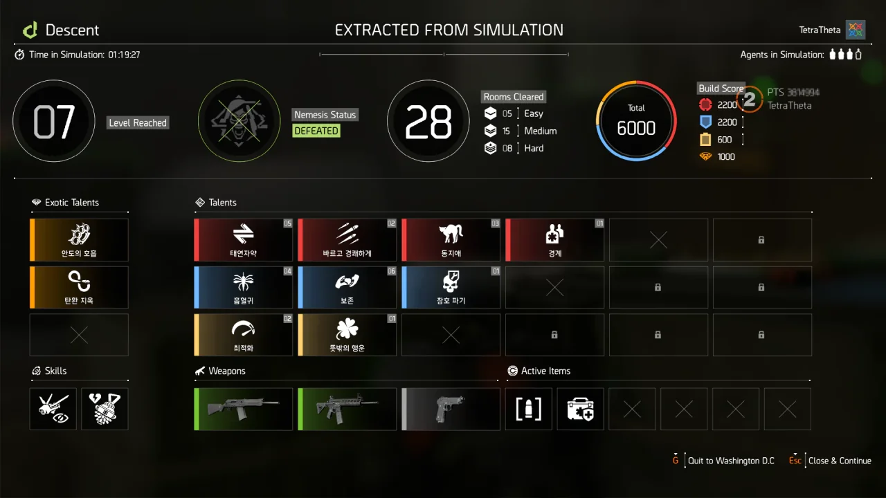

이번엔 단 두 명이서 하강 모드에 도전해 보았다.

한 번은 4 단계에서 방심한 탓에 전멸했고, 한 번은 막힌 통로 버그 때문에 억까당해 망했다.

그리고 세 번째에서 헌터를 잡는 데 성공했다.

&nbsp;

사실 처음부터 안도의 호흡(죽음의 귀부인)이 나와, '아, 이번 판 역시 망하는 건가?'라고 생각했는데, 그다음부터는 모든 탤런트가 완벽하게 나왔다.

PTS이기 때문에, 특급 탤런트의 등장 확률을 올리는 것이 불가능했음에도 불구하고 두 번째 특급에 탄환 지옥(탄환 제왕)이 기적처럼 나왔다.

이후, 태연자약 5 스택, 흡혈귀 4 스택, 보존 6 스택 등, 괜찮은 탤런트가 많이 나왔기에 처음 헌터를 만났을 때보다 훨씬 수월하게 헌터를 처리할 수 있었다.

심지어 헌터를 만나기까지 걸린 시간도 약 30분 정도가 줄어들었고.

&nbsp;

이러다가 나중에 정식으로 하강 모드가 나왔을 때, 1시간이면 네메시스를 볼 수 있게 되는 게 아닐까 싶다.
