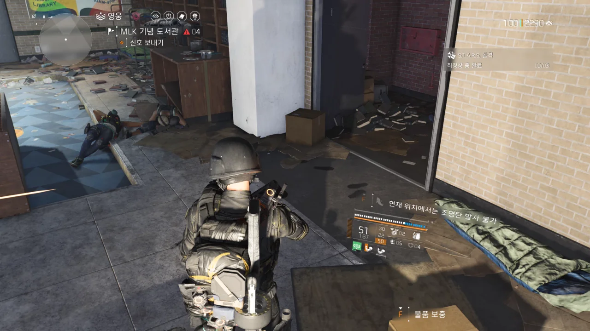
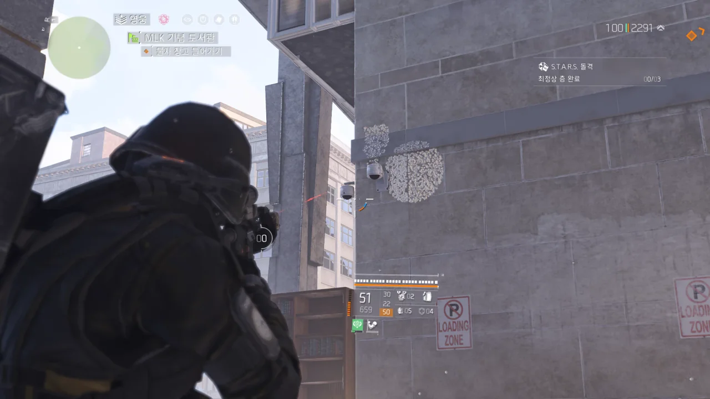
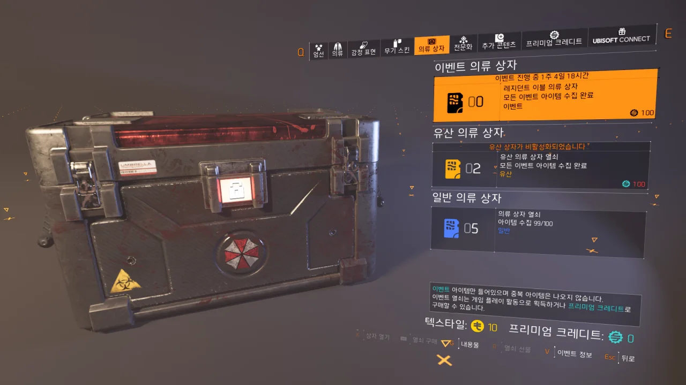

바이오하자드 의류 이벤트 때문에 열심히 경험치를 벌던 중, 여태껏 단 한 번도 보지 못한 해괴한 버그를 발견했다.

MLK 기념 도서관을 털던 중, 아무것도 없는 바닥에서 난데없이 총탄이 나오는 버그를 발견했다.

아무래도 오른쪽 공간에 처박힌 시체가 들고 있던 총에서 나오는 것 같은데, 시체만 보이고 정작 총은 보이지 않았다.

게다가 총탄이 지나가는 경로에 서있어도 아무런 대미지를 받지 않는다. 총이 타다당 하고 발사되는 소리가 들리고, 총탄이 움직이는 궤적이 보임에도 불구하고, 그 경로상에 서있는 나는 아무런 대미지를 받지 않는 것이다.

통제 지점 방어를 끝마치고, 여전히 시끄러운 소리를 내며 발사되고 있는 투명 총이 그리는 총탄의 궤적을 따라가 보았다.

아니 이게 진짜로 총탄으로 취급된 거라고? 벽에 패인 저 둥근 모양의 탄흔이 전부 저 버그 난 총에서 나온 것이다.

&nbsp;

저 사진을 찍고 나서 시체로 다시 되돌아가보았는데, 시체가 사라짐과 동시에 버그 난 총도 사라졌다.

***

그리고 드디어 고생 끝에 바이오하자드 의류 이벤트의 끝을 보았다.

&nbsp;

얼마 전, 개발진들이 공식 방송에서 '현재의 불균형한 경험치 보상 테이블을 균형 잡히도록 손보겠다'라고 말한 적이 있었다.

그런데 얼마 전 있었던 패치에서, 다른 경험치 보상은 그대로 둔 채, 자원 호송대 경험치 2배 버그만을 수정해 버렸다. 그 탓에 경험치를 벌기 매우 힘들어졌다.

다행이라면 다행인 점은, 개발진이 이 문제를 알게 되자, '해당 버그 픽스는 다른 경험치 보상 조정과 함께 내보냈어야 하는 건데, 너무 성급하게 버그 픽스만 해버렸다. 조만간 자원 호송대 경험치 2배 버그를 원래대로 돌려놓겠다'라고 했다는 점이다.

&nbsp;

버그 픽스 때문에 자원 호송대 경험치 보상이 너프가 되자, 영토 통제가 새로운 경험치 파밍의 강자로 부상했다.

필드에 서있는 몹을 4~5마리 잡고, 새로 나오는 몹을 또 4~5마리 잡으면 열쇠가 나오는데, 이 열쇠로 상자를 열면 영토 통제가 하나 끝나게 된다.

하지만 자원 호송대는 이러한 웨이브를 두세 번은 봐야 한다.

자원 호송대는 경험치를 2배로 주는 버그 때문에 가성비가 좋았던 거지, 그 버그가 없으면 자원 호송대보다 영토 통제가 훨씬 더 효율적인 경험치 파밍 방법인 것이다.

&nbsp;

아무튼 다음 추격전 타깃과 추격전 보스가 나올 2주 후까지는 디비전을 켤 일이 없을 것 같다.
