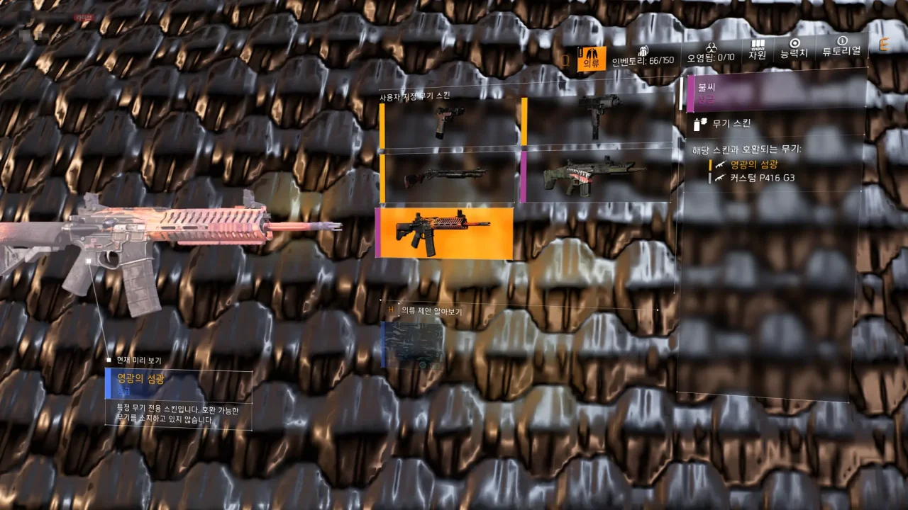
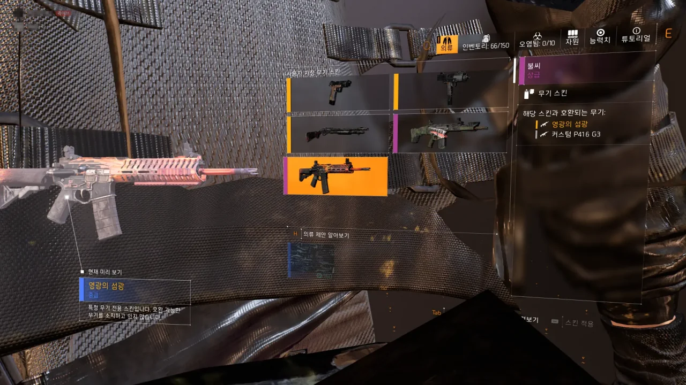

평범하게 게임을 하던 중, 모든 방어구에 검은색 색상을 적용하기 위해 의류 탭을 열었다.

원래 검은색 배경이 돼야 했는데, 무언가가 검은색 배경 앞에서 왔다 갔다 하며 시선을 끌고 있다.

처음에는 이게 뭔지 도저히 알지 못했다.

그런데 잠시 지나니까 카메라가 약간 줌아웃 되듯이 움직였다.

조금 전까지 화면에 비치고 있었던 것은 플레이어가 입고 있는 의상이었다.

원래라면 총기 스킨을 볼 때는 플레이어 모델을 숨겨야 하는데, 버그로 인해 플레이어 모델이 전혀 숨겨지지 않아 카메라가 플레이어 모델을 뚫고 플레이어의 의상을 크게 확대해서 보여주고 있었던 것이다.

&nbsp;

여기서 우리가 눈여겨봐야 하는 것은 하나이다.

우리는 평소 이렇게까지 플레이어의 의류를 자세히 확인할 수 없다. 기껏해야 카메라 모드로 들어가서 사진을 찍거나 스코프로 잔뜩 확대해서 보는 수밖에 없는데, 의류 하나에 이렇게까지 자세하게 디테일을 표현할 필요가 있었을까?

디비전 2가 80GB나 되는 이유가 바로 여기에 있었다. 평소라면 자세히 보지도 못할 것까지 자세하게 묘사하다 보니 모델의 용량이 커진 것이다.

분명 모델의 디테일을 절반 정도로 줄이면 디비전 2의 용량이 40GB도 채 되지 않을 정도로 떨어질 것이다.
