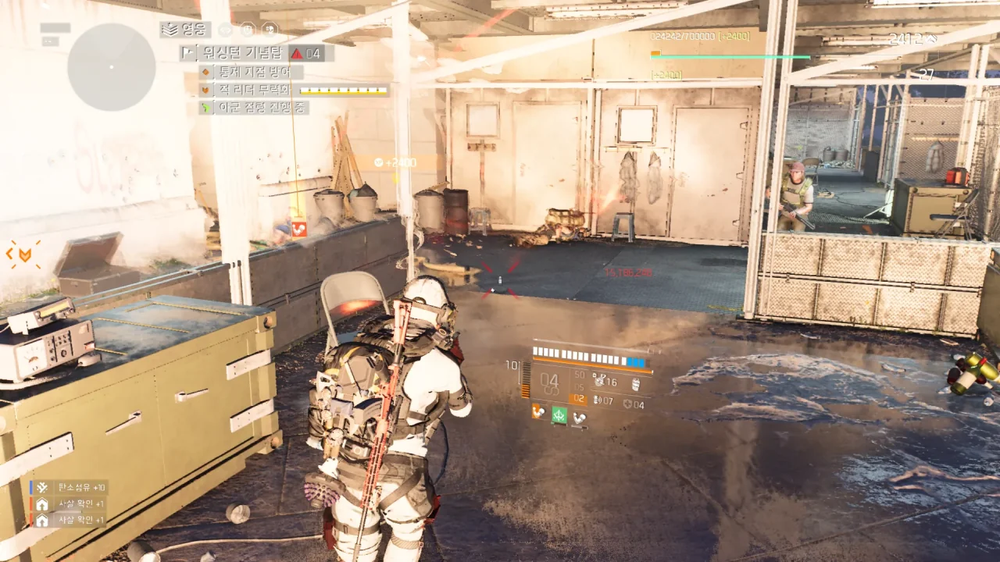
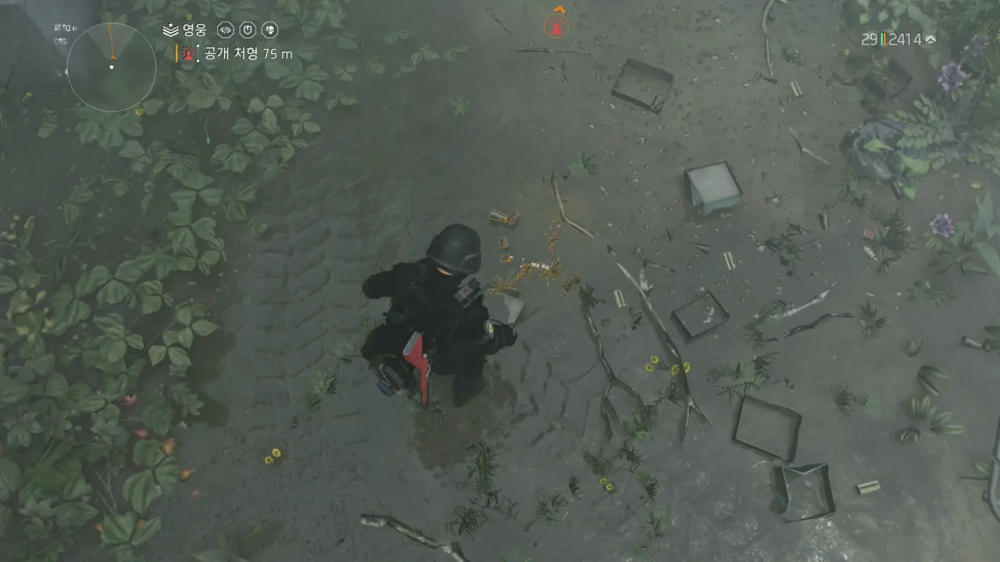
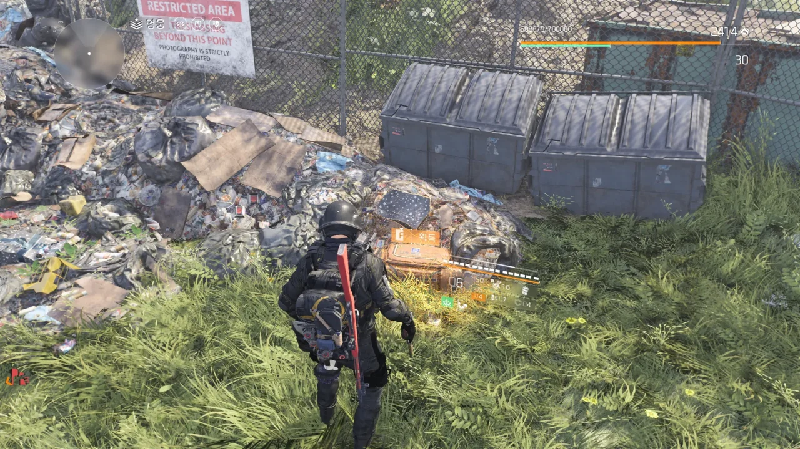

2023년 6월 8일 오후 4시 30분, 디비전 2는 Year 5 Season 1 적용을 위한 3시간 점검에 들어갔다.

예정된 점검 종료 시각은 오후 7시 30분.

{}



{}

예정 점검 종료 시각을 5분 앞둔 오후 7시 25분, 갑자기 점검이 3시간 연장되었다. 늘 있어왔던 일이니, 놀랍지 않았다.

연장된 점검 종료 시각은 오후 10시 30분.

{}



{}

하지만 오후 10시 30분이 되어도 서버는 열리지 않았다. 공식 디스코드에도 아무런 말이 없었고, 공식 트위터 역시 잠잠했다.

우연찮게 확인한 디비전 2 서버 상태를 알려주는 [페이지](https://ubistatic-a.akamaihd.net/0115/tctd2/status.html)에서 점검 종료 예정 시각이 11시 30분으로 표기된 것을 발견하였다.

다른 곳에서는 아무런 말도 하지 않은 채, 슬쩍 점검 종료 시각을 1시간 늦춘 것이다.

오후 11시 15분. 매시브는 게임 세이브 파일이 손상되는 문제 때문에 점검을 추가적으로 6시간 연장한다는 트윗을 올렸다.

변경된 점검 종료 시각은 6월 9일 오전 5시 30분.

{}



{}

6월 9일 오전 3시, 매시브는 '극적인 진전이 있었으나 내일 마저 이어서 하겠다'라며 점검을 무기한 연장했다. 서버를 닫아둔 채로 말이다.

{}



{}

상상조차 하기 힘든 조치였다. 점검을 하다가 퇴근 시간이 다 되었으니 그대로 퇴근을 한다고? 닫힌 서버는 그대로 내버려 두고?

점검이 예상외로 길어질 때 예상한 대응은 야근을 해서라도 한시라도 빨리 서버를 정상화시키거나, 서버 패치를 롤백하고 점검을 며칠 미루는 것이었는데, 서버를 끈 상태로 그대로 퇴근을 할 줄은 몰랐다.

저 트윗을 보고 나니 어처구니가 없더라.

디비전 2가 글로벌 서비스를 해서 망정이지, 대한민국 서버를 따로 두고 운영했다면 대번에 공식 홈페이지 등이 터져나갔을 일이다.

아, 유비소프트가 공식 포럼을 폐쇄하고 디스코드로 옮긴 것이 바로 이걸 감안하고 한 일이었나?

&nbsp;

점검을 시작한 지 25시간이 지난 오후 5시 30분, 오랜 공백 끝에 새로운 트윗이 올라왔다. 30분 후인 오후 6시에 디비전 2 서버를 열겠다는 트윗이었다.

시즌 첫 주에는 시즌 레벨 15 레벨을 달성하기 전까지 모든 경험치를 2배로 얻는데, 오랜 점검으로 인해 하루를 손해 보았으니, 황금 탄환 글로벌 이벤트를 시즌 일정에 추가했다고 한다.

{}



{}

어이가 없더라.

경험치 손실이 났으면 일괄적으로 15 레벨을 뿌리던가 해야 할 일 아닌가? 그런데 추가적인 노동을 필요로 하는 글로벌 이벤트를 시즌 일정에 추가하는 것으로 때우려 한다고?

물론 황금 탄환 기간 동안 총 쏘는 맛은 있겠지만, 지금까지 너무 많은 황금 탄환을 쏴왔던 지라, 별로 내키는 보상이 아니었다.

게다가 저 추가된 황금 탄환 기간은 내가 보기에 그냥 Year 5 Season 2를 준비하기 위한 일주일을 추가적으로 벌기 위한 꼼수로밖에 보이지 않는다.

그래서 서버가 오후 6시에 정상적으로 열렸냐고? 아니다. 30분이 지난 오후 6시 30분에 열렸다. 이 지연에 대해서는 그 어떠한 트윗이나 소식도 없었다.

&nbsp;

점검 시작 시각: 6월 8일 오후 4시 30분

점검 종료 시각: 6월 9일 오후 6시 30분

총 점검 시간: 26시간

***

26시간 동안의 점검은 그렇다고 치자.

Year 5가 되면서 시즌 넘버링을 12로 유지하는 대신 1로 초기화시켰는데, 그럴만할 정도로 새 시즌 콘텐츠를 잘 만들었으면 26시간의 긴 점검도 고개를 끄덕이며 넘어갈 수 있다.

그런데 조금 미묘하더라.

&nbsp;

원래 시즌 추격전의 구조는 단순하다.

특정 지역의 통제 지점을 모두 점령하고, 현상 수배를 1회 하고, 기타 필드 활동을 몇 번 하면 해당 시즌의 부 목표를 겨냥한 현상 수배를 플레이할 수 있다.

기본적으로 시즌의 주 목표와 부 목표는 모두 사살 대상이다. 다만 Year 4부터는 여기에 약간의 변화가 생겼다.

시즌 9의 주 목표인 루이스 대위는 사살 대상이었지만 협력 대상으로 변경되었고, 시즌 10의 주 목표인 앤더슨 장군은 탈출에 성공해 사살 실패 처리되었다. 시즌 11의 주 목표인 스토브파이프는 이미 죽은 상태로 발견되었다.

&nbsp;

그런데 이번에는 시작하자마자 대놓고 초크 통제 지점으로 사람을 보내더라. 이전 시즌에서는 그래도 추격전을 진행하려면 통제 지점, 현상 수배 등을 진행해야 했지만, 이번에는 그런 것 없이 그냥 모든 활동을 추격전 스토리에 녹여내었다.

예전처럼 통제 지점을 점령하고, 현상 수배를 진행하는 것은 동일하지만, 납치된 민간인의 흔적을 차근차근 추적해 나간다는 스토리가 곳곳에 녹아있었다.

이러한 변화점은 상당히 인상적이다.

***

그런데 버그는 정말 어쩔 수 없더라.

&nbsp;

일단 두 팔 벌려 환영할만한 버그 하나. (버그난) 단호함이 돌아왔다!

단호함이 처음 나왔을 때에는 드디어 지정사수소총에 한줄기 빛이 내려온 줄로만 알았다. 헤드샷 킬을 성공하면 그다음 사격이 헤드샷으로 판정되는데, 그 헤드샷 역시 단호함 탤런트를 활성화시킬 수 있었던 것이다. 즉, 대미지만 충분하다면 무한정 단호함 탤런트를 활성화시킬 수 있는 것이었다.

그런 것이 버그로 판정되어 헤드샷 판정을 1회에 한정한 것이 저번 패치였는데, 어째서인지 단호함이 원래대로 돌아왔다.

&nbsp;

그래서 옳다구나 하고 레인저로 변경해 둔 하얀 사신의 탤런트를 다시 단호함으로 바꾸고 열심히 꿀을 빨고 있다.

***

오늘 약 30분 동안 하면서 발견한 온갖 버그들.

워싱턴 기념탑 통제 지점을 점령하던 중, 저 화면에서 게임이 멈췄다.

게임이 잘 가다가 느닷없이 이런 식으로 멈추는 것이 그리 생소한 일은 아니지만, 이 장면을 찍으며 나는 '과연 30분 동안 어떤 버그를 마주할까?'라는 호기심에 사로잡혔다.



트럭 바퀴 밑에 있는 하수구에서 트루썬 잡몹 여럿이 하수구 뚜껑을 열고 튀어나왔다. 그런데 튀어나온 곳이 트럭 안쪽이다. 나도 트루썬을 쏘지 못하고, 트루썬 역시 소리만 지를 뿐 나를 쏘지 못하는 상황.

결국 내가 높은 곳에 올라가 트루썬의 머리를 따는 식으로 처리했다.

아무것도 없는 땅에 갑자기 '획득'이라는 프롬프트가 뜨는 상황이다.

F를 길게 눌러 획득을 해보니, 아무래도 주황색 자원 가방이 땅 밑에 파묻혀 생성된 것으로 보인다.

이 주황색 자원 가방은 아무리 F를 눌러도 그 안의 내용물을 획득할 수 없다.

연결 문제인가 싶어 조금 기다려보았는데, 아무리 기다려도 DELTA-3 오류가 나타나지 않더라.

결국 수동으로 로그아웃한 후, 재접속해 해결했다.

&nbsp;

이거... 게임 아냐...
