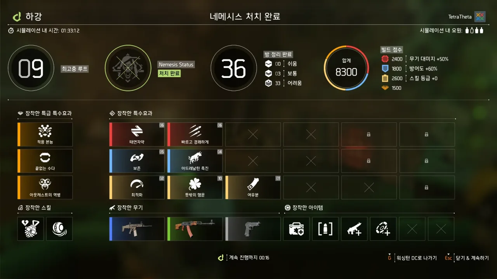
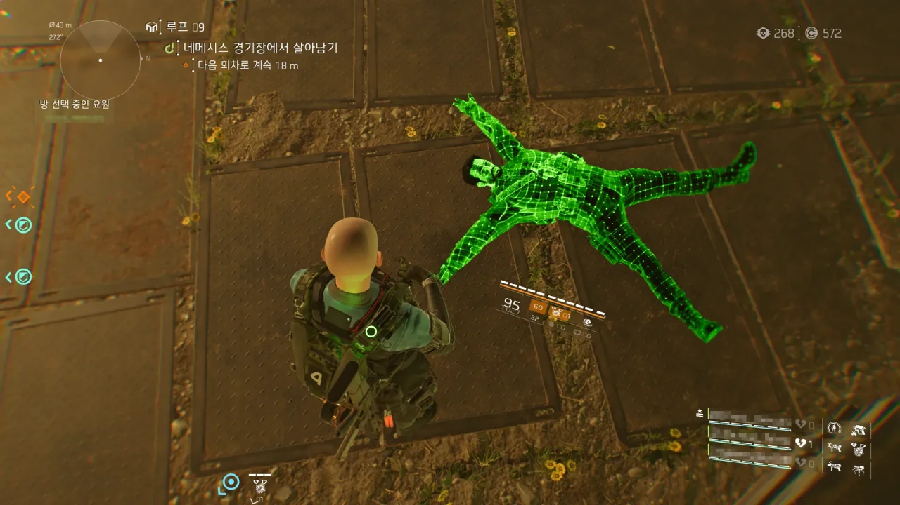
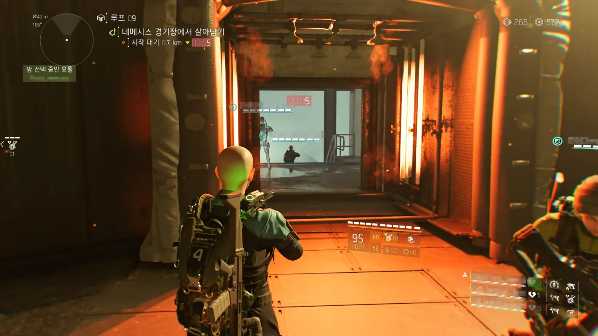
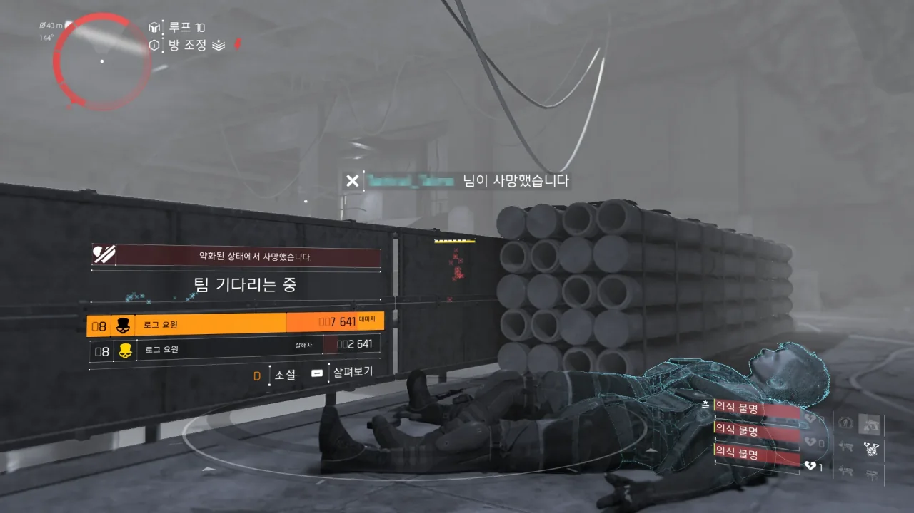
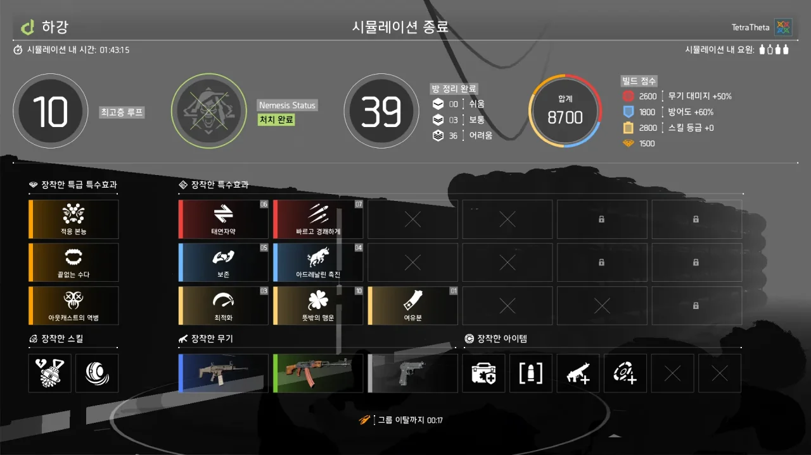

사실 PTS에서 네메시스를 몇 번 잡은 적이 있긴 하다. 하지만 그건 PTS 때의 이야기이지, 정식 서버에서의 이야기는 아니지 않은가.

하강 모드가 정식으로 출시한 이후, 나는 단 한 번도 네메시스를 잡은 적이 없다.

일단 제일 첫 번째 이유. 벌써부터 하강 모드에 질려버렸다.

PTS 때 하강 모드를 너무 많이 한 탓일까, 하강 모드가 정식으로 나왔지만 별로 하고 싶은 생각이 들지 않았다.

그다음 이유. PTS 때보다 몹을 상대하는 난이도가 더 올라갔다.

남들은 PTS에서도 10층을 찍어보았다, 20층도 찍어보았다, 이러면서 잘만 하강 모드를 즐겼지만, 난 혼자서 하강 모드를 하면 네메시스의 얼굴조차 보지 못하고 게임이 끝나버렸다. PTS에서도 그랬는데, 정식으로 출시한 하강 모드는 더욱 어려웠기에, 도저히 할 엄두를 내지 못했다.

&nbsp;

그런데 오늘, 클랜원들이 디스코드에 모여 하강 모드를 하고 있길래, 슬쩍 끼어들었다.

혼자서는 네메시스를 절대 보지 못하겠지만, 여럿이서 하면 얼굴 정도는 보고 죽을 수 있을 테니 말이다.

그리고 그 결과는 매우 고무적이었다.

매번 6층에서 죽던 내가 9층까지 가 네메시스를 잡을 수 있었다. 네메시스에 들어간 대미지 중 내 지분은 거의 없다시피 한 것 같지만...

&nbsp;

그동안 나를 포함한 클랜원들은 '불안정' 탤런트를 여러 개 중첩하는 빌드가 제일 좋다고 여겼었다.

그런데 오늘 '뜻밖의 행운'을 10개 중첩한 후, '떨리지 않는 손' 탤런트와 같이 쓰는 빌드를 써보니, 이 빌드가 더 안정적이라는 결론을 내릴 수 있었다.

'불안정' 탤런트는 대미지를 올려주긴 하지만, 그 대신 명중률과 안정성을 크게 저하한다. 그래서 '불안정' 탤런트를 채용하면 그 즉시 중장거리 교전이 불가능하게 된다. 하지만 네메시스와의 교전을 근거리에서 하는 건 자살행위나 다름없다.

하지만 '뜻밖의 행운' 탤런트와 '떨리지 않는 손' 탤런트를 조합하면 중장거리 교전을 편하게 수행할 수 있다.

'뜻밖의 행운' 탤런트는 탄창 용량을 10% 늘려주고 빗나간 탄환을 10%의 확률로 탄창에 반환해 준다. 이걸 10 중첩하게 되면 탄창 용량이 100% 증가하고 빗나간 탄환이 무조건 탄창에 반환되게 된다.

'떨리지 않는 손' 탤런트는 공격을 적중시키면 명중률과 안정성을 1%씩 증가시켜 주고, 중첩이 100개가 되면 중첩 효과를 제거하고 탄창을 즉시 보충해 준다. 이 탤런트 역시 중첩을 통해 증가하는 명중률과 안정성의 비율을 늘릴 수 있다.

자, 그러면 '뜻밖의 행운' 10 중첩과 '떨리지 않는 손' 다중 중첩을 쓰면 어떻게 될까? 엄폐한 상태에서 적을 조준하지 않은 채 손만 내밀고 총을 쏴도 총탄이 화면 가운데에 콕콕 박히게 되며, 빗나간 탄환은 곧바로 다시 탄창에 돌아오게 된다.

&nbsp;

다만 이번 세션에서는 '뜻밖의 행운' 탤런트만 나와서 큰 재미는 보지 못했다. '뜻밖의 행운' 10 중첩 이후에 '떨리지 않는 손' 탤런트가 나와야 했는데, 그러지 않았거든.

트레일러에서는 네메시스가 플레이어 캐릭터와 똑같이 생겨서 실제 게임에서 만나는 네메시스가 내 캐릭터와 똑같이 생겼을 줄로 기대하고 있었다.

하지만 모든 네메시스 캐릭터가 이 모델 하나를 돌려쓰고 있더라고. 좀 실망스러웠다.

네메시스와 싸우는 장소는 백악관 바로 앞이다. 정확히는 시뮬레이션된 백악관의 앞이다.

그래서 네메시스를 잡고 들어가는 곳이 백악관 입구와 동일하게 생겼다.

&nbsp;

그런데 다음 층으로 넘어갈 때, 갑자기 네메시스가 또 나타났다. 화면에도 '네메시스 분대 처치'라고 뜨던데... 버그겠지?

설마 거기서 시간을 너무 오래 끌면 네메시스가 또 나타나는 그런 건 아닐 거라 생각한다.

네메시스를 잡고 자신감이 가득 차게 된 우리는 거짓말처럼 그다음 층에서 로그 요원에게 전멸했다.

필드나 통제 지점, 임무 등에서 볼 수 있는 로그 요원과 다르게, 시뮬레이션에 나오는 로그 요원은 한 번에 사용할 수 있는 스킬의 제한이 없는 것 같다.

끊임없이 스킬을 뽑아내는 것도 짜증 나는데, 뽑아낸 스킬의 체력도 굉장히 높았다. 아아, EMP 스킬만 있었어도!

이번 하강은 여기까지. 다음에 또 다른 기회가 있을지도 모른다.

***



이건 하강 모드를 하기 전 찍은 사진이지만, 그냥 넘기기에는 너무 어처구니가 없어서 글로 남기기로 했다.

&nbsp;

디비전을 하다가 게임이 튕겼다. 이건 늘 있는 일이니 그럴 수 있다.

하지만 다시 접속해 보니, 내 캐릭터가 이렇게 죽어있더라고. 접속이 끊긴 후, 내 캐릭터가 필드에서 사라지지 않고 근처 몹에게 계속 맞다가 죽은 것이다.

PVP에서 이러는 건 충분히 이해할 수 있다. 다크존에서 PVP를 하다, 자기가 죽을 것 같다고 `Alt`+`F4`를 눌러 게임을 강제 종료하거나, 랜선을 뽑는 꼼수를 방지하기 위함일 테니.

하지만 여긴 PVP 지역이 아니라 PVE 지역이다. 플레이어의 접속이 끊겼으면 곧바로 플레이어 캐릭터를 필드에서 없애도 될 일을 왜 내 캐릭터가 빨간색 몹에게 맞아 죽을 때까지 필드에 내버려 둔 것인지 정말 이해가 되지 않는다.
