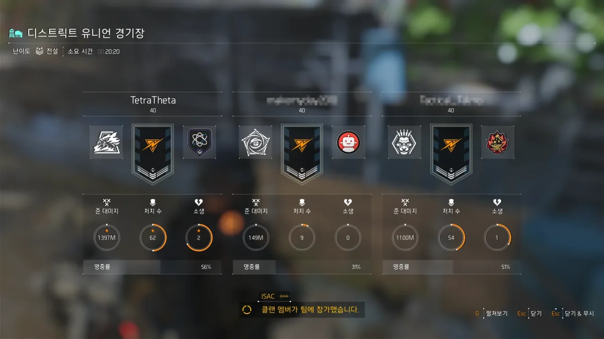

하강은 멈추지 않는다. 왜냐면 현재 경험치를 제일 빠르게 얻을 수 있는 방법이 하강이기 때문이다.

통제 지점을 계속해서 돌며 필드 활동도 같이 하는 것 역시 나쁘진 않지만, 하강만큼 경험치를 빠르게 얻을 수 없다. 아니, 네메시스를 잡고 나오면 30 레벨이 올라가 있다니까?



그래서 달렸다.

두 판 모두 네메시스만 잡고 나왔는데, 첫 번째 판은 네메시스가 9층에서 나왔고, 두 번째 판은 네메시스가 8층에서 나왔다.

&nbsp;

이번 하강에서 깨달은 것 몇 가지.

1. 역병은 신이다  
  화기에 집중적으로 투자를 해 기본 무기 대미지를 올린 후, 역병 탤런트로 적을 쏘면 된다.  
  그러면 적이 한여름에 아이스크림 녹듯 사르르 녹아 사라진다.
2. 유리 대포는 신중하게  
  역병과 유리 대포의 조합은 정말 최고다. 대미지가 월등히 높게 올라가니까.  
  하지만 반대급부로 한 대만 맞아도 사르르 녹는 몸이 되기 때문에 내 등 뒤를 봐줄 수 있는 팀원의 존재 여부가 굉장히 중요해지게 된다.  
  절대로 유리 대포는 솔로 플레이에서 쓰지 말자.

***

추가로 ~~이번~~저번 주 주간 전설인 디스트릭트 유니언 경기장도 끝냈다.

3명이서 도전할 때 '이 인원으로 깰 수 있을까?'라고 생각했었는데, 큰 문제없이 부드럽게 끝낼 수 있었다.

전설 난이도는 무조건 4인 기준으로 몹이 나온다고 알고 있었는데, 신기한 일이다.
