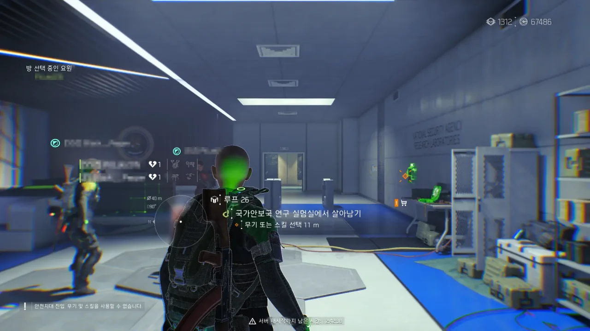

이번 하강 세션은 여러모로 의미가 깊은 세션이었다.

하강 게임 모드가 정식으로 출시한 이후, 이번 세션은...

1. 최초로 로그 요원을 모두 잡는 데 성공한 세션
2. 최초로 전멸이 아닌 자발적 파티 해산으로 끝맺은 세션

달리 말하자면, 지금까지의 모든 하강 세션은 파티가 네메시스 혹은 로그 요원에게 전멸해서 해산한 세션이었다는 이야기이다.

그리고 그걸 오늘 처음 극복해 낸 것이고 말이다.

***

이번 하강 세션은 평소와 약간 달랐다.

평소와 달리, 하강을 하려는 인원이 조금 더 모여, 4인 그룹 하나가 출발하는 것이 아닌, 3인 그룹 2개가 출발하는 모습이 되었다. 그중 나는 두 번째 그룹에 참가하게 되었다.

첫 번째 그룹이 두 번째 그룹보다 약 10분 정도 먼저 출발했는데, 엎친 데 덮친 격으로 두 번째 그룹의 한 그룹원이 4층에서 게임이 튕겨버리는 불상사가 생겨, 첫 번째 그룹과 두 번째 그룹의 격차가 상당히 벌어지게 되었다. 나중에 후술 하겠지만, 이 격차 차이가 눈덩이처럼 굴러가, 나중에는 두 그룹 사이의 격차가 상당히 벌어졌다.



확실히 이번 세션은 굉장히 운이 잘 따라주었다. 그야말로 필요한 것은 모두 나와주었다고 말할 수 있다.

&nbsp;

이번 빌드에서 가장 핵심이 되는 것은 '아웃캐스트의 역병' 특급 탤런트이다.

적에게 역병 스택을 충분히 쌓은 후 가만히 엄폐해 있으면, 적은 역병의 도트 대미지로 인해 윽윽 대다가 풀썩 죽어버리는 것이다.

그다음은 역병 스택을 안정적으로 쌓기 위한 '탄환 지옥' 특급 탤런트와 경기관총이다.

경기관총은 휴대 가능한 탄의 양이 가장 많은 무기이다. 이를 끊임없이 쏘기 위해 '탄환 지옥' 특급 탤런트를 이용한다.

요원의 몸은 종잇장과도 같아, 적에게 조금만 맞아도 방탄판이 터지고 차가운 바닥에 속절없이 엎드릴 수밖에 없다. 이를 피하는 방법의 하나는 엄폐한 상태에서 조준하지 않고 쏘는 것이다. 그렇게 하면 요원이 엄폐물 밖에 총만 내민 채 총을 쏘게 된다. 즉, 피탄 면적이 크게 줄어들게 된다.

하지만 그렇게 하면 당연히 총의 명중률이 큰 폭으로 떨어지게 된다. 이를 보완하기 위해 무기 조작력을 올려주는 '떨리지 않는 손', '지지대', '최적화' 등의 탤런트를 적극 채용한다. 이렇게 하면 엄폐한 채 총만 내밀고 쏴도 화면 정중앙에 총탄이 마치 레이저처럼 꽂히게 된다. '떨리지 않는 손'과 '뜻밖의 행운' 탤런트는 탄환을 보충해 주는 역할도 수행하게 된다.

&nbsp;

아무리 공격 스탯과 방어 스탯을 올려도 요원은 약하다. 공격 스탯에 올인해도 적이 잘 죽지 않으며, 방어 스탯에 올인해도 적의 공격을 버티기 어렵다. 그러니 공격력을 올려주는 '경계'와 '절멸' 탤런트를 이용하며, DPS를 올리고 심신을 편안하게 하기 위해 '빠르고 경쾌하게' 탤런트도 적극 채용한다.

방어는 '참호 파기'와 '보존' 탤런트를 채용해, 적의 공격으로 인해 손실된 방어도를 보충할 수 있도록 한다. '흡혈귀' 탤런트 역시 이를 위한 것이지만, 특급 탤런트로 분류되어 쉬이 얻기 어렵다.

&nbsp;

이 모든 걸 조합하면 이런 플레이가 나온다.

1. 적이 나타나는 문 앞에 문과 적당한 거리를 두고 엄폐한다.
2. 적이 나타나면 엄폐한 상태에서 손만 내민 채 경기관총을 쏜다.
3. 적에게 충분한 역병 스택이 쌓였다면 지정사수소총으로 교체해 역병 도트 대미지를 큰 폭으로 증가시킨다.
4. ???
5. PROFIT!

이 방식으로 네메시스도 잘 잡았고, 로그 요원도 잘 잡았다. 이 전략이야말로 이 시대 최고의 하강 전략인 것이다!

***

다만 이번 하강 세션은 평소와 같은 4인 세션이 아닌 3인 세션인 점을 감안해야 할 것이다.

확실히 4인으로 하강을 할 때보다 3인으로 하강을 할 때가 훨씬 쉬웠다. 한참을 쏴도 방어도가 깎인 것이 눈곱만큼도 보이지 않던 4인 세션 때의 네메시스와 달리, 3인 세션에서의 네메시스는 총을 좀만 쏴도 방어도가 훅훅 깎이는 것이 눈에 확연히 보일 정도였다.

로그 요원도 마찬가지. 대충 체감상으로는 영웅 난이도 임무에서 만나는 로그 요원을 상대한 느낌이었다. 그 정도면 아주 할만하지.

보이는가? '루프 26'이라는 저 기념할 만한 숫자가.

13층에서 로그 요원에게 전멸하기 일쑤였던 저번 세션들과는 다르게, 네메시스도 잘 잡고 로그 요원도 잘 잡고 하는 바람에 신이 잔뜩 나 벌써 26층까지 와버렸다.

&nbsp;

하지만 우리의 앞길을 막는 것이 단 하나 있었으니, 바로 시간이었다.

하강에서 달리다 보니 벌써 새벽이 되어버렸다. 내일, 아니 오늘의 일정을 준비하려면 다들 잠자리에 들어야 할 시간이다.

그래서 이번 세션은 전멸이 아닌, 자발적 해산이라는 색다른 방식으로 끝을 맺게 되었다.

&nbsp;

첫 번째 그룹 역시 두 번째 그룹과 비슷한 시각에 해산했는데, 그들의 해산 이유는 전멸이었다. 35층에서 RC카에 전멸했다고...

그들이 올린 스크린샷에 찍힌 하강 플레이 시간이 4시간 40분이었으니, 두 번째 그룹도 대략 4시간 정도는 하강을 달린 셈이다.

고작 30분이라는 시간 차이가 9층이라는 차이를 만들어내었다.



하강에서 나온 우리를 기다리고 있던 것은 무수한 양의 상자였다.

인벤토리에서 상자를 휴대할 수 있는 최대 수량이 20개인데, 그걸 넘어서는 양의 현장 숙달 상자를 얻는 바람에 나머지 상자가 바닥에 그대로 떨어졌다.

나중에 보관함에 가보니까, 하강에서 주는 하강 상자 역시 보관함에 한가득 쌓여있었다.

첫 번째 그룹 사람들은 이보다 훨씬 상황이 심각해, 보관함 역시 상자로 가득 차게 되었다고 들었다. 보관함에 들어가지 못한 하강 상자는 그냥 사라진 것 같다고 하더라.

&nbsp;

와! 하강! 정말 재미있는 게임 모드야!
