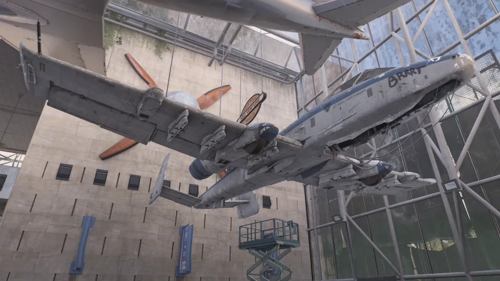
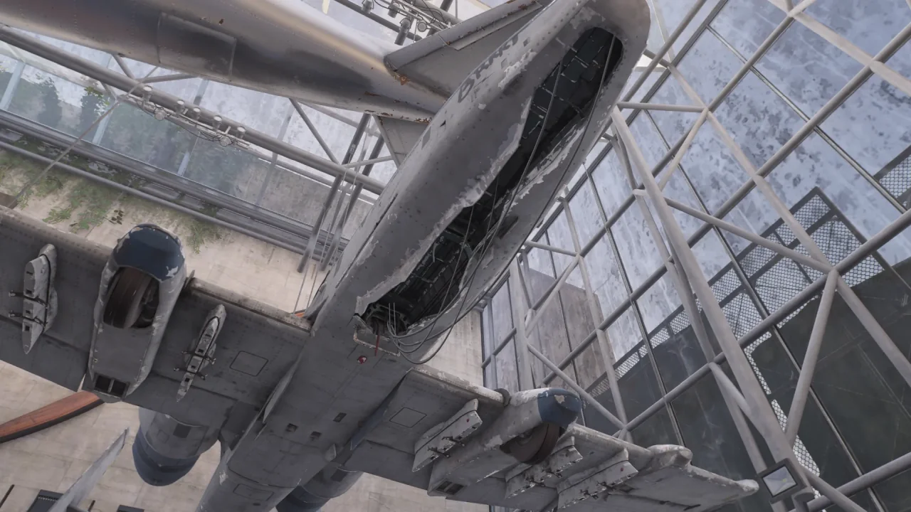
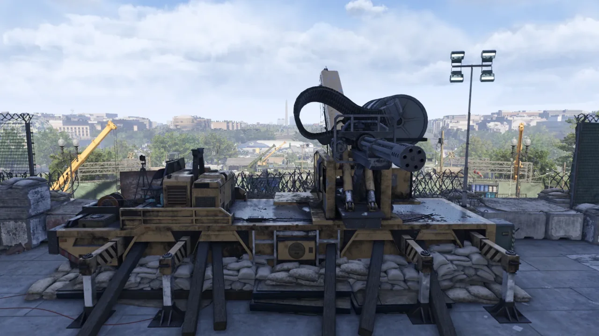
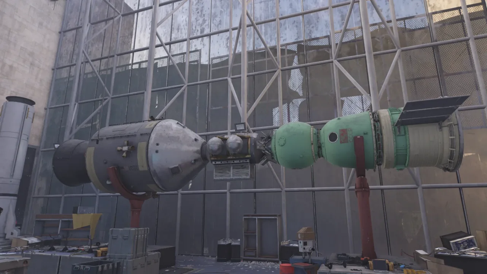
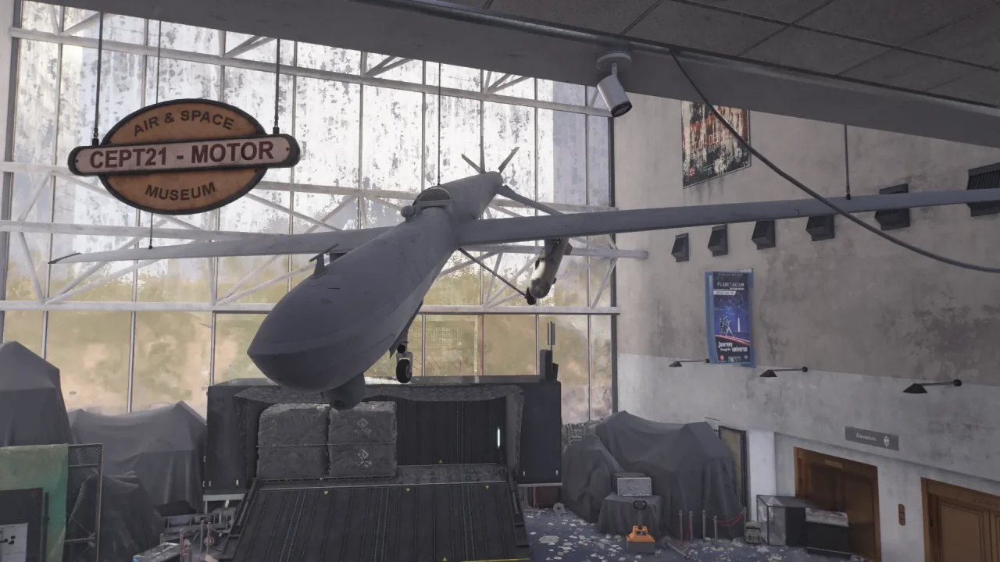
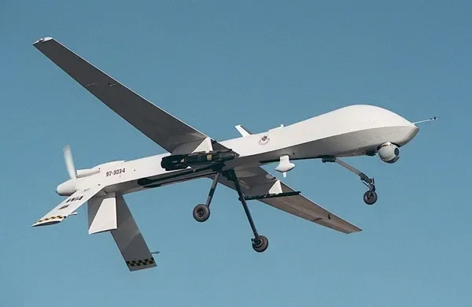
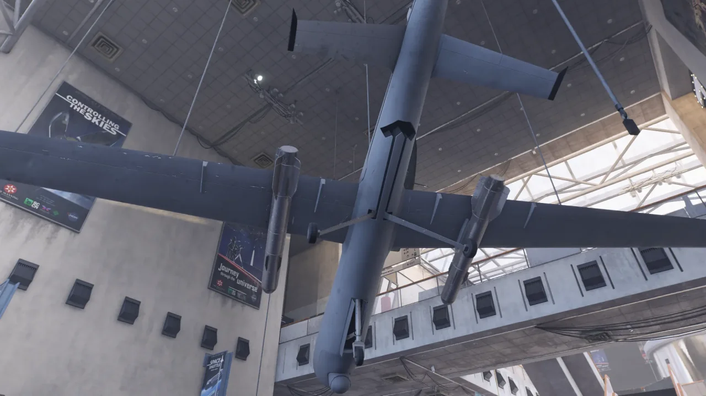
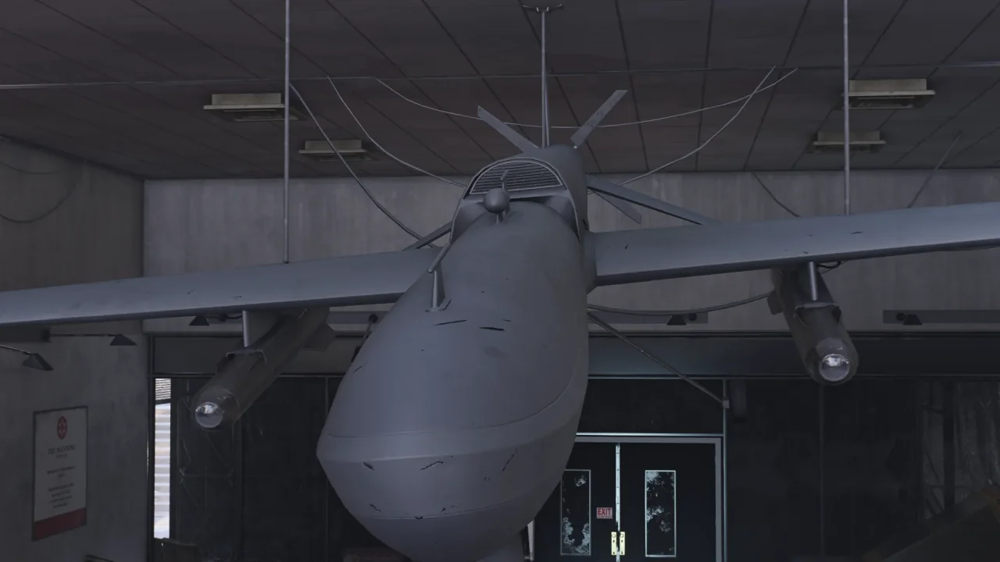

이번 주 침입 임무에 항공우주 박물관 임무가 있길래 별생각 없이 침입 임무를 돌던 중, 예전에 레딧에서 읽은 글 하나가 떠올랐다. 트루썬이 국회의사당에 배치한 개틀링 기관포는 사실 항공우주 박물관에서 가져온 것이라는 내용의 글이었다.

개틀링 기관포가 대체 왜 항공우주 박물관에 전시되어 있던 것일까 궁금해했었는데, 오늘에야 그 이유를 알 수 있게 되었다.

오늘의 주인공(?), A-10 썬더볼트 Ⅱ 되시겠다. '워트호그(혹멧돼지)'라는 별명으로 더 유명한 공격기이다.

A-10의 가장 큰 특징이라고 하면 전면에 배치된 GAU-8/A 어벤저 개틀링 기관포라고 할 수 있다. 그런데 이 A-10의 전면부 하단이 뜯겨 있다.

트루썬이 항공우주 박물관에 전시된 A-10을 분해해 A-10에 달려 있던 어벤저 개틀링 기관포를 떼간 것이다.



흔히 보던 왼쪽 사진과 비교해 보면 A-10의 꼬리 쪽 부분은 의외로 가느다랗다는 것을 알 수 있다.

이 정도면 그냥 비행기 동체에 엔진을 붙여놓은 수준인데...

트루썬이 어벤저 기관포를 참 알뜰살뜰하게도 뜯어갔다.

돌이켜 생각해 보면, 이 임무를 처음 할 때도 트루썬이 항공우주 박물관에 전시된 것들을 주섬주섬 끌어모아 전시된 미사일에 조립해 실제로 작동하는 미사일을 만들려고 했었지.

매니 말대로 손재주 하나는 좋은 놈들이다.



어차피 이번 주 침입 요새도 국회의사당이겠다, 트루썬이 국회의사당에 어떻게 어벤저 기관포를 배치해 놓았나 보려고 다시 국회의사당을 찾았다.

기중기 뒤쪽에 기관포를 달아둔 후, 기중기를 반대로 돌려 기관포가 앞으로 향하도록 배치해 뒀다. 지금은 국회의사당의 정문을 부순다고 그걸 다시 원래대로 돌려놓았지만.

기관포를 A-10에서 떼왔다는 것을 증명이라도 하듯, 어벤저 기관포가 원형 모습 거의 그대로 놓여 있다. 이 정도면 기관포를 기중기에 올려둔 채 떨어지지 않도록 용접만 했다는 느낌이다.

작지만 강한 친구, 어벤저 기관포!

실제로도 게임 내에서 어벤저 기관포의 위력을 체험해 볼 수 있다. 멋모르고 기관포 앞에서 깔짝대다가는 30mm 탄환 세례를 맞고 즉사를 면치 못하게 된다.

일반적으로 요원의 체력이 모두 바닥났을 경우 요원은 바닥에 엎드려 헉헉대다가 완전히 쓰러져 죽게 된다. 하지만 이 어벤저 기관포에 맞게 될 경우, 바닥에 엎드릴 새도 없이 그냥 차가운 바닥에 죽어 힘없이 널브러지게 된다.

소생 하이브가 있다면 운 좋게 알아서 살아날 수 있지만, 간혹 재수가 없으면 소생 하이브 역시 30mm 탄환 세례를 버티지 못하고 터져 그대로 게임 오버가 되고 만다. 만약 영웅 난이도에서 이런 짓을 했다면, 다시 임무를 처음부터 해야 한다.

&nbsp;

참고로 국회의사당 임무를 처음 시작할 때 민병대가 철조망에 대고 터트리는 C4 역시 이러한 즉사 판정이 있다. 다른 임무 등에서 등장하는 폭탄에는 이러한 즉사 판정이 없지만, 유일하게 국회의사당 초입 C4는 즉사 판정이 있다.

&nbsp;

즉, 소생 하이브만 충분하다면 멋도 모르는 뉴비를 두 번 죽일 수 있다는 이야기이다!

물론 나는 뉴비를 뒤에 엄폐시켜 둔 채 '여기 가만히 있으면 내가 재미있는 걸 보여드릴게요'라고 한 후 나 혼자 C4와 기관포 앞으로 달려가 춤을 추며 대기하지만, 다들 보통 '뭐지?' 하면서 날 따라오더라고. 그러면 내가 '어어 오면 안 돼요'라고 말하기도 전에 기관포와 C4에 갈려 같이 죽어버린다.

이건 내가 죽인 게 아니라, 뉴비가 멋대로 와서 죽은 것이니, 내 잘못은 없다.

***

이게 아마 아폴로-소유즈 테스트 프로젝트에 관한 전시일 것이다. 왼쪽이 아폴로 우주선과 아폴로가 달고 간 커플러이고, 오른쪽이 소유즈 우주선이다.

이 프로젝트를 계기로 '랑데부(Rendez-Vous)'라는 프랑스어 기반 항공우주 용어가 대중에게 널리 알려졌다고 한다.

***

보자마자 이것이 무인기인 것은 곧바로 알아차렸는데, 정확히 무슨 무인기인지는 잘 몰랐다. 찾아보니까 MQ-1 프레데터였다.

사진과 비교해 보면 꽤 많이 비슷하다. 직선으로 뻗은 주익, 머리 아래에 달린 카메라, 아래로 뻗은 꼬리 날개 등...



임무 지역을 끝에서 처음까지 거슬러 올라가면서 발견한 것인데, 의외로 이 임무에서 같은 모델을 돌려쓴 것이 꽤 많다.

한쪽 날개가 없는 비행기도 두세 번 본 것 같고, 이 프레데터 역시 두세 번 정도 보았다.

프레데터를 보면서 느끼는 거지만, '정말 이게 가능한 일인가?'라고 생각되는 부분이 참 많다.

저 가느다란 다리를 보라. 저 커다란 동체의 무게를 가느다란 다리 세 개가 버틸 수 있다는 게 난 정말 믿기지 않는다. 분명 동체의 무게가 꽤 무거울 텐데 말이다.

동체 위에 있는 회색 부분이 대체 뭔가 싶었는데, 엔진에 필요한 공기가 들어오는 공기 흡입구였다.

&nbsp;

살펴보면 의외의 디테일을 발견할 수 있는 게임, 더 디비전 2! 절대 하지 마세요.
