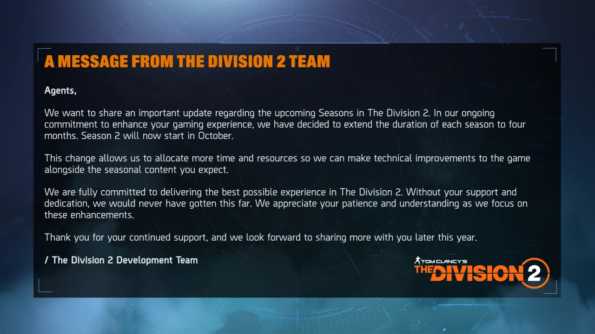



디비전을 삭제했다. 이전부터 계속 게임을 삭제할지 말지 고민하고 있었는데, 오늘 결단을 내렸다.

디비전을 삭제하기로 마음먹은 데에는 이유가 있다.

약 2주 전 올라온 공지다. 대략 요약하자면 다음과 같다.

* 기존 3개월 당 한 시즌이었던 것을 4개월 당 한 시즌으로 변경함  
  이제 1년에 4개의 시즌을 보는 것이 아니라 3개의 시즌을 보게 된다.
* 이번 시즌도 4개월로 연장함  
  다음 시즌은 10월에 시작한다.

그냥 보기에는 '뭐 괜찮은 것 아닌가? 1개월씩 더 한다는 것만 빼면...'이라고 생각할 수 있다.

문제는 디비전 2 개발팀이 평소에 하는 게 별로 없다는 것이다.

디비전의 시즌은 대략 다음과 같이 매주마다 순차적으로 진행된다.

1. 첫 번째 부목표 추격전
2. 리그
3. 글로벌 이벤트
4. 두 번째 부목표 추격전
5. 리그
6. 글로벌 이벤트
7. 세 번째 부목표 추격전
8. 리그
9. 글로벌 이벤트
10. 네 번째 부목표 및 시즌 주목표 추격전
11. 리그
12. 글로벌 이벤트

이렇게 하면 12주, 3개월이 지나간다. 중간에 의류 이벤트 같은 것이 있긴 하지만, 다른 일정과 동시에 진행되므로 제외했다.

## 추격전{id="manhunt"}

먼저 추격전을 살펴보자.

추격전은 특정 지역의 각종 필드 활동들을 통해 추격전 대상에 대한 정보를 획득하고, 최종적으로 현상수배를 통해 현재 추격전의 목표를 완료하면 되는 콘텐츠이다

대부분의 경우 추격전의 목표는 해당 추격전의 대상을 사살하는 것이었지만, 최근 들어 추격전의 목표가 '납치된 민간인 구출'로 설정되는 듯, 사살 일변도의 단조로움을 약간이나마 해소하려는 기미를 보이고 있다.

대상에 대한 정보를 얻기 위해 필드 활동 중 하나인 통제지점 점령을 할 때에도 평소와 다른 변화점을 준다. 클리너 지역이기 때문에 평소 클리너가 점령하던 통제지점이, 현재 추격전의 주요 세력인 트루썬에게 점령되는 식으로, 약간의 변화점이 생긴다.

추격전 임무의 핵심이라고 할 수 있는 추격전 현상수배 역시 다른 현상수배와는 확연히 다른 모습을 보여준다. 추격전 현상수배는 다른 현상수배처럼 보조 임무 지역에서 진행되는 것이 아니라, 주 임무 지역에서 진행된다. 또한 통상 임무를 진행할 때와 다르게, 임무 지역 곳곳에 새로운 기믹이 설치되기도 하고, 아예 정상적인 임무 진행 방향과 정반대로 거슬러 올라가기도 한다.

&nbsp;

새로운 걸 찾아볼 수 있는 건 딱 여기까지이다.

# 리그{id="league"}

리그는 정말 볼 것이 없다. 주 임무 4개를 정해진 시간 안에 재빨리 완료하면 되고, 일부 임무를 제외하면 그리 어려운 것도 아니다. 이번 주 점수가 모자라면, 나머지 임무인 '특정 세력 적에게 특정 상태 이상 부여', '특정 세력 적을 특정 방법으로 사살' 등을 진행해 점수를 채울 수도 있다.

이때 해야 하는 주 임무는 평소의 주 임무와 전혀 달라진 것이 없기 때문에, 이제는 너무 식상하다.

# 글로벌 이벤트{id="global-event"}

글로벌 이벤트 역시 너무 식상하다. 디비전 2에서 글로벌 이벤트는 딱 6가지가 존재한다.

* 양극성 스위치
* 부활자
* 수호자
* 할리우드
* SHD 노출
* 황금 탄환

새로운 글로벌 이벤트 추가 없이, 이 6개를 5년 내내 우려먹고 있다. 이제는 사골 국물조차 나오지 않을 것이다.

# 의류 이벤트{id="apparel-event"}

디비전 2 개발진이 하는 일은 딱 두 가지밖에 없을 것이다. 나머지는 죄다 재탕에 재탕을 거듭한 것이니, 일을 한다고 할 수 없고.

* 추격전 현상수배 및 임무 디자인
* 의류 이벤트 의류 디자인

의류 이벤트에는 정말 공을 들이고 있다는 것이 느껴지긴 한다. 그 결과물 대부분에 그리 호감이 가지 않아서 문제지.

게다가 지난 의류 이벤트의 의상은 완료 보상을 제외하면 나중에 다 상점에서 인게임 재화로 살 수 있도록 해두기 때문에, 의류 이벤트의 의상에서 마음에 드는 것이 없다면 그냥 마음 편하게 해당 의류 이벤트를 넘겨도 좋다. 나중에 인게임 재화로 사면 되니까.

***

다음 시즌이 10월에 시작할 예정이고 한 시즌의 길이가 4개월이니, 디비전 2를 다시 설치하는 것은 아마 내년 2월이 되지 않을까 생각한다. 결국 내게 있어 중요한 것은 새로운 이야기와 새로운 콘텐츠밖에 없거든.
