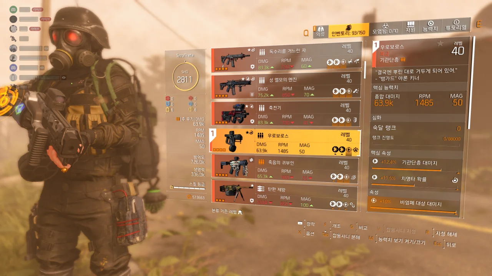

드디어! 먹었다! 우로보로스!

10월 2일 늦은 밤 있었던 디비전 2 방송에서 '당장 내일부터 습격을 이용할 수 있습니다!'라고 했을 때부터 이미 내 마음은 우로보로스에게 꽂혀 있었다.

습격 완료 후 열 수 있는 상자에서 10%의 확률로, 그리고 각 네임드마다 1%의 확률로 우로보로스를 떨어트린다고 하더라.

&nbsp;

그래서 진짜 매일 습격을 돌았다.

화요일 습격이 열리자마자 습격에 머리를 박아가며 습격을 클리어했고, 습격 상자에서 우로보로스가 나오지 않자 매일 늦은 밤까지 습격을 끊임없이 돌았다.

그러기를 9일째, 드디어 우로보로스가 나왔다.

&nbsp;

재료가 한참 부족해 우로보로스를 최적화할 수는 없지만, 뭐, 재료는 금방 모일 테니까.

***

클랜 사람들이 하나둘 우로보로스를 먹어갈 때, 나와 쿨파님만 우로보로스를 얻지 못했다.

쿨파님이 총대를 잡고 끊임없이 습격 파티를 굴렸는데, 같은 파티원이 자꾸만 우로보로스를 얻어가는 것이다. 그들 역시 처음으로 우로보로스를 얻는 것이니, 그저 축하한다고밖에 할 수 있는 말이 없다.

심지어 딜러로서 처음 습격을 가는 매드독님은 단 한 번 만에 우로보로스를 가져가시더라고.

그러다가 마지막 보스들인 존슨과 마르티네즈를 잡고 난 후, 내 화면에 붉은 기둥이 나타났다. 심지어 붉은 칸이 하나가 아니라 둘이더라고.

습격이 끝난 후, 가서 확인해 보니 '죽음의 귀부인'과 함께 '우로보로스'가 떨어져 있었다.

&nbsp;

분명 F12를 눌러 스크린샷을 찍었다고 생각했는데, 유플레이 오버레이를 꺼둔 터라 스크린샷이 전혀 찍히지 않았더라. 그래서 그때 당시의 상황을 남기지 못했다. 하다못해 OBS로 리플레이라도 남겨둘 걸...
