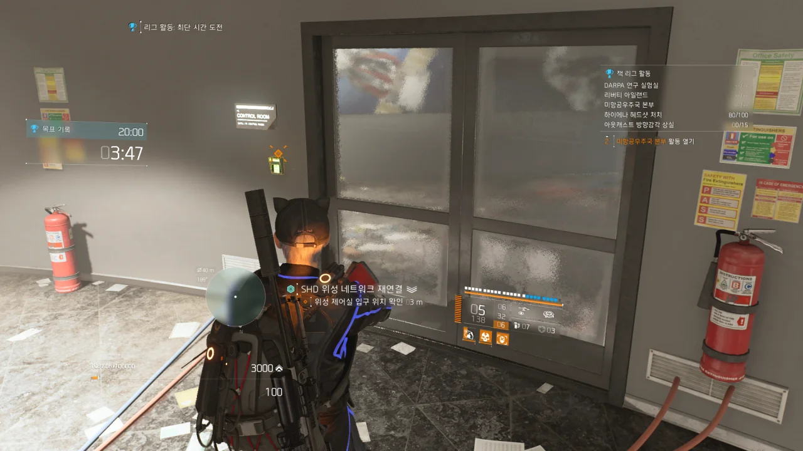
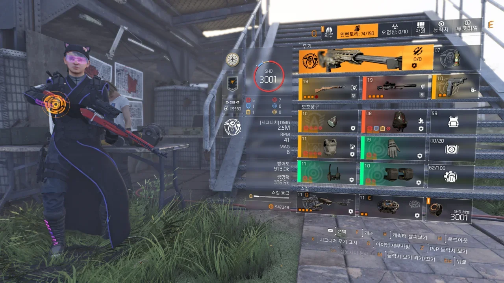

드디어 3,000 레벨이 되어버리고 말았다. 2,990 레벨이 되고 나서부터 '아, 언젠간 곧 3,000 레벨을 찍겠구나'라고 생각했는데, 그게 오늘일 줄이야.

하필이면 3,000 레벨이 된 것이 리그 활동 중이어서, 임무가 모두 끝난 후 다시 사진을 찍었다. 임무 완료 보상 때문에 1 레벨이 더 올라 3,001 레벨이 되었지만 아무튼...

예전에 듣기로, 부캐런의 효율은 3,000 레벨인가 4,000 레벨인가 그 때부터 좋아진다고 하더라. 들이는 시간 대비 얻을 수 있는 포인트가 차이가 나는지라.

하지만 내가 과연 부캐런을 할까...?
