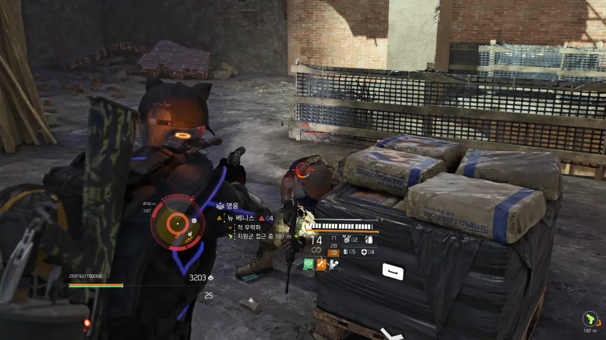
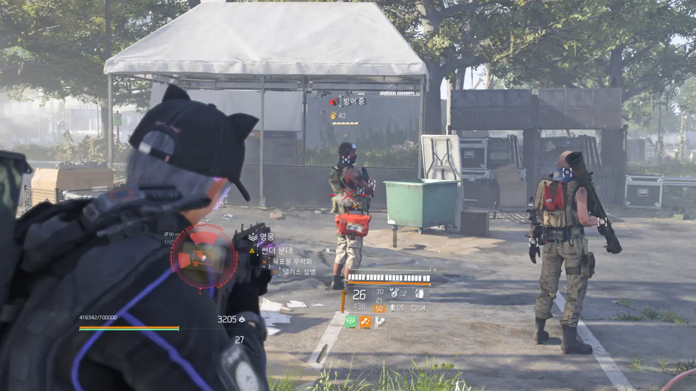

최근, 디비전 2에 대한 흥미가 굉장히 많이 식었다.

마지막으로 협동 콘텐츠를 한 게 대체 언제였더라? 아마 우로보로스를 먹기 위해 습격을 돈 게 마지막이었던 것 같은데. 의류 이벤트나 리그 같은 콘텐츠 역시 손을 대지 않은 지 오래되었다. 의류 이벤트에서 얻는 신규 의류라고 해봤자 결국 거기서 거기이고, 리그 역시 새로울 게 없는 타임어택 뺑뺑이가 전부이지 않은가.

결국 디비전 2에 남은 건 스토리라고 할 수 있는 추격전밖에 없게 되었다. 그리고 오늘, 4개월짜리 시즌의 마지막 스토리가 열리게 되었다.

기다려 뭐 하겠는가? 얼른 추격전을 끝내고 디비전 2를 삭제해야지. 하지도 않을 게임이 저장공간만 차지하고 있는 건 엄청난 낭비이다. 디비전 2를 삭제하고 나면 유플레이도 같이 삭제할 거다.

&nbsp;

저번 달에 실수로 --- 원래 계획은 모든 추격전 스토리를 한 번에 몰아서 하는 것이었다 --- 추격전 부목표 3개를 미리 끝내놨으니, 이번에 열리는 추격전 부목표 1개와 주목표 1개를 끝내는 데에 한 시간이면 충분할 거라 생각한 내게 유비소프트는 거대한 빅엿을 안겨주었다.

바로 끊이질 않는 DELTA-03 오류였다.

게임이 이렇게 잘 튕기는 건 정말 오랜만이다. 체감상 거의 5~10분마다 튕기는 것 같은데, 이 빈도는 밖에서 뛰어다니기만 해도 DELTA-03 오류를 볼 수 있었던 디비전 2 극초창기때와 비슷할 거다.

처음 두어 번 튕기고 나니, 튕길 때마다 사진을 찍어 기록으로 남겨야겠다는 생각이 절로 들었다.

아무리 총을 쏴도 적들의 체력이 닳지 않는 걸 보고 반쯤 체념해서 춤을 추다가 튕겼다.

이전에 두어 번 튕길 때에도 이렇게 통제 지점 위에서 싸우고 있었기 때문에, 사다리나 로프를 타면 튕기는 건가 의심했었다. 그래서 다시 접속한 후에는 위로 올라가지 않고 아래에서 싸웠고, 튕기는 일 없이 무사히 통제 지점을 점령할 수 있었다.

그런데 나중에 알고 보니, 튕기는 것과 사다리를 타는 것에는 아무런 연관점이 없었다. 그냥 튕기는 것이었다.

통제 지점 점령을 위해 가까운 장소로 빠른 이동을 하다가 튕겼다. 어째 로딩 시간이 길더라니.

통제 지점 점령 중 튕겼다.

이때 알게 된 것 하나. 재장전을 했는데도 총알이 곧바로 나가지 않는다면 그건 곧 튕길 거라는 신호이다. 아니, 이미 서버와의 접속은 끊어졌으니 자세를 바르게 하고 DELTA-03을 영접할 준비를 하라는 신호이다.

서버와의 연결은 이미 끊어졌는데 여분 탄약은 꼬박꼬박 줄어드는 게 묘하게 화가 난다.

다시 그 통제 지점을 점령하던 중, 또 튕겼다.

열심히 트루썬 병사에게 총을 쏘고 있지만, 놈은 몸을 움찔거리기만 할 뿐, 전혀 대미지를 입지 않고 있다.

겨우 통제 지점을 점령하는 데 성공했다. 이다음 해야 할 것은 현상 수배이다.

그리고 당연하게도 튕겼다. 아니, 이 녀석들, 아예 내가 없다는 듯 태연하게 걸어와서 지역을 방어하고 있더라?

게임에 재접속할 때마다 대기열이 보인다. 이건 디비전 2가 갓겜이라서가 아니라, 너도나도 다 같이 튕겨서 재접속을 시도하느라 생기는 대기열이다.

그리고 대기열에서 기다리던 도중, 튕겼다.

뭐요?

언제나 그래왔듯, 현상 수배가 끝나면 또 다른 통제 지점을 점령하러 가야 한다. 원래 추격전이라는 게 이렇다. 늘 지겹게 하던 현상 수배와 통제 지점 점령을 반복해야 하지.

그리고 내 기대를 저버리지 않고, 또 튕겼다.

계속 이렇게 게임이 튕기니, 결국 나도 질려서 게임을 강제 종료했다. 그리고 내가 게임을 강제 종료하자마자 '우리 조금 있다가 서버 불안정 이슈 해결하기 위해 긴급 점검 할게요!'라는 공지가 올라왔다.

예정 점검 소요 시간은 1시간이라 적혀 있지만, 과연 이 녀석들이 1시간 안에 서버를 제대로 고칠 수 있을까? 전설의 26시간 점검이 고작 13개월 전인데?

&nbsp;

원래 평소라면 그냥 넘어갔을 흠도 마음이 떠나니 눈에 거슬린다.

난 싱글 플레이 게임에 인터넷 연결을 강제한다는 것 자체부터가 마음에 들지 않는다. 물론 디비전 2는 싱글 플레이 게임이 아니라, 협동 콘텐츠가 존재하는 멀티 플레이 게임이다. 하지만 디비전 2가 100% 멀티 플레이 게임이라고 하기에는 지적할 점이 너무 많다.

안전 가옥에서 여러 플레이어들을 볼 수 있지만, 그 많은 플레이어들은 안전 가옥을 나가는 즉시 내 시야에서 사라진다. 당연한 거 아니냐고? 데스티니 2는 그렇지 않거든. 데스티니 2에서 플레이어가 정말 혼자가 되는 건 '던전'에 들어갔을 때가 유일하다. 필드 곳곳에서 다른 플레이어를 발견할 수 있는 게 바로 데스티니 2이다.

싱글 플레이에 인터넷 연결을 강제하는 것조차 보더랜드 시리즈를 가져다 놓으면 할 말이 없어진다. 보더랜드 시리즈 역시 협동 콘텐츠가 존재하는 게임이지만, 인터넷 연결이 없어도 혼자 플레이하는 데에 아무런 지장이 없거든. 디비전 2는 그러면 안 되는 건가?

내가 봤을 때, 디비전 2는 싱글 플레이 게임과 멀티 플레이 게임의 장단점 중, 단점만 쏙쏙 골라 놓은 게임이다. 이번 사건처럼 서버 상태가 좋지 않을 때에는 혼자 게임을 할 수조차 없다는 점에서 그 단점이 유달리 두드러지는 것이다.

디비전 2뿐만이 아니다. 유비소프트의 행보도 마음에 들지 않는다.

기억하는가? 파 크라이 6는 굵직한 시상식에서 단 한 개의 상도 받지 못했지만, 유비소프트는 뻔뻔하게도 '파 크라이 6 GOTY(Game of the Year) 에디션'을 내놓았다는 걸.

디비전 시리즈의 후속작이 단 하나도 나오지 않았음에도 불구하고 무턱대고 디비전 2의 사후지원을 종료할 계획이었다는 것은 말할 것도 없다. 그마저도 유비소프트가 내놓은 게임이 죄다 망하니까 어마 뜨거라 하면서 허겁지겁 계획을 취소하고 사후지원을 다시 시작한 거고.

일이 이렇게 되어가니, 디비전 2 추격전 스토리가 점점 산으로 가고 있다는 문제는 정말 사소한 문제처럼 보일 지경이다.

어휴, 얼른 이번 추격전 스토리가 어떻게 되는지만 보고 얼른 게임을 지워야지...
