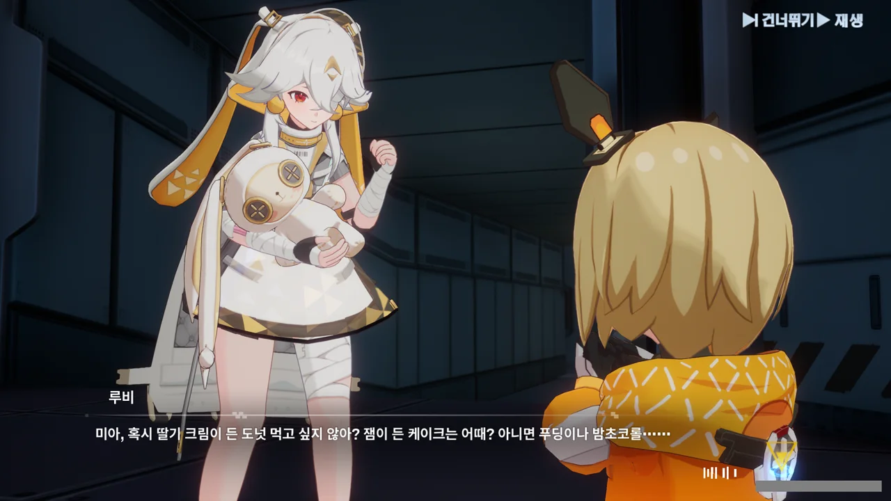
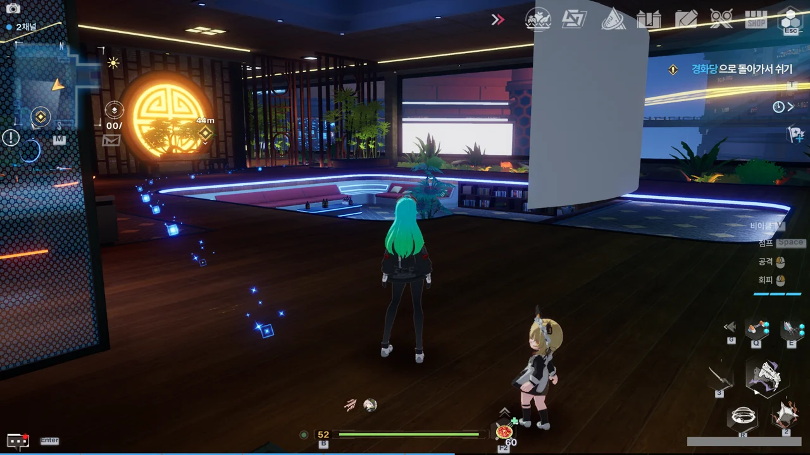
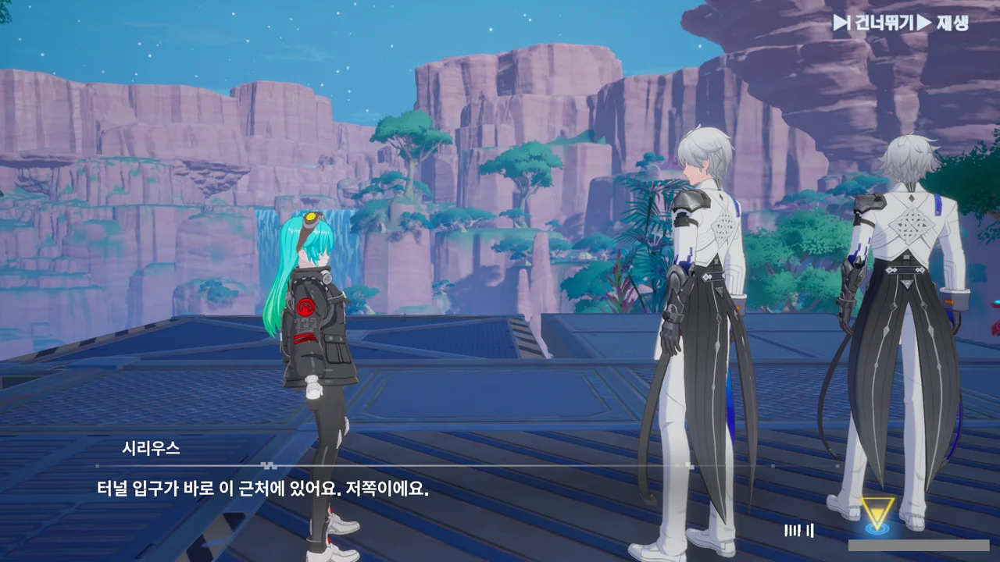

원신을 삭제한 후, 다른 오픈월드 게임을 찾아 돌아다녔다.

원신 대신할 게임이기 때문에, 몇 가지 조건이 붙었다.

* 온라인 게임일 것  
  패키지 게임은 원신처럼 지속적인 스토리 업데이트가 불가능하거나 힘들기 때문에 제외한다.
* 혼자 플레이해도 스토리 진행에 문제가 없을 것  
  스토리를 더 보기 위해서 고난도 협동 콘텐츠를 강제로 시키는 게임은 좋아하지 않는다.
* 개발사가 이용자와 소통이 잘 될 것
* 혐오 관련 논란이 없거나 해소되었을 것  
  위 두 이유는 내가 원신을 접은 이유이니만큼, 당연한 이야기이다.
* 게임의 평가가 나쁘지 않을 것

이런 조건을 다니, 엄청나게 많은 게임이 걸러지더라.

결국 내 목록에 남은 건 두 게임뿐이었다.

* 타워 오브 판타지
* 명조: 워더링 웨이브

둘 다 중국산 게임이지만, 상관없다. 원신에 이미 손을 댄 이상, 중국산 게임이니 안 하겠다고 말하는 건 언어도단, 뻔뻔하기 짝이 없는 말일테니.

명조의 경우, 아직 출시하지 않은 게임이기 때문에 자연스럽게 타워 오브 판타지에 손을 대게 되었다. 원신을 **당장** 대신할 게임이 필요했기 때문이다.

***

솔직히 말해, 타워 오브 판타지를 시작하기 전에 많은 걱정을 했었다.

위키를 읽어보는데, 게임 시스템이 무과금 혹은 소과금 유저에게 전혀 친절하지 않는다는 글이 적혀있었거든.

그래서 지금도 타오판을 하는 여러 사람들에게 물어보니, 그건 아주 오래전 이야기고, 지금은 오히려 무과금이나 소과금도 아무 문제 없이 할 수 있는 게임이라고 하더라.

그래서 시작했다.

***

다들 1.0 스토리가 너무 구려서 제작사조차 1.0 스토리를 메인 임무에서 보조 임무로 옮겼다고 하던데, 직접 해보니 그렇게까지 구리진 않았다.

다만 툭하면 '임무를 마저 진행하려면 레벨을 더 올리고 오세요'라고 하던데, 이건 짜증 나더라. 보조 임무로 옮겼으면서, 레벨 제한은 풀지 않은 모양이지.

그래도 싫은 부분을 꼽자면, 판타지 타워를 올라갈 때, 발키리가 갑자기 나타나 퍼즐을 풀게 한 장면이 있다.

물론, 발키리가 주인공의 발을 묶어 시간을 벌고 있다는 설정으로 무마할 수는 있겠지만, 너무 뜬금없이 나타나 퍼즐을 풀게 하니, 좀 짜게 식는 느낌이더라. 차라리 전투로 대체했으면 좋았을 텐데.

루비도 귀엽고 미아도 귀엽더라.

마음이 치유되는 느낌이야...

벨라에서는 자꾸만 경회당으로 돌아가 쉬라고 하던데, 옛날에 임무를 마저 진행하려면 실제 시간으로 약 하루를 기다려야 했던 흔적이 아닐까 생각된다.

지금은 그런 시간제한이 다 사라졌다고 하니, 참으로 다행스러운 일이다.

시리우스가 둘이 되었다. 물론 버그다.
