에스페리아, 벨라를 넘어 구주의 스토리도 슬슬 마지막이 보일 것만 같다.

구주를 배반한 나인을 처리하면 아무래도 구주 스토리가 끝날 것만 같단 말이지...

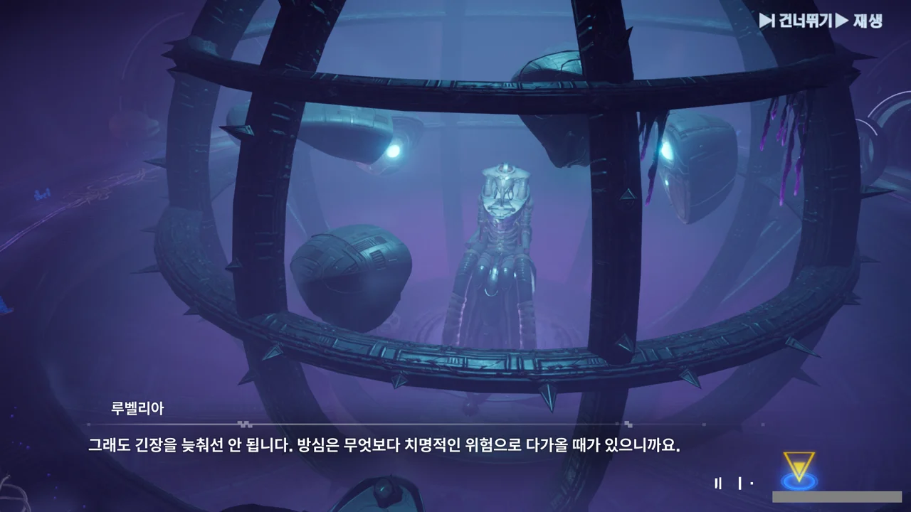

아니 그런데 왜 갑자기 분위기가 에일리언이 된 거지? 분명 난 설군 금지구역에 있는 현옥(=블랙스톤) 유적에 들어왔을 뿐인데?

저기 저 가운데에 있는 무언가를 보니, 에이리언 영화에 나온 엔지니어 시체가 생각난다.

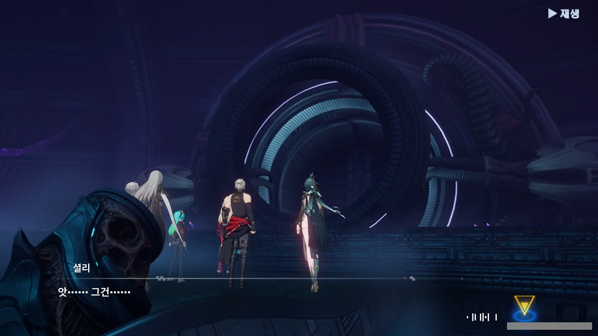

게다가 왼쪽 밑에 있는 생명체와 기계의 조합물 역시 기괴함을 더해주고 있다.

마치 MOTHER 3에 나오는 기그의 모습처럼 생겼지 않은가.

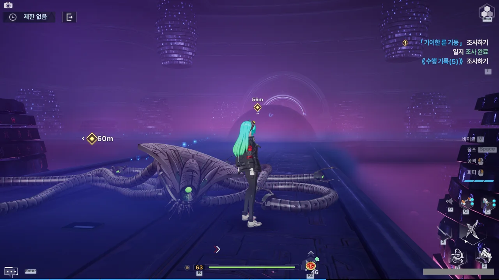

게다가 여기에는 문어 모양 로봇도 있네?

지금까지 방문했던 블랙스톤 유적과 달리, 이곳은 어떤 시설이라는 느낌이 강하게 드는 곳이다.

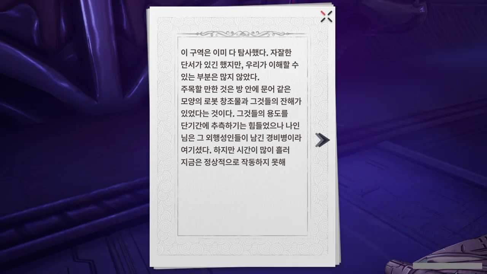

나인을 포함한 원정대가 남긴 자료에는 저 문어 로봇을 '현옥 경비병'이라고 칭하고 있다.

장르를 불문하고, 이렇게 정체를 알 수 없는 기술을 잔뜩 쓴 유적이 나왔을 때, 그 출처는 고대인 아니면 외계인인 경우가 대다수다.

벨라에서도 블랙스톤 유적은 외계인이 만든 것일 거라는 추측이 나왔었는데, 벨라와 완전 분리되어 있던 구주에서도 현옥 유적을 외계인이 만들었을 거라 추측하고 있다.

여기 인류의 시초가 퍼스펙티브 호를 타고 아이다 행성으로 온 지구의 인류였으니, 고대인이 이 유적들을 만들었을 것이란 추측은 하기 힘든가 보다.

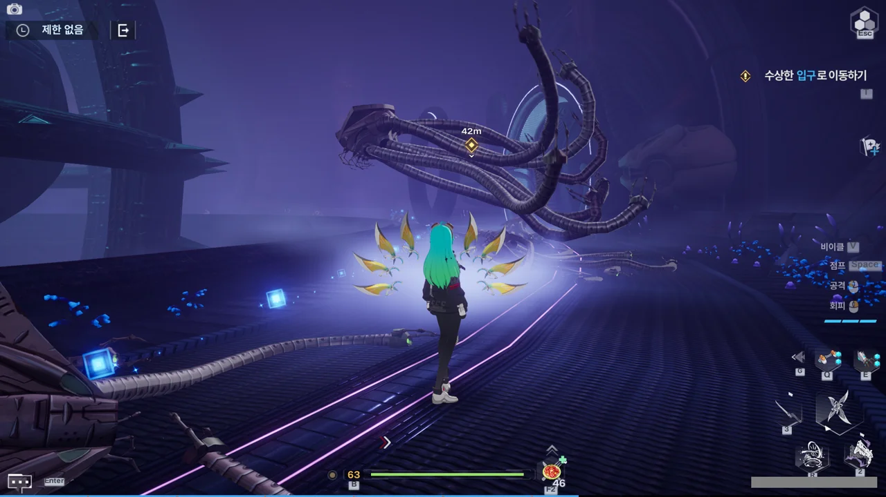

그런데 이 문어, 다시 살아나더라? 물론 쓱 그어주니까 파르르 떨며 죽어버렸다. 월드 레벨이 15밖에 되지 않기 때문에 일어나는 일이다.

하지만, 난 편하게 스토리를 보고 싶거든. 스토리에서조차 피똥 싸긴 싫다.

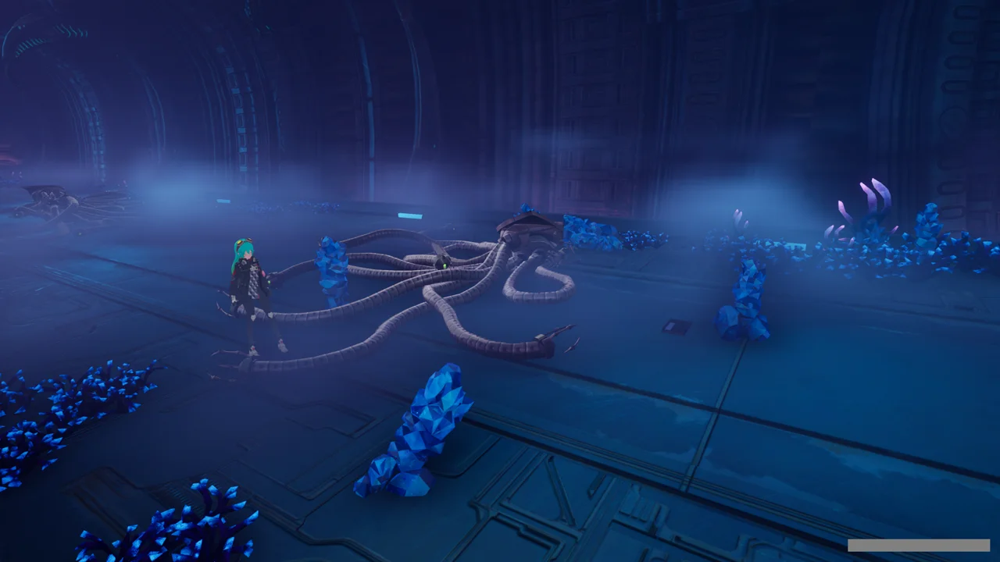

아까 본 문어 로봇과 함께 푸른 수정 조각이 곳곳에서 발견된다. 대체 이건 뭐지?

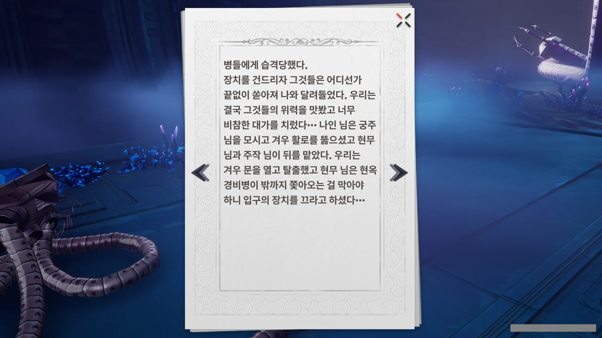

첫 원정대에 동원된 인원은 그야말로 구주의 정예 중 정예라고 할 수 있다.

* 궁주
* 청룡: 현 청룡(황)의 아버지
* 주작
* 현무
* 백호: 나인, 당시 우형사 사관
* 그 밖의 수많은 역위들

그런데 이 현옥 경비병에게 주작과 현무가 허무하게 가버렸다.

저 자료 뒷 장에는 '주작과 현무가 문을 닫고 시간을 벌겠다고 했지만, 문이 닫힌 후 얼마 되지 않아 건너편이 조용해졌다'라는 식의 서술이 있는데, 정황상 수없이 몰려오는 현옥 경비병에게 얼마 버티지 못하고 당한 모양이다.

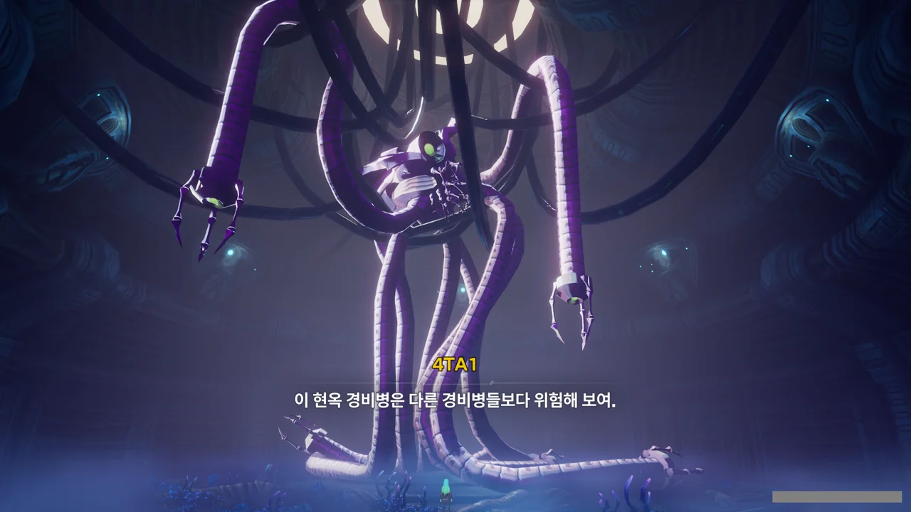

설마 나중에 여기서 저 큰 문어와 싸우는 건 아니겠지? 죽은 시체인 줄 알고 지나쳤는데, 나중에 다시 살아나 덤비는 건 클리셰잖아.

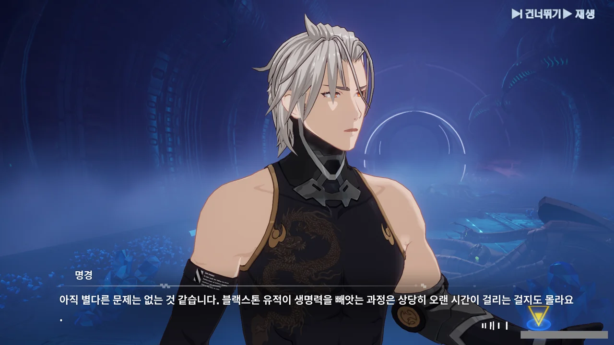

아까 본 푸른 수정이 전부 생명력을 빼앗긴 사람이라고 한다.

사람 같게 생기지도 않아서 그냥 '이게 뭐지?' 하고 지나쳤는데, 저게 다 사람이었다니!

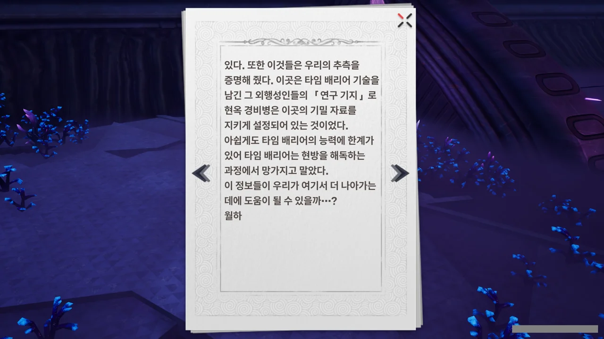

심지어 이 유적을 탐사하다 발견한, 기록 장치로 보이는 현방을 해독하려다 타임 배리어가 현방과 함께 망가졌다고 한다.

타임 배리어는 어둠(그레이)과 맞서 싸우기 위해 반드시 필요한 장치이니만큼, 이 시점에서 원정대의 생환 확률은 급감한 셈이 된다.

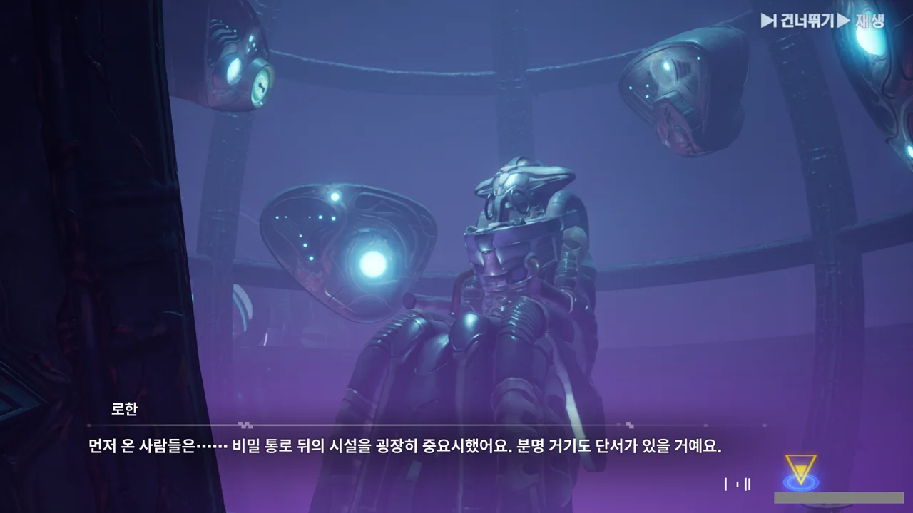

에이리언 영화에서 나온 엔지니어 시체는 누워있었고, 이 *조각상*은 앉아있는 걸 제외하면, 진짜 비슷하게 생겼다.

아무리 봐도 여기가 조종석인 거 같지 않아?



여태까지의 모든 잠금장치는 현옥(블랙스톤)으로만 열 수 있었는데, 이 잠금장치는 어둠(그레이)의 힘으로 열어야만 하는 잠금장치이다.

대체 뭐지? 블랙스톤은 그레이를 억압하고 제한하는 기능을 갖고 있는 거 아니었나?

에이리언 시리즈가 자꾸만 머릿속에 아른거린다. 사실 그레이는 블랙스톤 유적을 만든 외계인이 만든 생명체라거나 그런 건 아니겠지?

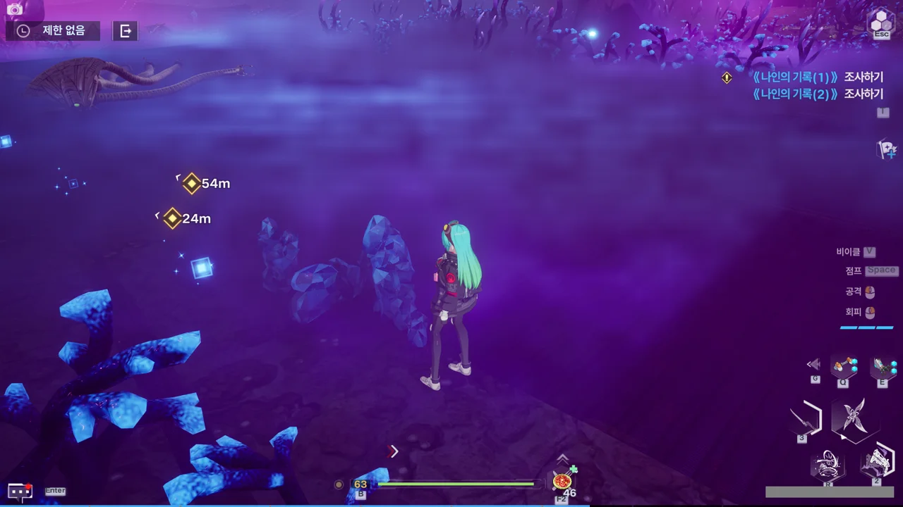

여기도 푸른 수정이 있다. 이곳 역시 사람들의 생명력을 빼앗는 무언가가 있는 모양.





여태껏 본 일지는 전부 원정대에 참여한 역위가 작성한 것으로 보이는 일지였지만, 이번에 발견한 일지는 원정대의 유일한 *귀환자*인 나인이 쓴 일지이다.

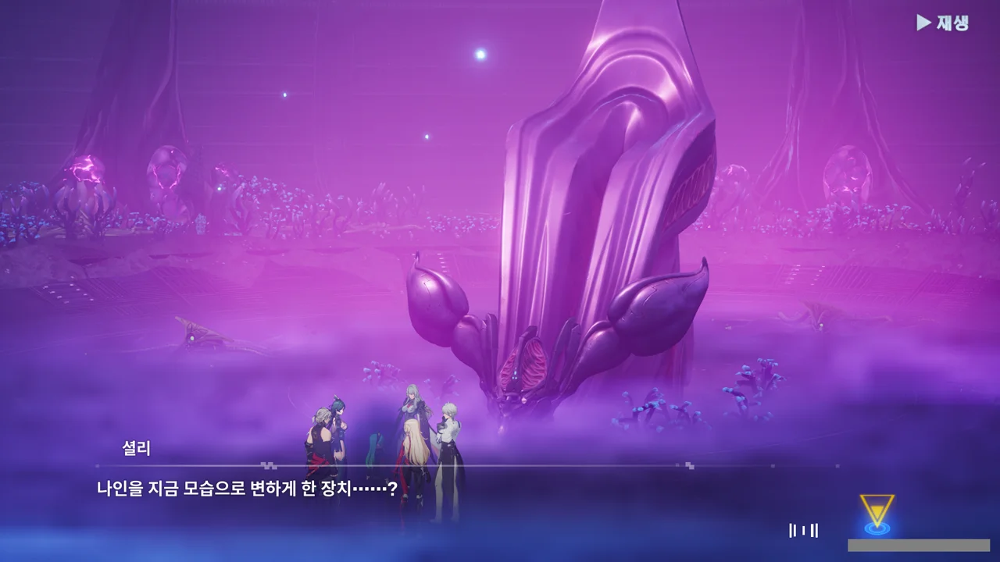

정황상 나인은 이 장치를 통해 '전환 프로세스'를 겪었고, 지금의 모습이 된 것으로 추정된다.



저 장치 안에는 분명 멀쩡한 기록 장치가 있을 것이다.

그런데 그걸 어떻게 꺼내게?





그러면 그렇지. 주인공이 전환 프로세스에 자원하는 모습이 되었다.

사실 그게 제일 합리적인 선택이긴 하지...

셜리는 이미 F-엔젤 프로젝트의 실험체가 되어 기계 인간이 되었으니, 여기서 셜리에게 뭔갈 더 시키는 건 차마 할 짓이 아닐 것이다.

나머지 사람 역시 구주에서 각자 맡은 역할이 크다. 이들 중 한 명이라도 전환 프로세스를 통해 나인처럼 적으로 돌아선다면, 그렇지 않아도 이미 많이 위태로운 구주는 몰락의 길로 확실히 접어들 게 뻔하니까.

하지만 우리 주인공은 아무것도 없다. 그저 어느 구역에서 온 익스큐셔너라는 것 정도밖에 없지. 제일 가진 것도 없고, 제일 잃을 것도 없다. 이미 이전의 기억을 몽땅 잃기도 했고.



구주에 와서 자주 겪는 일이지만, 구주 스토리 컷신에는 유독 개척자 커스터마이징이 무시되고 기본 프리셋을 쓰는 경우가 잦다.

개척자의 기본 프리셋을 안 본 지 너무 오래되어, 난 처음에 기본 프리셋 상태의 개척자를 보고 '얘가 누구더라?'라고 생각했다니까?

길드원들의 추측에 따르면, 컷신을 개척자 커스터마이징을 적용해 실시간으로 보여주기에는 자원 소모가 너무 심해, 사전 렌더링된 영상을 틀어주는 것 같다고 하더라.

그게 그렇게까지 자원 소모가 심할 것 같진 않은데... 그냥 개발사인 호타의 역량 부족 때문이 아닐까?





전환 프로세스를 완료한 나인이 현옥 경비병의 공격을 받지 않고 오히려 그들의 사열을 받는 모습이다.

현옥 경비병들은 대체 왜 죽은 역위들의 시체를 가져간 걸까?





아까 말했던 대로, 전환 프로세스를 강제 중단하기 위해 루벨리아 박사가 그레이의 힘을 써 전환 프로세스 기계의 현방을 강제 추출한다.

그보다 먼저 있었던 로한의 공격이 무슨 배리어에 막혔던 것으로 보아, 저 장치에는 실험체를 보호하는 기능까지 갖춰져 있었던 모양이다.

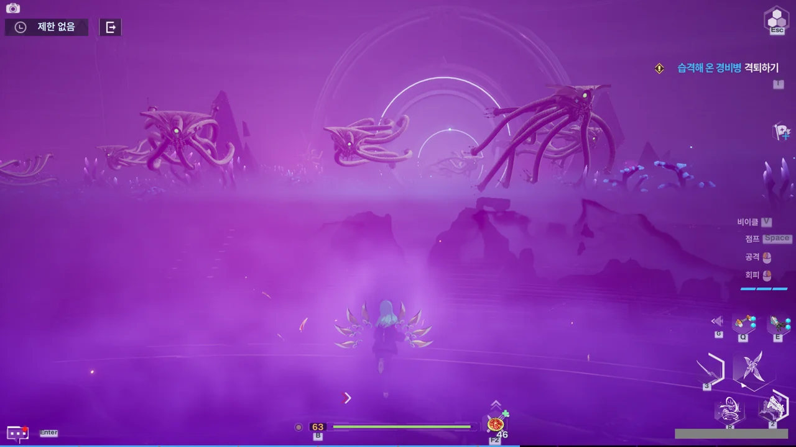

이 정도면 타코야키는 배부르게 먹을 수 있겠는걸.



야야, 주인공 상태를 먼저 물어봤어야 하는 거 아냐? 나인이 저 꼬라지가 된 전환 프로세스의 실험 대상이 되었잖아.



로한과 명경은 현옥 경비병의 잔해를 가져오지 못한 걸 아쉬워하고 있다.

그래도 일단 전환 프로세스 현방을 가져온 것만 해도 큰 수확이다. 이걸 분석하면 대체 왜 나인이 돌아온 후 어둠(그레이)의 편이 되어 사람들을 공격하는지에 대해 조금이라도 알 수 있을 테니.

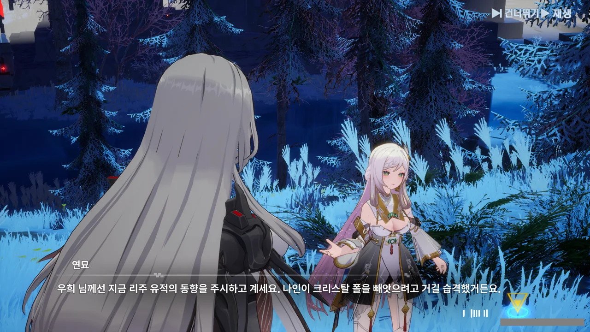

나인이 주작 지역의 크리스탈 폴을 빼앗으려 현옥 유적을 습격했다고 연묘가 알려준다.

연묘의 목소리 연기 톤이 레플리카 PV에서 본 것과는 사뭇 달라, 어색했다.



레플리카 PV에서 확인할 수 있는 연묘의 모습은 다음과 같다.

> 우형사 사관이라는 직위에 짓눌렸고, 자존감 낮은 소녀
{.block-quote}

하지만 스토리에서의 연묘의 모습은 약간 달랐다.

> 고소공포증이 있으며, 우형사 사관이라는 직위에 짓눌렸지만, 할 일은 똑 부러지게 잘 하는 소녀
{.block-quote}

스토리에서 그나마 연묘의 자존감이 낮다는 인상을 준 것도 연묘를 처음 만났을 때, 다른 지역으로 이동하기 위해 탄 잠자리가 높은 곳에 올라가자, 잔뜩 겁에 질리면서도 자신은 우형사의 사관이라며 스스로를 다독일 때가 전부였다.

환탑을 시작한 이유 중 하나가 바로 연묘의 이런 성격 때문이었는데, 많이 아쉽다.

> 좋아하는 것: 훌쩍거리며 우는 것
> 싫어하는 것: 훌쩍거리며 우는 것
{.block-quote}

이게 바로 연묘의 레플리카 프로필에 기재된 내용이다.

난 이걸 보고 환탑을 시작해야겠다고 마음 먹었거든... 이런 성격의 캐릭터를 내놓는 게임 회사의 게임이 재미 없을 리 없다고 생각해서 말이다.

하...

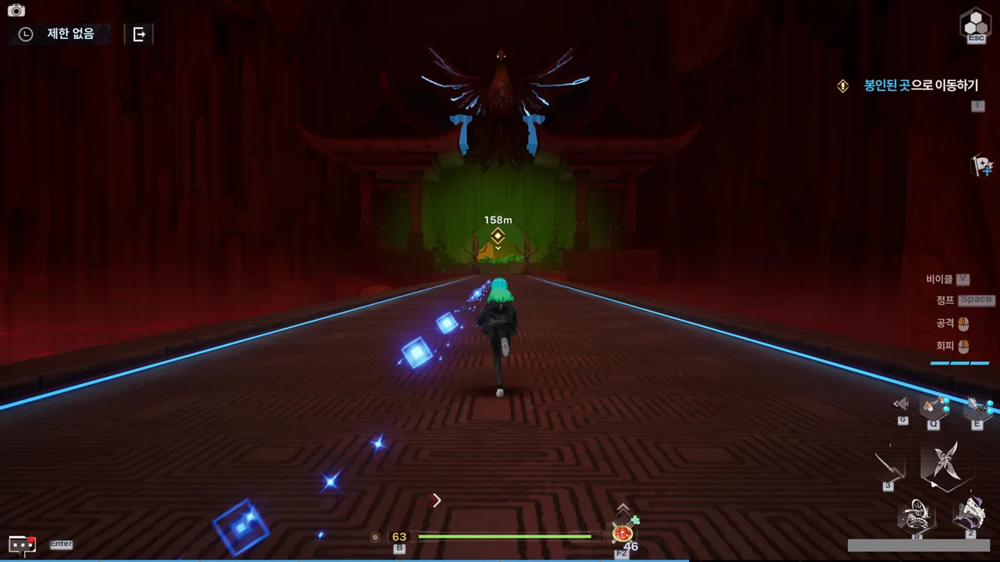

처음 방문한 현옥 유적이 여기였는데, 여길 다시 오게 될 줄이야...



기어이 나인이 크리스탈 폴을 유적에 있던 그레이에게서 빼앗았다.

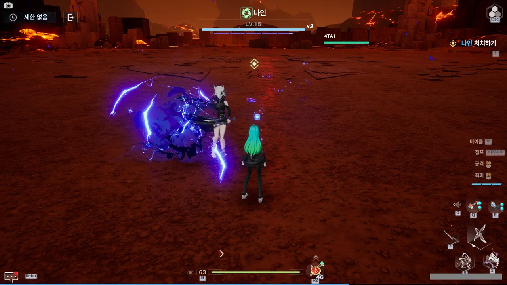

그러니까 지금 널 뚜까 패면 구주 스토리도 슬슬 종막으로 간다는 거지? 그렇지?

그런데 월드 레벨을 15로 맞춰놓아도, 나인의 공격이 꽤 아프더라. 정신 차려 보니 벌써 피가 반이나 깎여 있더라고.

이걸 월드 레벨 시스템 없이 잡은 사람들은 대체...



질 것 같으니까 비겁하게 피리를 꺼내 들어 사람들에게 촉수 플레이를 강요하는 나인.



하지만 빼앗은 크리스탈 폴이 과부하라도 걸렸는지 터져버리자, 이에 대미지를 입은 듯 주춤하더니, 잽싸게 도망쳐버린다.

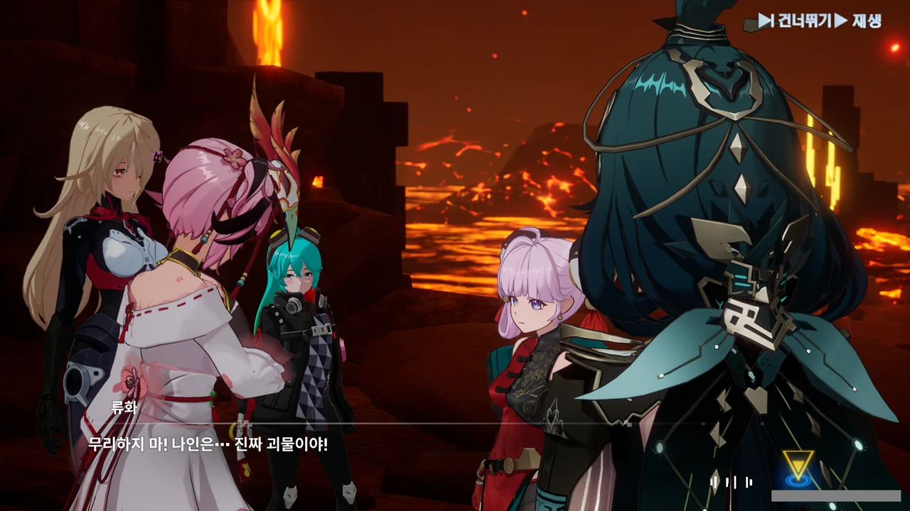

그렇지. 멀쩡한 사람은 다른 사람에게 촉수 플레이를 강요하지 않아.



'야누누'를 만났다. 야누누는 브리비가 부르는 애칭이고, 실제 이름은 아르노르라고 한다.

아르노르 등장 컷신 사진을 찍어놓고 감탄하는 사람이 많던데, 어... 음... 확실히 파격적이긴 하더라.



알고 보니, 야누누가 브리비에게 '구주 생존 가이드'를 알려준 사람이라고 한다.

그런데 하는 이야기를 들어보니, 그냥 공상 클럽 같아...



그러고 보니, 구주의 천구를 판타지 타워로 개조할 때, 뭔가 수상쩍은 장면이 나오긴 했었다.

옴니엄 원자로가 설치되어 작동될 때, 그걸 바라보는 셜리의 눈에 무슨 01001 같은 코드가 나타나더니, 헬가드에서는 옴니엄 원자로에 대한 통제를 상실해 이를 황급히 복구하려는 장면이 나왔거든.

내가 보기에, 셜리가 저도 모르는 사이에 천구의 옴니엄 원자로를 해킹한 모양인데, 지금 셜리의 몸은 테러 집단인 '아이다의 후계자'가 만들어준 몸이란 걸 생각하면, 상당히 의심쩍은 장면이다.

게다가 그 이전에 셜리가 꾸었던 꿈에는 헬가드에 있는 '거스토스'인가 뭔가 하는 AI가 셜리를 기계 촉수로 감싸더니, 셜리가 업그레이드된 네메시스 같은 것이 되어 세상을 불태우고 있었거든.



아, 이년, 비호감 확정. 첫 만남부터 이렇게 싸가지 없이 말하는 건 놈년 상관없이 비호감이다.

콧대가 굉장한 모양인데, 그런 콧대는 언젠가 부러지게 되어 있다.

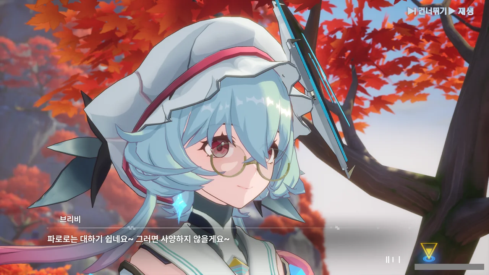

물론 우리의 브리비는 그런 거 아랑곳 않고 '파로티 님이라 부르지 말고 파로티라고 편하게 불러'라는 말을 듣자 대번에 '파로로'라는 애칭을 붙여버린다.

브리비, 대단해!







원래대로라면, 천구가 판타지 타워로 개조된 후에는 구주 에너지에 대한 걱정이 모두 해결되어, 천구가 구주 전역에 대량의 구주 에너지를 공급할 수 있어야 한다.

하지만 어째서인지, 전송하는 구주 에너지의 양이 일정량을 넘어서면 천구가 꺼진다고 한다.

현 상태를 유지하는 데에는 문제가 없지만, 중기원의 기술 연구에 쓰기에는 에너지가 턱없이 부족한 모양.

아마 셜리가 옴니엄 원자로에 뭔갈 해서겠지. 본인은 물론 그 누구도 모르고 있지만.









구주의 슈퍼 컴퓨터인 열진자가 분석한 현방의 정보는 꽤 충격적이었다.

설군 금지구역에 있는 현옥 유적은 생물을 그레이로 전환시키는 실험을 위해 존재했으며, 전환 프로세스를 거친 생물은 완전한 능력을 갖추지 못한 「유생」이 된다고 한다.

「유생」이 「성체」로 진화하기 위해서는 막대한 양의 에너지를 필요로 하는데, 그레이가 된 나인이 구주의 각 현옥 유적에 있는 그레이를 습격해 크리스탈 폴을 빼앗은 이유가 바로 여기에 있었다.

음, 그러니까 구주 사람들이 알던 나인은 이미 죽고 없고, 지금 돌아다니는 건 나인의 모습을 한 그레이라는 거잖아.

간단하네! 나인을 죽이면 끝!

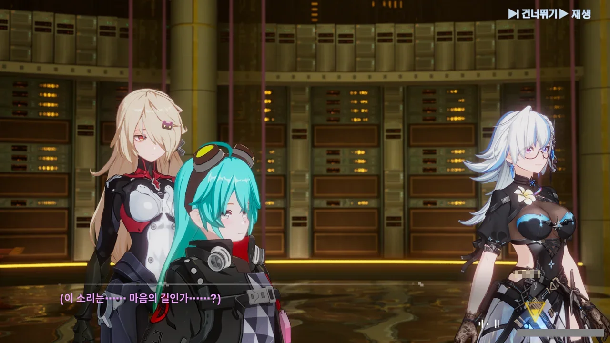

아, 그리고 개척자와 셜리가 타임 배리어를 얻을 때, 말을 걸어온 게 바로 저 열진자였다.

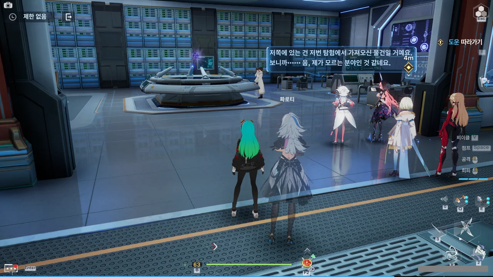

설군 금지구역에서 가져온 현방이 실컷 씹히고 뜯기고 맛 보이고 즐겨지고 있다.



아르노르의 직책은 개척자처럼 익스큐셔너인 모양이다. 그걸 갖고 파로티가 '개는 브리비를 잘 지키기나 해라'라고 시비를 걸자, '물리지 않게 조심이나 해라'라고 맞받아치는 아르노르.

그리고 여전히 눈치 없는 브리비는 둘이 잘 지내는 모양이라고 생각한다. 으휴...



그리고 개척자와 셜리는 우희를 핑계 삼아 도망친다.





나인을 상대할 때, 무슨 푸른색 안개 같은 것이 나인 주변에 둘러져 있었는데, 그걸 말하는 걸까?

나인은 그 능력을 갖고 다른 그레이들을 강화한 모양이다.

안 되겠어, 얼른 죽이지 않으면...
