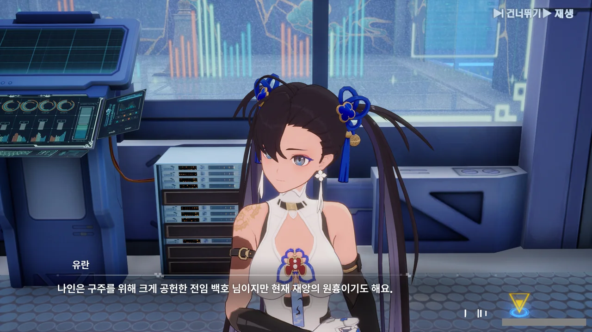
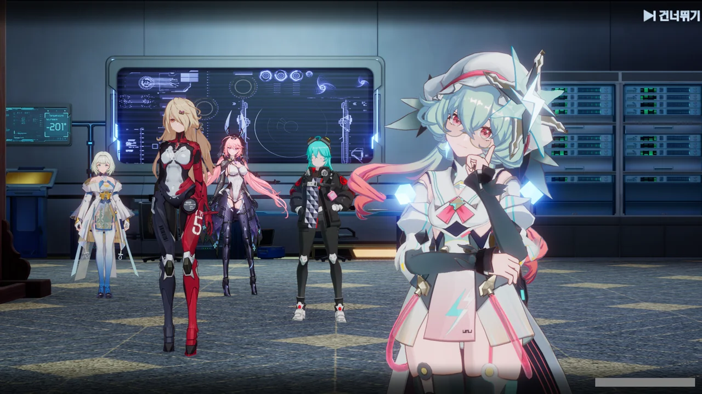

음, 어쩌면 내가 앞으로의 스토리에 대해 뭔가 오해하고 있었던 것 같다.



좌측이 3.4 버전 배경화면이고, 우측이 3.6 버전 배경화면이다.

3.6 버전 배경화면에는 여태껏 최종 보스 아우라를 풍기던 나인 대신, 흰색의 누군가가 '나 악역이오'하는 분위기를 잔뜩 풍기며 서있다. 그리고 나인은 그녀와 대립하는 구도로 서있고.

이를 바탕으로 미루어볼 때, 나인은 구주의 다른 사람들이 알지 못하는 무언가를 변환 프로세스 과정에서 알게 되었고, 저 흰색의 무언가를 막기 위해 여태껏 어둠의 크리스탈 폴을 빼앗아 더 큰 힘을 가진 「성체」로서의 진화를 꾸민 것으로 보인다.

음... 단순한 이야기가 아니었네, 이번 건.



무언가가 헬가드의 거스토스와 천구 옴니엄 원자로 사이의 시공간 초월 통신을 방해했고, 옴니엄 원자로의 권한 부여 프로세스까지 멋대로 장악했다.

그리고 난 그 원인이 셜리 안에 있는 무언가라고 추측하고 있다.

음, 컷신만 보고선 그저 통제를 벗어난 거로 생각했는데, 규모가 조금 더 컸던 모양이다.



해당 이상 현상의 이유에 대한 브리비의 첫 번째 가설.

실제 천구를 개조할 때 기존 설계와 다르게 시공된 것 때문에 이상 현상이 발생했다.



두 번째와 세 번째 가설은 각각 현옥에 기반한 기술과 옴니엄 기술이 서로 제대로 호환되지 않는다는 것과 구주 지역 자체에 무언가 방해 요소가 있다는 것이다.

그러니까 모든 곳이 다 의심스럽다는 거네.

난 셜리 안의 무언가가 천구의 옴니엄 원자로에 개입했을 것이라 생각하고 있다. 그렇지 않고서야 그런 장면을 우리에게 보여주었을 리 없지 않은가.

하지만 그걸 본 건 아무도 없었다. 답답할 노릇이네.

나인에 대해 찾아볼 때, 나인이 전임 백호였다는 말을 듣고 그 언급이 대체 어디서 나왔나 했는데, 바로 여기서 나오는 거였구나.

난 지금껏 주작, 백호, 현무 등이 겸임이 불가능한 직책인 줄 알고 있었는데, 전임 백호이자 우형사 사관이던 나인처럼 겸직이 가능한 모양이다.



파로티가 '파파' 인형을 손에 든 채 혼잣말로 하소연하고 있다.

처음 구주에 왔을 땐 잔뜩 잘난 체하며 '내 호흡을 잘 따라오기나 해라'와 같은 건방진 말을 쏟아내었는데, 정작 자기도 대체 왜 이런 문제가 생기는 건지 파악하지 못한 모양이다.

에휴, 그러게 뒷일도 좀 생각하지.





그리고 그런 파로티 뒤에 갑자기 나타난 브리비.

파로티가 눈을 동그랗게 뜬 채 회색빛이 되는 연출이 굉장히 마음에 든다. 이런 직접적인 만화적 연출은 보기 힘든데 말이야...

브리비의 말에 따르면, 열진자와 거스토스의 통신 구조가 일치하지 않아 서로 충돌할 수 없지만, 열진자 외에 이런 일이 가능한 설비는 구주에 존재하지 않는다고 한다.



브리비 뿐만 아니라 개척자와 셜리, 아르노르까지 다 파로티의 기행을 보고 있었다.



애써 '파파'의 존재를 부정하며 우희를 핑계 삼아 도망치는 파로티.





파파를 그냥 그대로 놓고 가나 싶었는데, 잔뜩 굳은 모습으로 금방 되돌아와 브리비 손에 있던 파파를 재빠르게 낚아챈 후 서둘러 방 밖으로 나가는 파로티.

파로티가 참 재수 없다고 생각했는데, 저런 모습을 보니 그런 생각이 눈 녹듯 사라진다. 그 높던 콧대도 한풀 꺾였고 말이다.



파로티에 대한 악감정이 제일 심했을 아르노르가 '방금 전 일이 기억나지 않는다'라고 하길래, 난 아르노르의 속마음이 굉장히 넓다고 생각했다.

그런데 그건 그냥 우희 앞에서 웃으면 안 되니 애써 기억나지 않는다며 잊어버린 척하는 거였다.





상황이 개선되지 않자, 곧바로 우희에게 가서 죄송하다며 먼저 사과한 후, 다시 돌아올 때 확실한 해결책을 가져오겠다고 말하는 파로티.

프라이드만 높은 게 아니라, 그에 대한 책임도 서슴지 않고 짊어지는 성격이었네. 이러면 콧대가 높아도 뭐라 불만을 표할 수 없겠는걸.





천구를 판타지 타워로 개조하는 작업 자체는 잘 마무리되었으니, 브리비의 역할은 여기까지 인가 보다.

브리비를 호위하기 위해 온 아르노르 역시 브리비와 함께 헬가드로 돌아갈 테고.



벨라와 구주 사이의 교류가 잘 되고 있는 모양이다. 벨라 역시 구주의 타임 배리어 기술을 이용해 그레이를 상대하고 싶어 한다.

그러고 보니, 미미 역시 청룡과 천장각 각주의 역할을 겸임하고 있었네. '황'은 별칭인 걸까?









현방에 담긴 정보를 열진자뿐만 아니라 헬가드의 거스토스와 함께 해독하고 싶어 하는 우희.

거스토스의 시공간 초월 통신 기능 때문에 불가능한 일은 아니라며, 그에 대한 헬가드의 답변 역시 다음에 같이 갖고 오겠다는 파로티.

그리고 이제야 눈치챈 건데, 우희 뒤에 있는 건 책장이 아니라 열진자 그 자체였다. 아무리 봐도 저건 슈퍼컴퓨터 혹은 서버렉처럼 보이지 않은가.
