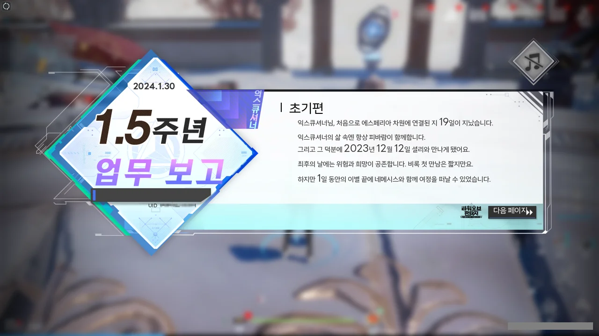
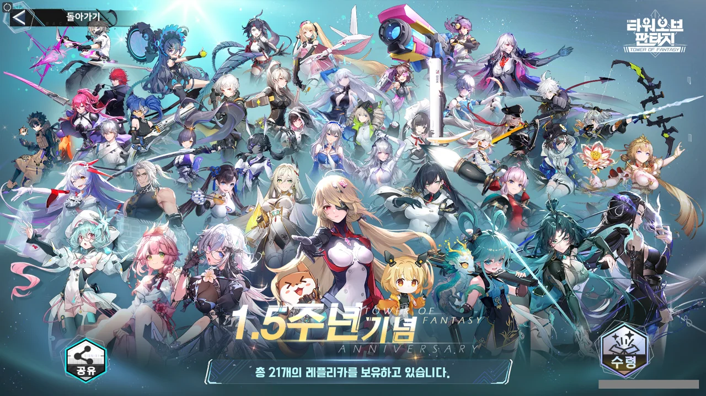

오늘은 기다리고 기다리던 타워 오브 판타지 3.6 버전 업데이트 날이다. 사실 3.6 버전 업데이트 내용을 기다리기보다, 다시 구매 가능하게 된 6,000원짜리 패키지를 더 기다렸었던 거지만.

이유는 간단하다. 내가 타워 오브 판타지를 시작하게 된 계기 중 하나인 애나벨라를 이제 뽑을 수 있거든.

내가 타워 오브 판타지를 시작한 지 얼마 되지 않은 시점에 애나벨라가 상시로 편입이 되었다. 그리고 그 소식을 들은 나는 '상시? 골드 코어 뽑기에서 곧 나오겠네!'라는, 굉장히 안일한 생각을 해버렸다.

상시로 편입된 뽑기는 레드 코어 뽑기에서 절대로 나오지 않기 때문에, 상시로 편입된 애나벨라를 얻는 경우의 수는 다음 두 가지밖에 없게 된다.

1. SSR 선택 패키지 구매  
   바로 오늘 풀린 그 패키지이다. 여태껏 상시로 편입된 무기를 직접 하나 고를 수 있다.
2. 골드 코어 뽑기  
   여태껏 상시로 편입된 수많은 무기 중 애나벨라를 낮은 확률로 뽑는다.

그때 난 내가 2번에 해당할 줄 알았다. 그런데 결국 1번에 해당하게 되더라고.

생각해 보면 당연한 일이다. 당장 블루 아카이브에서도 코코나 픽업을 지나치며 '통언뜬! 통언뜬!'을 속으로 외쳤지만, 여태껏 단 한 번도 코코나가 나오지 않았는데 말이다.

***

게임을 켜니, 1.5주년 업무 보고라는 것이 생겼다.



그리고 보자마자 뿜지 않을 수 없었다.

내가 환탑을 시작한 게 작년 12월일 텐데? 졸지에 환탑이 처음 출시했을 때부터 플레이 한 할배가 되어버렸다.

여기도 버그가 가득하다.

> 처음으로 에스페리아 차원에 연결된 지 19일이 지났습니다.
{.bq}

환탑을 처음 시작하는 장소가 에스페리아이니, 저 말은 내가 환탑을 시작한 지 19일밖에 되지 않았다는 말이다.

내가 환탑을 12월 12일에 시작했다는 저 말도 상당히 진위가 의심스럽다.

그야, 내가 서브 임무로 격하된 에스페리아 임무를 대략 일주일 넘게 했었거든. 절대로 하루 만에 끝낼 분량이 아니었단 말이다.



여기서 내가 확실하게 확인할 수 있는 정보는 딱 두 가지이다.

* 주로 매일 18시 - 24시에 임무를 수행하시는군요.
* 임무를 수행할 때에는 송골매를 타는 것을 좋아하시네요.

환탑을 하는 건 항상 저녁이었으니 당연한 거다.

송골매는 처음 지급받은 비이클인 데다, 지금 쓰는 비이클을 얻은 건 에스페리아 임무는 물론, 이너스 임무까지 다 끝내고 구주 임무도 공개된 분량의 거의 막바지에 다다를 즈음이었고.

일러스트는 참 이쁘네. 공유 버튼을 눌러 일러스트를 저장하려 했지만, 내 닉네임과 UID가 박제되어 저장되는 바람에 포기했다.

***



그리고 애나벨라를 샀다.

내가 처음 생각했던 것처럼 빨리 쏠 수 있는 총도 아니었고, 탄속도 느리게 느껴지는 무기지만, 이쁘니까...
