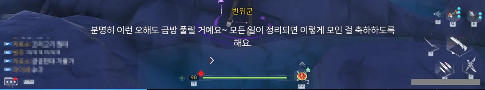

드디어 새로운 메인 스토리가 나왔다.

환탑은 새로운 스토리 챕터가 시작되어도 그 챕터의 이름을 알려주지 않기 때문에, 게임 내 터미널과 해외 위키를 뒤져서 새로운 챕터의 이름을 알아내야 했다. 터미널의 접근성이 썩 좋지 않기 때문에, 이런 점은 확실히 불편하다.

벨라에서 처음 봤던, 이카루스가 구주에 도착했다.

벨라에서 처음 이카루스를 봤을 때, 난 이카루스 역시 지금껏 만났던 캐릭터들처럼 여캐일 거라 생각했다. 성우 목소리도 영락없는 여자 목소리였고, 몸매나 얼굴도 곱상하게 생겼으니 말이다.

그런데 나중에 길드 사람들과 이야기하다가 이카루스가 사실 남캐라는 걸 알게 되었다. 대체 왜? 저 곱상한 몸매와 얼굴, 목소리를 가진 캐릭터가 왜 남캐인 거지?

심지어 이카루스의 매출이 예상보다 훨씬 적다는 이유로, 개발사인 호타가 앞으로 남캐를 내지 않겠다고 공언하게 만든 '열사'라고 하더라.

&nbsp;

... 정말 보면 볼수록 대단한 게임이야.





저번에 우희에게 공언했던 대로, 파로티가 천구에 무슨 문제가 있었는지 파악해 온 모양이다. 성격이 개차반이라도, 실력 하나는 좋다, 이거지...

> 해석된 정보가 무엇을 의미하는지도 말이야. 이미 그 답을 갖고 있는 사람도 몇 있을 테지.

파로티의 저 말은 나인을 두고 말하는 걸까?





천구의 옴니엄 원자로가 정상 작동하지 않은 이유는 원자로가 정상적으로 활성화되지 않았기 때문이라고 한다.

열진자와의 합의 후, 거스토스가 원자로 권한 획득 프로세스를 다시 시작하자, 원자로가 정상적으로 거스토스와 연결되어 거스토스가 원자로 출력을 변경할 수 있게 되었다.

어... 그러면 열진자와 거스토스가 서로 충돌했다는 말 아냐? 분명 저번에 브리비가 열진자와 거스토스는 통신 구조가 일치하지 않기 때문에 서로 충돌할 수 없다고 하지 않았나?





거스토스가 원자로 제어 권한을 획득하려 했을 때, 원자로는 비슷한 명령을 두 개 받았다고 한다. 원자로는 거스토스의 것 대신, 「방해 요인」이 보낸 명령을 실행했고, 원자로의 제어가 「방해 요인」에게 넘어갔다고 한다.

그랬기에, 거스토스와 헬가드 측에서 아무리 애를 써도 원자로의 통제 권한을 회수할 수 없었던 것이다.





자신이 말한 「방해 요소」가 바로 열진자라고 말하는 파로티.

열진자 역시 거스토스와 비슷한 원자로 권한 부여 능력을 갖고 있었고, 원자로가 권한 요청을 보냈을 때 거스토스보다 먼저 해당 요청을 가로채 원자로 제어 권한을 가져갔다고 한다.

아니, 그러면 열진자는 천구 옴니엄 원자로 제어 권한을 가져갔으면서도 그동안 입도 빵긋 안 했단 거잖아. 그게 말이 돼?

'헤헷, 저도 모르게 원자로 제어 권한을 가져갔나 보네요~'라고 컴퓨터가 말할 수는 없다고.

&nbsp;

그나저나 난 여태껏 셜리 안의 무언가가 옴니엄 원자로의 제어 권한을 탈취했다고 생각해 왔는데, 이러면 옴니엄 원자로가 처음 기동할 때 셜리 눈에 나타난 숫자는 대체 뭘 의미한 거였을까?







하지만 구주는 여태껏 다른 시공간과 단절되어 있었다. 헬가드와의 접촉도 이너스 심해류에서의 조우가 처음인 것으로 아는데, 어떻게 열진자가 거스토스처럼 원자로 권한 부여 능력을 갖고 있는 걸까?

&nbsp;

그에 대해, 파로티는 에스페리아, 벨라, 구주를 비롯한 여러 지역 사람들은 모두 아이다의 원주민이 아니며, 오래전 「퍼스펙티브호」를 타고 아이다로 이주한 이주민이라고 말한다.

하지만 모종의 이유로 「퍼스펙티브호」는 아이다에 착륙하는 데 실패했고, 아이다 궤도 상공에서 다섯 이민선을 사출 한 후 자폭했다.

당시 아이다로 착륙하는 데 성공한 이민선은 단 둘 뿐이었고, 여기 타고 있던 사람들이 에스페리아와 벨라의 선조라고 한다.

남은 세 이민선 중 두 척은 추락했고, 다른 한 척은 행방이 묘연해졌는데, 파로티는 구주의 선조가 이 행방불명된 8번 이민선에 타고 있던 사람이라고 생각한다.





이런 생각은 구주에서도 이미 하고 있었던 것이지만, 현재 상황이 상황인지라 가설의 검증이 불가능해 줄곧 보류하고 있었다고 한다.

하지만 열진자가 헬가드의 거스토스처럼 옴니엄 원자로 권한 부여 능력을 갖고 있음이 확인되었으니, 이 가설의 신빙성이 매우 높아졌다고 할 수 있다.

아마 셜리 말처럼, 열진자와 거스토스 모두 그 기술의 원류가 「퍼스펙티브호」였기에 가능한 일이었겠지.







정말 그런가 보네.

헬가드 거스토스의 전신은 「퍼스펙티브호」의 중앙 제어 슈퍼컴퓨터 「샘」이며, 8번 이민선에 탑재된 슈퍼컴퓨터 역시 「샘」과 유사한 구조를 갖고 있었다.

8번 이민선은 구주에 강제로 착륙한 여파로 인해 대부분의 설비가 파괴되어 사용할 수 없게 되었고, 그나마 건질 수 있었던 것이 열진자였다고 한다.

구주에는 다른 행성의 문명이 남긴 현옥 유적이 있었고, 구주 사람들은 현옥 유적에서 얻은 기술을 이용해 에스페리아나 벨라와는 다른 방향으로 발전했다.

&nbsp;

정말 파로티 말처럼, '잃어버렸던 동료들이 다시 모인 셈'이다.



현방에서 추출한 정보와 루벨리아의 견해에 따르면, 나인은 설군 금지구역에 있던 「부화실」에서 다른 행성의 문명 의지에 의해 지배되는 새로운 어둠의 「하이브 마더」가 되었다고 한다.

그냥 좀 센 그레이가 된 줄 알았는데, 하이브 마더까지 되었을 줄이야...





현옥 유적을 남긴 다른 행성의 문명은 어둠/그레이 종족의 적응력과 파괴력을 자신들의 뜻대로 이용하길 원했지만, 어둠 종족이 가진 독보적인 진화 능력 때문에 번번이 실패했다.

그래서 그 문명이 생각해 낸 방법은 자신들의 통제를 받는 새로운 하이브 마더를 양성해, 기존의 하이브 마더를 물리치게 한 후, 새로운 하이브 마더를 통해 그 밑의 모든 어둠 종족을 간접적으로 통제하는 것이었다.

하지만 어째서인지 그 시도는 실패로 돌아갔고, 그 문명은 하이브 마더를 봉인하고 구주에 버렸다고 한다.



현재 나인은 다른 행성의 문명이 그토록 원하던 '다른 행성 문명의 통제를 받는 새로운 하이브 마더'에 가깝다.

그래서 나인은 「부화실」에서 입력된 명령대로, 끊임없이 크라스탈 폴을 탈취해 자신의 힘을 키워 기존 하이브 마더를 물리치려고 하고 있고 말이다.





현재 구주에서 일어나고 있는 모든 사태는 크게 보면 어둠 종족 간의 권력 투쟁이다. 나인이 명귀로 만든 병사들 역시, 이 권력 투쟁에서 쓰기 위해 만든 패에 불과할 뿐이다.

이대로 나인의, 그 너머에 있는 다른 행성의 문명의 계획이 성공하게 된다면, 구주는 어둠을 더 이상 막을 수 없게 된다.

나인이 마지막 남은 감주 유적의 크리스탈 폴을 손에 넣는 것은 어떻게 해서든 막아야 하는 상황.



설군 금지구역 원정 때처럼, 이번에도 네 명의 수장이 감주 유적에 모였다고 한다.





반위군과 이후의 계획에 대해 이야기하고 있는 루벨리아.





처음 '반위군'이라는 이름을 들었을 때, 난 육군, 해군처럼 군대의 이름인 줄 알았다. 그런데 정말 사람 이름이었네?

반위군은 감주 구주 중기원 연구개발 부서 담당자라고 한다. 이 사람이 현옥 유적을 기반으로 한 각종 기술을 개발하는 부서의 톱이라는 말이다.





현재 계획은 이렇다.

감주 관저의 에너지 파워 필드는 크리스탈 폴이 방출하는 에너지를 차단해 나인이 이를 감지할 수 없게 만들 수 있다. 나인이 크리스탈 폴을 찾아 헤매는 사이, 3세대 타임 배리어 기술을 완성하면 어둠과의 싸움에서 승산을 높일 수 있는 것이다.

하지만 에너지 파워 필드의 효력은 감주 관저로 한정된다. 감주 유적에서 감주 관저까지는 임시 에너지 차단 용기를 통해 크리스탈 폴을 옮겨야 한다.

만약 운송 중 크리스탈 폴의 에너지가 유출되어 나인이 이를 눈치채게 된다면, 이 모든 노력이 물거품이 되는 것이다.





현재 나인의 위치는 알 수 없지만, 어둠 에너지는 쉬이 다룰 수 있는 것이 아니라, 상황이 무조건 나인에게 유리한 건 아닌 것 같다.

길드 사람들이 해준 말에 따르면, 8번 이민선에 타고 있던 사람들은 중국 제조업체인 '구주 중공업' 사람들이었고, 그 때문에 구주가 '구주'라는 이름을 가지고, 중국풍 문화를 가지게 되었다고 한다.

현재 볼 수 있는 '구주 중기원', '진궁', '천장각' 등의 여러 기관은 구주 중공업의 여러 부서가 조직 개편을 거쳐 생겨난 것이라고 한다.

구주는 구주 중공업의 후신이라고 해도 과언이 아니겠네.

구주에 착륙한 것이 8번 이민선 혼자였고, 다른 이민선과 소통할 수 없었기에, 구주 사람들은 여태 「퍼스펙티브호」에서 살아남은 것이 자신들 뿐이라고 생각해 온 모양이다.

... 그래. 새로운 지역이 나올 거란 건 이미 알고 있었어...

이거 대체 언제 다 뚫지?
