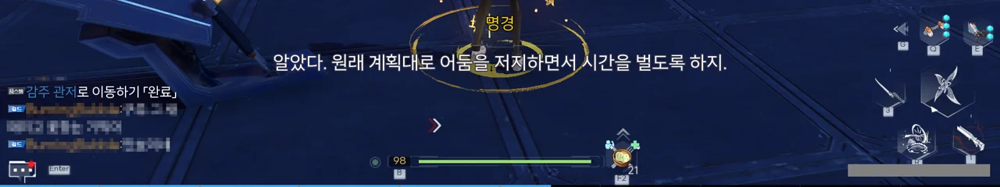
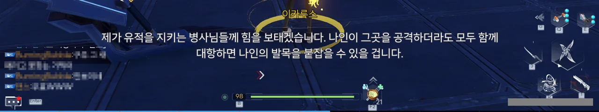

드디어 감주로 간다.

길드 사람들에게 물어보니, 저 커다란 게 퍼스펙티브호의 8번 이민선이라고 하더라.

아마 저게 8번 이민선의 원래 모습은 아닐 것이다. 착륙 후 멀쩡한 부분만 남긴 모습이겠지.

그리고 지도를 먼저 밝혔다. 대략 한 시간 정도가 걸렸다.

오랜만에 연묘와 클라우디아로 날아다녀서 그런가, 시간 가는 줄도 모르고 재미있게 했다.



감주 유적에 들어가 크리스탈 폴을 회수하기 전, 주변에 있는 어둠을 모두 제거해 혹시라도 나인이 감주 유적에 대한 정보를 얻는 것을 차단했으며, 크리스탈 폴이 드러났을 때의 파장조차 나인이 느낄 수 없도록 차단용 파워 필드까지 설치했다.

이 정도면 준비만반이라 할 수 있을 것이다.







청룡(미미), 주작(란), 백호(로한), 현무(명경) 넷이 감주 유적의 봉인을 해제한다.

이러니까 정말 예전에 있었던 태주 금지구역 원정대 같은걸.

그런데 다른 사람들은 곧게 서서 봉인을 해제하는데, 왜 미미 얘만 엉거주춤하게 서있는 걸까?

&nbsp;

이 꼬맹이의 이름은 아직도 잘 이해가 되지 않는다.

이 녀석과 친한 사람들은 '미미'라고 부른다. 하지만 게임 내에서는 '황'이라고 표기된다.

원래 이름이 '미미'였지만, 청룡이 되고 나서 자신의 이름을 '황'으로 바꿨다는 말도 들었다.

'미미'가 더 귀여우니까 앞으로 계속 '미미'로 부를 거지만.

감주 유적 안에 들어왔다. 파란색을 띤 실 같은 구조물은 처음 보는데...



그리고 나타난 현옥 유적의 보스들.

보스의 모습을 보여줄 때, 가슴, 사타구니, 사타구니 한 번 더, 이 순서로 보여주는 걸 보고 피식 웃음이 나왔다.

천박하게 말하면 섹스어필이고, 점잖게 말하면 'ㅗㅜㅑ'가 된다. 아니, 그 반대인가?

&nbsp;

그런데 가면 갈수록 등장하는 어둠/그레이의 모습이 점점 인간을 닮아간다. 지금 이 보스도 좀 특이하게 생긴 인간이라고 하면 다들 믿을 걸?

하지만 이쁜 것과는 별개로, 그 성능이 흉악한 보스였다.

&nbsp;

기본적으로 어둠 · 비익은 두 개체가 하나의 체력을 공유하는 보스이다. 그런데 두 개체가 행동하는 게 각자 따로인데다, 텔레포트까지 하기 때문에 상대하기 매우 귀찮았다.

한쪽만 나와 공격하는 건 그렇다 치는데, 그 공격이 끝난 후, 방금까지 공격하던 녀석은 어디론가 사라지고 저 멀리에 다른 녀석이 나와서 날 향해 또 다른 공격을 한다.

지금 주로 쓰는 무기가 애나벨라인데, 환탑에서 총기류 무기는 멀리 떨어진 적을 자동으로 조준하지 않는다.

자동 조준 기능을 이용하려면 굉장히 가까이 가야 하는데, 보스를 향해 달려가 도착할 즈음에는 보스가 텔레포트로 사라지고 다른 녀석이 저 멀리서 날 쏘고 있다.

멀리서 쏘는 선택지조차 없다. 멀리서 그냥 쏘면 개척자가 보고 있는 방향으로만 총을 쏘기 때문에, 보스를 제대로 맞추기 힘들다. 공격 키를 길게 눌러 조준을 하려고 하면 지나치게 높은 조준 배율 때문에 보스를 제대로 보기조차 힘들다.

어찌 방향을 맞춰 쐈다고 하더라도, 멀리서 쏜 탄환이 보스에게 닿을 때 즈음에는 이미 보스가 텔레포트로 사라진 이후이다.

게다가 보스의 공격이 제대로 나오기도 전에 얻어맞는 경우도 있어, 조금 짜증이 났다.

하지만 내가 이겼죠.

애나벨라로 때린 대미지의 총합보다 연묘로 때린 대미지의 총합이 더 컸을 것이다. 연묘의 공격은 범위 대미지라서 때리기 쉽거든.



나 혼자 보스를 상대했는데, 저번 나인 때처럼 다 같이 모여 싸운 설정인가 보다.



미미, 란, 로한은 각자 맡은 지역을 방어하기 위해 각 주로 돌아가고, 감주를 맡은 명경이 크리스탈 폴을 감주 관저로 이송하기로 했다.

나인이 우리 계획을 알아차리기라도 한 듯, 감주 유적이 어둠의 대대적인 습격을 받았다.

이카루스가 유적에 남아, 혹시라도 있을 나인의 습격에 대비하기로 했다.



드디어 도착한 8번 이민선 내부. 정식 명칭은 '퍼스펙티브호 제8선체'라고 한다.

내부의 모습이 미러시티와 굉장히 흡사하게 생겼다. 중국 느낌이 좀 더 섞인 미러시티라고 해야 할까?



에너지 파워 필드 내부로 들어왔으니, 한숨 돌릴 수 있게 되었다.

아직까지 나인이 우리의 계획을 눈치채지는 못한 모양이다. 만약 우리의 계획을 눈치챘으면 득달같이 달려와 크리스탈 폴을 빼앗으려 했겠지.



그런데 나인이 노리는 게 크리스탈 폴이라면, 그냥 크리스탈 폴을 파괴하면 되는 일 아닐까?

구주 사람들은 크리스탈 폴에 있는 에너지를 필요로 하지 않고, 괜히 놔뒀다간 나인 좋은 일만 해주는 꼴이 될 테니 말이다.





하지만 실험 결과, 순도가 훨씬 떨어지는 인공 크리스탈 폴을 파괴했음에도 불구하고 그 파괴력이 상당했다고 한다.

만약 인공 크리스탈 폴이 아닌, 어비스의 크리스탈 폴을 파괴할 경우, 그로 인해 발생할 재해와 오염을 감당할 수 없을 거라고 한다.

3세대 타임 배리어 시스템을 응용하면 크리스탈 폴 파괴나 어둠의 활동으로 인해 발생한 생태 환경오염을 개선할 수 있을지도 모르지만, 현재 가장 시급한 문제가 하이브 마더와 나인의 위협으로부터 벗어나는 것이라, 3세대 타임 배리어 시스템의 연구 방향은 어둠 제압에 초점이 맞춰져 있다고 한다.



3세대 타임 배리어와 관련해, 구주 중기원에서 벌써 결과를 내놓았다고 한다.

만성 에너지 부족에 시달리던 구주 중기원에 구주 에너지가 원활히 공급된 것이 꽤 최근의 일인데, 굉장하다.

지도조차 생긴 것이 미러시티와 판박이이다.

곳곳에 놓인 입체 도로를 보았을 때, 여기도 미러시티처럼 워프 포인트가 굉장히 부족할 것 같다.

미러시티를 탐사하기 싫은 이유 중 하나가 바로 빈약한 워프 포인트의 개수인데, 여긴 더했으면 더했지, 모자라진 않을 거 같거든.





크리스탈 폴을 감주 관저에 무사히 안치하는 데에는 성공했지만, 어둠의 특성상 나인이 크리스탈 폴이 사라졌음을 눈치챘을 가능성이 높다.

즉, 나인이 사라진 크리스탈 폴을 찾기 위해 크리스탈 폴을 보관할 수 있을 만한 장소를 죄다 뒤지고 다닐 수도 있다는 말이다.

하지만 일단은 타임 배리어 시스템을 먼저 업그레이드하기로 했다.

연구개발 부서가 위치한 건물의 이름은 '관성루'이다. 말 그대로 정말 누각이네.





타임 배리어의 개조 자체는 그리 오래 걸리지 않는 건지, 벌써 개조 준비가 다 되어 있다.



그런데 그냥 타임 배리어에 레이저를 쏘는 게 과연 업그레이드인가?

타임 배리어를 업그레이드하고 나와보니, 감주 관저에 어둠이 벌써 들이닥쳤다.

방금 전의 어둠은 척후병에 불과했던 건지, 본격적으로 어둠이 감주 관저로 쳐들어왔다.

&nbsp;

&nbsp;

그리고 게임이 꺼졌다. 위 사진에 나온 저 장면의 다음으로 넘어가지 못하고, 게임이 픽 하고 꺼져버렸다.

순간 감탄했다. 나인이 부리는 어둠이 드디어 게임을 꺼트리는 능력을 습득했구나!

하도 어이가 없어서, 코웃음이 절로 나오더라고.

&nbsp;

내가 보지 못한 장면은 아마 3.6 버전 PV에서 나온 장면으로 추정된다.



다만 감주 관저에 폭발이 일어나는 장면이 PV에 나오지 않는 것으로 보아, 대충 상황만 일치할 뿐, 동일한 영상은 아닌 것으로 보인다.

다시 게임을 켰더니, 새로운 로딩 팁이 나왔다.

> 사주사상
> ***
> 4대 현옥 유적은 각각 구주의 4개 주에 위치하고 있습니다. 인류는 유적이 타임 배리어 기술 특성에 영향을 줄 수 있다는 것을 발견했습니다. 이것이 증명된 후 진궁은 최종적으로 사상 개념을 사용해 각 주를 구분했고, 능력이 출중한 4인을 선발해 사상의 이름을 짊어지고 구주의 각 주를 나누어 관장하게 했습니다.
{.block-quote}

> 퍼스펙티브호 제8선체
> ***
> 구주 중공업 시설과 인력을 실은 퍼스펙티브호 선실. 아이다에 불시착할 때 바다에 추락했고, 이후 인류가 제8선체를 찾으려 했으나 결국 실패했습니다. 제8선체의 실종은 인류의 공업 능력에 큰 타격을 주었고, 아이다의 개척 과정에 지대한 영향을 미쳤습니다.
{.block-quote}

> 구주 중공업
> ***
> 지구 제일의 중공업 기업. 지구 각 지역에 인프라 건설을 위한 맞춤형 서비스를 제공해 지구의 번영과 발전을 촉진했습니다. 구주 중공업 직원은 고대 동양 문화를 숭배하며, 기술을 발전시켜 사업을 확장시켜 나가는 동시에 인류 문화를 중시해 독특한 기업 이미지를 형성했습니다. 원래 9척의 통합형 원양 중공업 제조선으로 유명했기에 「구주」라는 이름이 지어졌습니다.
{.block-quote}

이런 건 로딩 팁이 아니라 게임 안에서 풀어야 하는 설정 아냐?





정황상, 나인이 크리스탈 폴을 노리고 감주 관저를 습격했다가, 하이브 마더가 갇힌 감옥으로 향하는 균열을 감지하고 그곳으로 들어간 것 같다.

나인이 하이브 마더를 가둔 감옥에 들어갔다는 건, 나인이 지금 이 상태로도 하이브 마더를 상대할 수 있다고 생각했기 때문일 것이다.

&nbsp;

하이브 마더를 가둔 감옥이 열리고, 그 영향 때문인지 감주 곳곳에 수많은 심연류가 생겨나 어둠을 뱉어내고 있다.

처음 계획을 세웠을 때 제일 염려하던 상황이 터진 것이다.



정정. 감주뿐만 아니라 구주 곳곳에 심연류가 열렸다. 특히나 란이 맡은 리주가 심각한 피해를 입었다.

감주 관저 근처에 있던 어둠을 제거하자 원래 있던 NPC가 다시 나타났다.

> 어때요? 오늘 견학이 논문에 도움이 되었나요?

... 거 참 분위기 안 맞네. 조금 전까지만 해도 여기 잔뜩 널려 있던 어둠을 처치하고 있었는데 말이야...

리주에 가보니, 개판이 펼쳐져 있었다.

애나벨라는 일대일 상황에서나 쓸모가 있을 것 같다. 범위 공격이 안되니, 여러 어둠에게 둘러싸이는 상황에서는 연묘가 더 효율적이다.



나인이 크리스탈 폴을 가져가지는 못했을 거라 생각했는데, 기어이 가져가버린 모양이다.

이게 다 컷신을 보던 중 게임이 종료되면 컷신을 다시 처음부터 보여주지 않는 호타 때문이다.



나인보다 먼저 크리스탈 폴을 손에 넣은 건 그저 시간을 벌기 위한 임시방편일 뿐이었고, 실제로 아주 약간이나마 나인이 크리스탈 폴을 손에 넣는 걸 지연시켰으니, 그간의 노력이 헛수고가 된 건 아니라고 말하는 란.

와... 이게 바로 긍정의 힘인가?



심연류가 구주 전체에 나타나게 된 건 나인과 하이브 마더가 서로 싸우면서 발생한 대량의 어둠 에너지 때문인 것 같다..



진궁에서의 소집 연락이 왔다.

우희라면 이 상황을 타개할 수 있을 만한 해결책을 갖고 있을지도 모르겠다.

나? 컷신을 제대로 못 봐서 뭐가 어떻게 돌아가고 있는지 잘 모르겠는걸요?





리주에는 야누누가 남아 지원하기로 했다.

&nbsp;

야누누를 처음 봤을 때에는 별로라고 생각했는데, 보면 볼수록 마음에 들더라고.

그래서 야누누 픽업을 위해 레드 코어를 열심히 모으고 있다.
