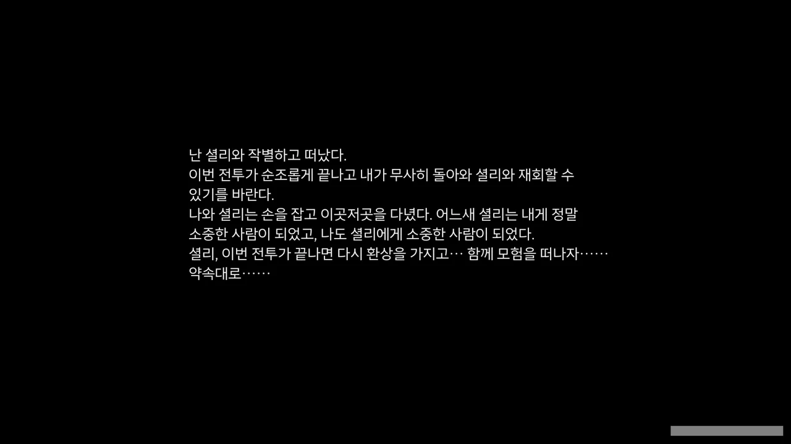
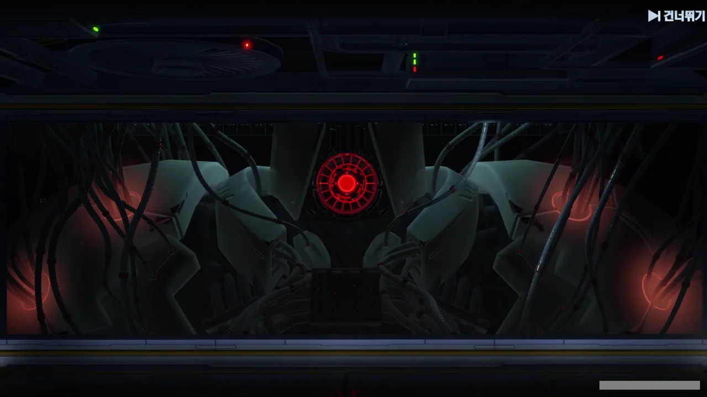





감주 상공의 균열에서 분출되는 어둠 에너지는 하이브 마더의 것이라고 한다. 게다가 하이브 마더의 봉인이 곧 깨질 거라는 정보도 얻었다.

나인이 크리스탈 폴을 빼앗으려 서둘렀던 것은 역시 하이브 마더가 아직 현옥 유적에 갇혀 있을 때 하이브 마더를 처치하기 위함이었던 것으로 보인다.





우희의 새로운 전략은 나인과 하이브 마더가 서로 싸울 때 개입해, 양쪽 모두를 치는 것이다.

나인과 하이브 마더가 서로 싸우느라 힘을 적잖이 소비할 테니, 그 기회를 노려 양쪽 모두를 격멸하는 것이다.







업그레이드된 타임 배리어로 현옥 유적과 상호작용할 수 있게 되었다. 타임 배리어로 현옥 유적을 조작해 하이브 마더와 나인을 함께 봉인할 수 있는 것이다.

다만 이건 현옥 유적의 상태가 멀쩡할 때에나 기대할 수 있는 것 같다.



루벨리아 혼자만의 힘으로는 현옥 유적으로 향하는 길을 열 수 없다고 한다.





셜리가 그때 현옥 유적으로 향하는 특이한 좌표를 감지했다고 한다.

하이브 마더의 위치를 특정한 후, 옴니엄으로 그 길을 다시 열면 되지 않겠느냐는 셜리의 말에, 파로티가 이론상 가능한 일이라고 말한다.





재미있는 것은, 에스페리아나 벨라와 달리 시공간에 고립된 구주 역시 그 상황을 타파하기 위해 옴니엄을 이용하여 시공간의 속박을 부수려 했다는 것이다. 옴니엄(역맥)이 부족해 보류했었지만.





다만 이렇게 옴니엄을 이용해 강제로 시공간을 비트는 데에는 막대한 양의 에너지가 필요하기 때문에, 천구에 설치된 옴니엄 원자로가 시공간을 비트는 데 필요한 옴니엄 에너지를 제공하다가 과부하되지 않도록, 거스토스와 열진자의 공동 연산 프로그램을 먼저 테스트해봐야 한다고 파로티가 말한다.

그러자 우희는 파로티가 프로그램을 테스트할 동안, 시공간을 비틀 수 있는 장치인 천문포의 준비를 마치겠다고 말한다.



셜리는 천구에 남아 열진자로 하이브 마더의 구체적인 좌표를 고정하는 역할을 맡게 되었다.

이번엔 우희 역시 천구에 있지만 않고 직접 나서기로 했다.





갑자기 시작된 개척자와 셜리의 달달한 대화.





타워 오브 판타지의 이야기는 기억을 잃고 아스트라 대피소로 실려온 개척자와 셜리가 만나는 것으로 시작했으니, 개척자와 가장 가까운 건 셜리라고 할 수 있다.

셜리 역시 마찬가지로, 유일한 가족인 오빠가 또 다른 대재앙을 막기 위해 타임 엔진을 폐쇄하고 시공간의 난기류 속으로 사라진 후, 그나마 붙잡을 수 있는 것이 개척자뿐이다.

비록 구주에 와서 다시 오빠를 만날 수 있었지만, 다시 만난 오빠는 모든 기억을 잃고 '명경'이 되어 있었으니, 셜리의 원래 모습을 기억하는 건 개척자와, 다시는 돌아갈 수 없는, 아스트라 대피소 사람들 밖에 없는 것이다.









개척자가 셜리를 "언제나 그렇게 강하다"라고 생각한 것처럼, 셜리 역시 개척자를 "언제나 당당하게 앞장서며 끝없는 미지로 가득한 미래를 맞이한다"라고 생각한다.

F-엔젤이 된 후, 자신이 존재하는 이유를 찾기 위해 개척자와 함께 여행을 떠나고 많은 걸 얻었지만, 여전히 자신이 왜 존재하는지에 대한 명확한 답을 찾지 못한 셜리.

그런 셜리가 보기에, 개척자는 자신과 달리 아무런 걱정이 없는 것처럼 언제나 당당하게 앞장서며 미지로 가득한 미래를 마주하는 사람이었다.

자신도 개척자처럼 될 수 있을까 고민하던 셜리는 적어도 감정에 얽매여 멈춰 서고 싶지는 않았기에, 개척자가 가는 길을 따라가기로 결심한 것이다.







더 이야기를 나누고 싶지만, 셜리는 열진자에 가 하이브 마더의 좌표를 고정해야 하고, 개척자는 감주에 합류해 하이브 마더를 처치해야 한다.

> 하고 싶은 이야기가 아주 많지만... 다음을 기약할게!

어어... 이거 플래그인데...

분명 이후 불행한 사고가 생겨, 셜리와 개척자가 다시 만날 수 없게 될 것만 같다.



음... 진짜 걱정되는데. 똑같은 플래그가 너무 많이 꽂히고 있다.

마치 전투를 앞두고 숨겨둔 술을 꺼내 전우들과 나누며 폴라로이드 카메라로 전우들과의 사진을 찍는 그런 느낌이란 말이다. "이 전쟁이 끝나고 돌아가면 애인에게 고백할 거야" 같은 대사를 마구 날리며 말이다.





열진자와 거스토스가 함께 옴니엄의 출력을 조정해 천문포를 조작하고 있다.





천문포가 하이브 마더가 봉인된 현옥 유적으로 가는 길을 열고 있다.

하늘이 붉은색으로 물드는 장면 역시 3.6 버전 PV에서 본 것 같은데...

이제 정말로 하이브 마더를 만날 수 있을 것 같다. 벨라에서부터 우릴 계속 괴롭히던 하이브 마더를 드디어 끝장낼 수 있는 걸까?



구주는 물론이요, 벨라, 헬가드에서도 관측되는 보랏빛. 구주에서는 한 노인이 그걸 보고 '불길한 빛'이라고 말한다.



그런데 갑자기 거스토스가 픽하고 꺼져버린다.



갑자기 거스토스가 사라져서 그런지, 현옥 유적으로 가는 길을 열던 천문포 역시 작동을 멈춰버렸다.



천구에서는 옴니엄 원자로의 출력이 떨어지고 있다는 이야기가 들린다.





셜리가 열진자에 뭔가 조작을 가하더니, 모습이 변해버렸다.

셜리의 꿈속에 나왔던 그 모습인 것 같기도 하고, 다른 것 같기도 하다.



거스토스에 셜리 안에 있던 무언가가 업로드되는 듯한 모습이 나오더니, 거스토스를 대신해 작동하기 시작한다.

정황상, 셜리 혹은 셜리 안에 있던 무언가가 열진자를 통해 거스토스에 업로드된 모양이다.



다시 옴니엄 원자로의 출력이 상승해, 현옥 유적으로 향하는 길이 열렸다.

불길한 붉은빛을 남기고 꺼지는 거스토스.

&nbsp;

진짜 한 치 앞을 알 수 없게 되어버렸다.

하이브 마더를 처치할 수는 있게 되었지만, 셜리는 대체 어떻게 되는 거지?
