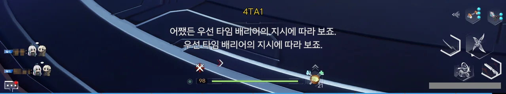





하이브 마더가 봉인된 현옥 유적 안에 진입했다.

여기서 지체할 시간이 없으니, 여긴 역위들에게 맡기고 하이브 마더를 찾아 전진하기로 했다.

설계대로, 3세대 타임 배리어와 현옥 유적이 공명을 일으켰다. 이제 타임 배리어를 이용해 현옥 유적을 조작할 수 있게 된 것이다.

&nbsp;

그나저나 호타야... 번역이 이게 뭐니.

> 어쨌든 우선 타임 배리어의 지시에 따라 보죠.
> 우선 타임 배리어의 지시에 따라 보죠.

왜 같은 대사가 두 번 출력되니...





이 너머에 하이브 마더가 있는 것이 분명하지만, 타임 배리어로 열 수 없는 문이다.







문 앞에 있는 알 같은 장치를 만지자, 양 끝에 있던 '사다리 모양 현옥 장치'가 활성화되었고, 그 둘을 활성화 하자 문이 열렸다.

저기 앞에 거대한 무언가가 있는 것이 보인다.

거대한 체구의 하이브 마더와 흰색으로 변해 버린 나인이 서로 싸우고 있다.

하이브 마더는 거대한 체구 탓인지 공격이 굼뜨지만, 나인은 하이브 마더의 공격을 피하는 데에만 급급하고 있다.





앞서 정찰을 나간 루벨리아의 말에 따르면, 하이브 마더는 평범한 공격으로는 처치할 수 없다고 한다. 이게 하이브 마더의 고유 능력인 건지 영역 능력인 건지는 잘 모르지만 말이다.

하지만 하이브 마더는 분명 현옥 유적의 기술로 봉인된 적이 있다. 분명 하이브 마더를 제압하거나 봉인할 수 있는 방법 역시 여기에 있을 것이다.



아까 보았던 알 모양의 장치이다.



장치를 작동하자 앞쪽에 있는 '현옥 궁노'라는 장치가 활성화되었다.

현옥 궁노의 영역 안에서 어둠을 죽이면 장치에 에너지를 충전할 수 있다.

&nbsp;

영역 안에 있던 어둠을 죽여도 모자라서, 영역 바깥에 나가 다른 어둠을 공격해 어그로를 끈 후, 영역 안으로 끌고 와 죽여야 했다.





그러자 현옥 궁노에 심연류 포탈이 열렸다.

여기에 계속 있어봤자 별다른 수가 없으니, 들어가는 수밖에.



도착한 곳은 방금 있던 방의 2층이었다.

나인과 하이브 마더가 레이저 빔까지 쏘며 싸우는 모습을 특등석에서 관람할 수 있다.



두 곳의 장치를 활성화하자, 하이브 마더가 힘이 빠지는 건지, 비명을 지른다.

하이브 마더가 비명을 지르자, 갑자기 이상한 공간으로 끌려간다. 뭐지?

애나벨라로 확대해 보니, 아까 보았던 거대한 하이브 마더가 작아진 모습이다.

설마 여기가 하이브 마더의 심상 세계인 건 아니겠지?



하이브 마더의 이름은 '재난의 어머니'. 저번에 봤던 어둠 · 비익보다는 쉬웠지만, 사기 스킬을 하나 갖고 있었다.

보스가 뭔가를 충전하는 듯하더니, 바닥에 알 수 없는 무언가가 내리 꽂힌다. 그러면 짜잔, 내 체력이 삭제된다.

의도된 스크립트 연출이었는지, 방금 한 번 썼기 때문에 아직 쿨타임이 돌아가는 중일 터인 타임 배리어를 곧바로 다시 충전해 줘서, 그거로 모든 체력을 회복할 수 있었지만, 기분이 더러웠다.

&nbsp;

일대일 전투라서 그런지, 애나벨라로도 충분하더라.

어차피 스토리 보스는 내가 얼마나 많은 대미지를 욱여넣던 체력이 일정하게 고정폭으로 깎이기 때문에, 멀리서 평타로 툭툭 치는 것만으로도 이길 수 있다.



방금 그곳은 정말 하이브 마더의 영역이었던 것인지, 나인이 개입해 하이브 마더가 쳐놓은 영역을 걷어내었다.

와. 정말 '와' 이 말밖에 할 수 없다.



나인이 뭔가 힘을 모으는 듯하더니...

그대로 하이브 마더를 헤드샷 해버린다.



말이 헤드샷이지, 나인이 자신의 몸을 탄체로 삼아 그대로 하이브 마더의 머리를 관통한 것이다.





어둠도 헤드샷에는 장사 없는지, 머리가 뚫린 하이브 마더가 잔뜩 좋아하며 비명을 지르더니 말 그대로 폭발해 버렸다.



그리고 나인 역시 폭발에 같이 휘말렸다.

사진으로 제대로 남길 수 없어서 그렇지, 나인 역시 폭발에 힘없이 뒤로 날아가더라고.



하이브 마더는 크리스탈 폴을 남긴 채 소멸했다. 지금까지 함께 해서 더러웠고, 다시는 만나지 말자.



나인 역시 온통 흰색이던 모습에서 원래 사람 모습으로 되돌아왔다.



하지만 원정대는 죄다 이곳저곳에 쓰러져 정신을 잃었다.



다시 눈을 뜬 나인.

눈동자의 모습이 사람이었을 때의 눈동자인 것으로 보아, 적어도 인간 나인의 의식인 것은 확실해 보인다.



겨우 눈을 뜬 로한 눈에 보이는 건, 크리스탈 폴을 향해 다가가는 나인의 모습.





그러더니 갑자기 나인과 로한의 과거 회상이 나온다.

나인과 로한이 한때 굉장히 친한 사이였다고 알고 있었는데, 그때의 모습을 보여주는 모양이다.





피리를 불던 나인이 보랏빛 가루가 되어 산산이 흩어져 사라지고, 나인을 의미하는 나비 한 마리가 로한을 지나쳐 하늘 위로 사라진다.



아뇨, 안 괜찮아요. 시야가 RGB가 되어버렸어요. 이대로 색안경만 쓰면 3D로 즐길 수 있을 것만 같아요.







하이브 마더가 폭발할 때, 개척자 역시 정신을 잃었다가 이제야 깨어난 것 같다.

물어볼 수 있는 게 굉장히 많다.

{}





나인이 어둠이 되어 수많은 역위들을 명귀로 만들고 수많은 가정을 망가트린 건 확실한 죄이다. 비록 그게 나인의 본의가 아니었을지라도, 그 길 외에는 다른 선택지가 없었을지라도 말이다.



하지만 마지막 순간, 나인은 제정신을 차리고 크리스탈 폴과 함께 사라졌다.

그게 정확히 뭘 의미하는 건지는 아직 잘 모르지만, 구주를 위협하던 두 하이브 마더가 함께 사라졌다는 것은 확실하다.





루벨리아는 나인이 그때 자신이 누구인지 깨달은 것 같다고 생각한다. 그랬기에 크리스탈 폴과 함께 사라지는 선택을 했을 거라고 말이다.





마지막에 본래 자기 자신으로 되돌아온 나인은, 크리스탈 폴과 함께 사라지는 선택을 함으로써 자신의 사명을 다하고 이전에 지은 업보를 조금이나마 되갚은 것일 거라고 말하는 루벨리아.

덧붙여, 아마 나인은 처음부터 외계 문명의 의지에 대항해 맞서 싸우고 있었을 거라고 말한다.

{}

{}



외계 문명 역시 하이브 마더를 제거하지 못했고, 그저 현옥 유적에 봉인하는데 그칠 뿐이었다.

현방에서 얻은 정보와 그간의 경험으로 미루어볼 때, 하이브 마더의 생명은 오직 어둠 종족만이 끝낼 수 있는 것이 아닐까 추측하는 루벨리아.

너무 사기 종족인데, 그러면.







하이브 마더가 죽을 때에는 대량의 어둠 에너지가 방출되는데, 이는 하이브 마더의 마지막 발악이자 보복이라고 한다. 아마 그게 조금 전 봤던 폭발로 표현된 거겠지.

하지만 나인은 새로운 하이브 마더가 되자마자 그 어둠 에너지를 현옥 유적 내부로 유도했고, 그 에너지로 하이브 마더를 대상으로 하는 봉인을 강화했다고 한다.

나인이 새로운 어둠의 하이브 마더가 되었으니, 그 봉인은 나인을 봉인할 테고 말이다.



새로운 어둠의 수장이 된 나인에게 어떤 변화가 일어날지, 그로 인해 어떤 결과가 나올지는 모두 미지수이다.

구주에게 남은 선택지는 한 번 어둠 종족을 봉인했던 현옥 유적의 기술을 모방해 나인을 한 번 더 봉인하는 수밖에 없다.

하이브 마더는 어둠 종족만이 제대로 죽일 수 있고, 그 외의 방법으로 어찌어찌 하이브 마더를 죽이더라도, 하이브 마더가 죽으면서 내뿜는 막대한 양의 어둠 에너지 폭발을 억제할 수 없을 테니까.



현방에서 얻은 정보에 따르면, 한 번 봉인된 하이브 마더는 한동안 잠잠할 것이라고 한다.

그러니 구주는 그동안 현옥 유적의 기술을 연구하고 새로운 방법을 찾을 수 있을 것이다.



현재 봉인된 나인은 루벨리아조차 기운을 분별할 수 없을 정도로 약해졌다고 한다.

{}

{}



새로운 하이브 마더가 된 나인이 봉인되었다고 해도, 어둠은 여전히 구주로 몰려올 것이라고 한다. 그래도 하이브 마더라는 구심점이 없는 한, 큰 소란은 일으키지 못할 것이라는 것이 루벨리아의 예측이다.



구주 역시 손만 놓고 있지 않고, 어둠과 구주 에너지에 대한 연구, 방어 시설 개선 등을 통해 나인이 깨어나기 전에 더욱 효과적인 방법을 찾을 것이라고 한다.



루벨리아는 나인의 의식이 어둠 에너지 충격과 함께 완전히 사라졌을 것이라 생각하고 있다.

즉, 다시 깨어난 나인은 완전한 어둠 종족이 되어 있을 수도 있다는 말이다.





나인은 구주를 위기에 빠트리기도 했지만, 동시에 구주를 구하기도 했다.

우희는 나인의 죄와 희생을 모두에게 알리고, 그에 대한 판단은 각자에게 맡기겠다고 말한다.

{}

좋지 않은 일이 또 있다고 한다. 대체 뭐지?





셜리가 하이브 마더의 좌표를 고정하는 걸 도운 이후, 갑자기 힘을 잃고 쓰러졌다고 한다. 응급 처치를 통해 안정을 찾았지만, 대체 왜 쓰러졌는지는 아직 잘 알지 못한다고 한다.

그래, 하이브 마더와 싸우기 전, 셜리가 열진자에 뭔가를 하더니, 모습이 변해버렸지. 그리고 거스토스에는 셜리, 혹은 셜리 안에 있던 다른 무언가가 업로드되었고 말이다.

아무리 봐도 셜리가 쓰러진 게 그것 때문인 것 같은데...



셜리가 지금 있는 곳은 진궁인 것 같다. 하지만 직접 진궁으로 가봐도, 셜리를 찾을 수 없었다.

&nbsp;

3.6 버전에서 구주 스토리를 끝내겠다고 하길래 '드디어 조금 쉴 수 있는 건가'라고 생각했는데, 셜리가 몸져누웠다니!

이래 서야는 기승전결 기승전결의 흐름이 아니라 기승전 기승전이 되잖아!
