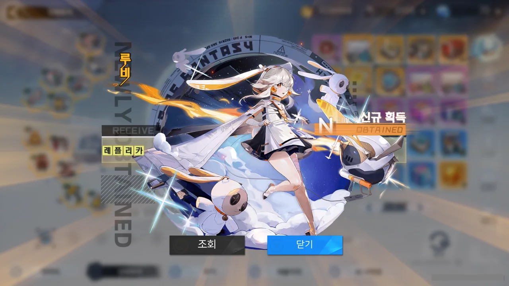
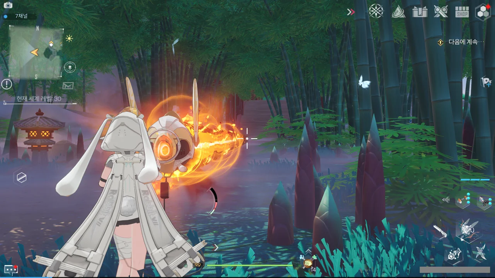

1.5주년 기념 이벤트의 3일 출석 보상으로 SSR 무기 선택 상자를 얻었다.

갖고 싶었던 애나밸라는 6,000원짜리 패키지로 이미 얻었기에, 조금 고민하다가 루비를 선택했다.

그야, 귀여우니까.





하... 보고만 있어도 입가에 미소가 떠나질 않는다. 너무 귀여워!

루비의 무기, 스파크를 써봤는데, 쓰기 힘들 것 같더라. 레이저 빔을 쏘는 건 매력적이다만...

그런데 스파크를 쓰다가 확인한 건데, 스파크 아래에 연결된 선이 루비와 연결되어 있었다. 그 선이 정확히 루비의 어디에 연결되어 있는지 확인하려 했지만, 잘 보이지 않았다.

레플리카 일러스트를 다시 확인해 보니, 스파크와 루비를 연결하는 선이 분명 그려져 있다.

대체 저 선의 정체는 뭘까?
