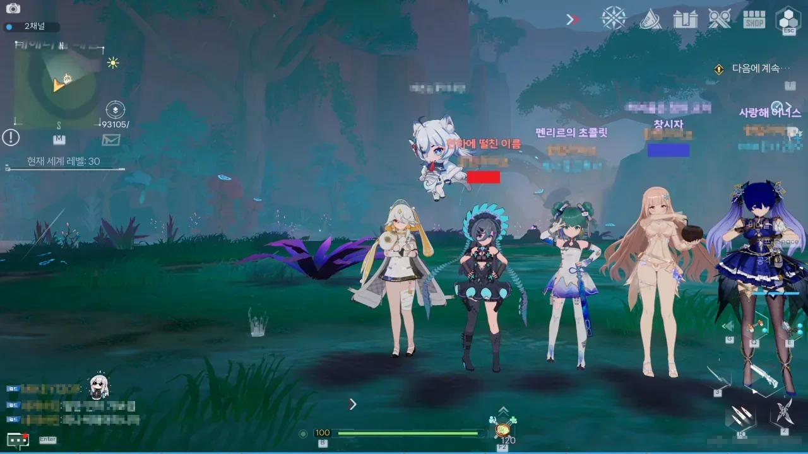
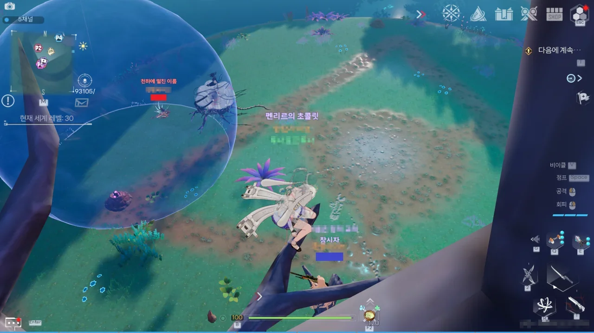
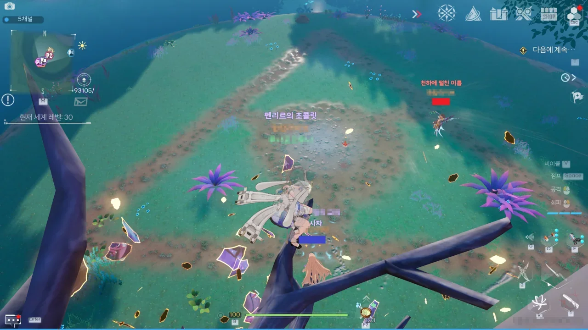
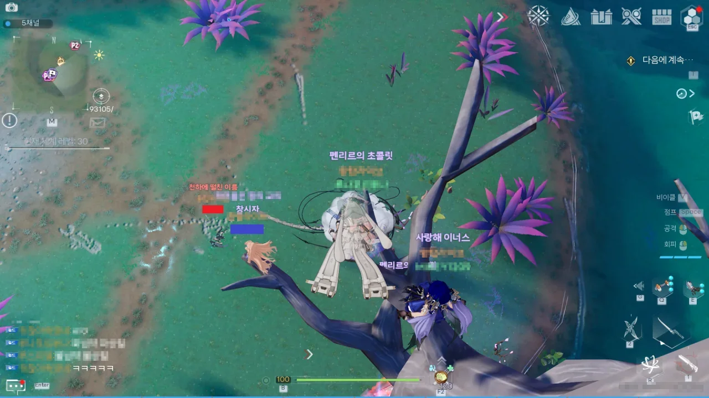
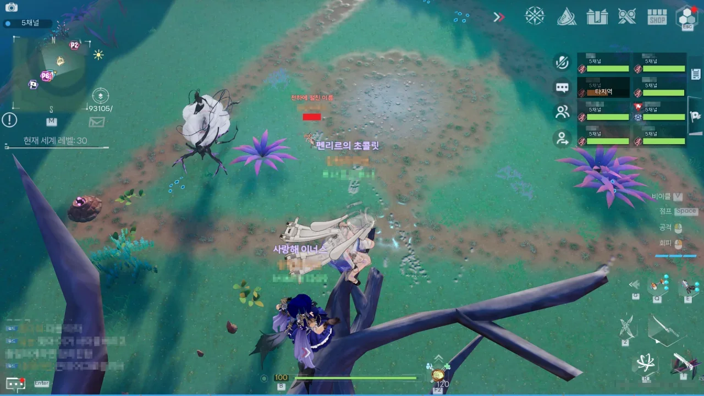
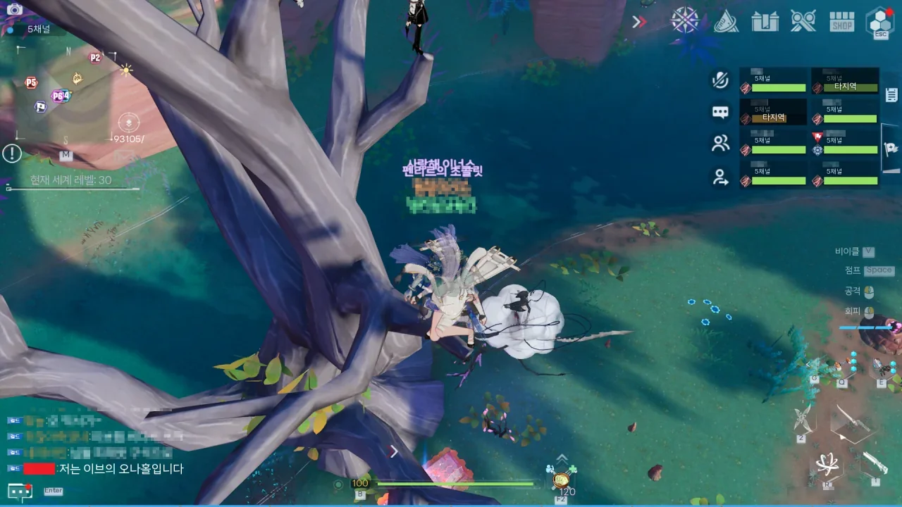
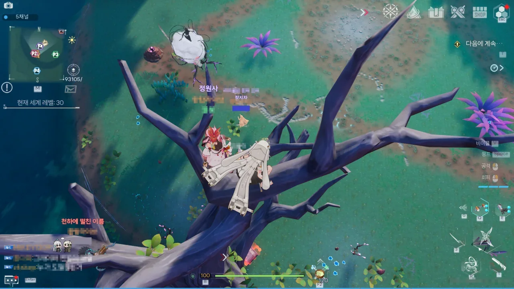
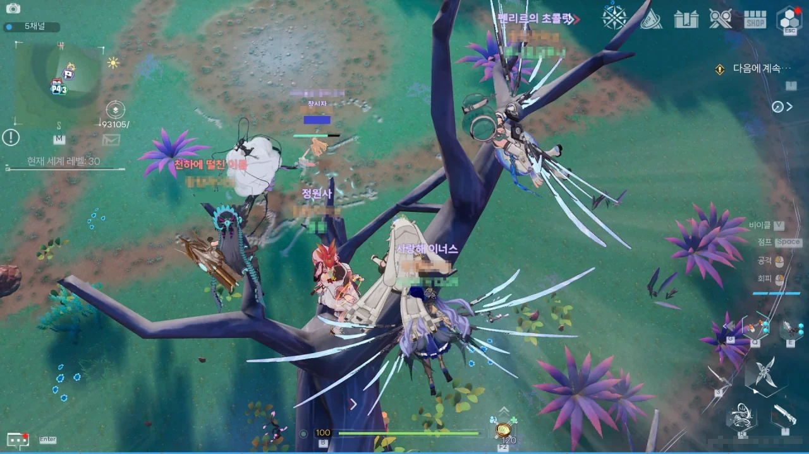
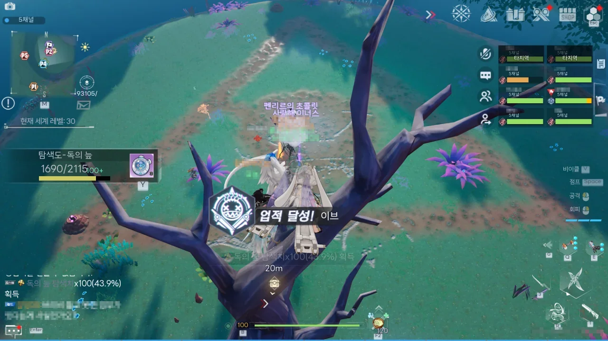
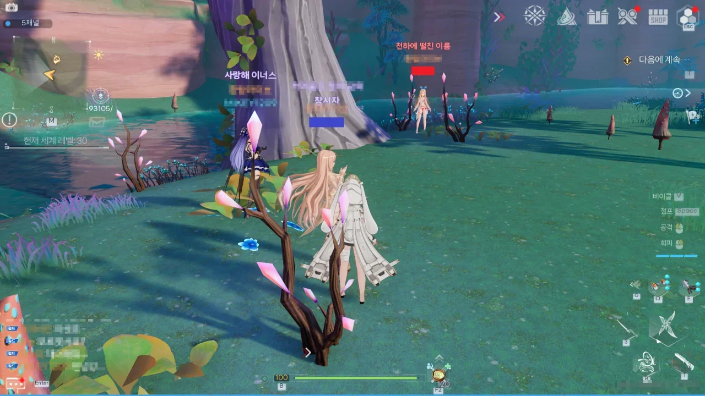

오늘 환탑에서 할 일을 다 하고 게임을 끄려던 찰나, 길드 채팅이 '이브'를 찾느라 소란스러운 것을 발견했다.

스크롤을 올려 대화 내역을 살펴보니, 월드 보스 중 하나인 '어비스: 이브'를 월드 레벨을 100으로 설정한 상태에서 솔로 플레이로 잡을 수 있나 없나로 경쟁 아닌 경쟁이 벌어지고 있었다.

이브를 솔플로 잡을 수 있나 없나를 확인하려면, 일단 이브가 아직 사냥당하지 않고 살아있는 채널을 찾아야 하는데, 그것 때문에 이 채널 저 채널을 들쑤시고 다니느라 길드 채팅이 시끄러운 것이었다.

이대로 게임을 끄기에는 뭔가 재미있는 구경거리를 놓칠 것만 같은 느낌. 그래서 나도 거기에 꼈다.

내가 잔치에 끼었을 때에는 이미 모든 채널에서 이브가 잡힌 후라, 다들 여러 채널에서 이브의 재생성을 기다리고 있었다.

누군가가 미미 레플리카를 끼고 서있길래, 루비 레플리카를 끼고 있던 나도 슬그머니 옆으로 다가가 섰다. 그러자 다른 누군가가 그노노 레플리카를 끼고 둘 사이에 섰다.

환탑 3대 로리 파티가 완성되었다.

드디어 고대하던 이브의 재생성.

첫 번째 주자가 용감하게 이브와 일기토를 펼친다.

다른 사람들은 나무 위라는 특등석에 옹기종기 모여 앉아 일기토를 관람하기 시작한다.

제트팩과 비행을 적극 활용해 이브의 공격을 흘려 넘기는 도전자.

주변에서 들려오는, 비겁하다는 야유에도 아랑곳 않고 이브에게 맹공을 펼친다.

직접 볼 때에는 그냥 날아다닌다고 생각했는데, 지금 보니 파로티의 스킬을 써서 날아다닌 것으로 보인다.

그리고 죽었다.



열심히 움직이다가 갑자기 움직이지 않는 도전자를 자세히 보니, 싸늘한 바닥에 힘없이 몸을 뉘이고 있었다.

그리고 곧바로 채팅창에 올라오는 'ㅋㅋㅋㅋㅋ'

부활한 후, 다시 이브에게 재도전하는 도전자.



또 죽었다.

결국 굴욕적인 패배 선언을 하는 첫 번째 도전자. 이브의 오X홀이 되어버리고 말았다.

다음 타자를 구하는 채팅이 올라오자, 분연히 자리를 떨치고 일어나는 두 번째 주자.

이브의 공격에 단 한 번 스쳤을 뿐인데, 전체 체력의 1/3이 날아갔다. 그야말로 대위기!



하지만 차분하게 브리비의 스킬을 쓴 후, 이브와 거리를 벌린 채로 이브를 공격하고, 그와 동시에 자신의 체력을 회복하는 도전자.

길드 채팅은 도전자의 체력이 다시 차오르는 속도에 경악하는 사람들의 채팅으로 가득했다.

그리고 이브를 솔플로 잡는 데 성공한 두 번째 도전자.

나무 위에서 구경하던 나는 이브 격파 업적을 날름 주워 먹었다.

오늘의 결론:

파로티를 쓰는 화염덱은 약하고, 브리비를 쓰는 번개덱은 강하다.

그러니까 화염덱 상향 좀.
