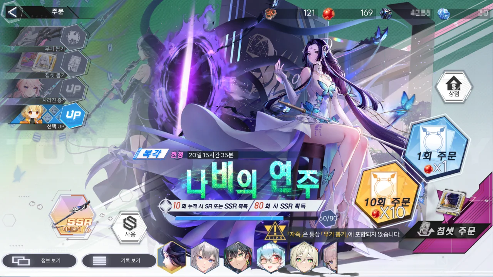

드디어 오늘이다. 그토록 기다려왔던 야누누 픽업날이.

이번 픽업과 복각에서 내가 뽑고자 하는 무기는 다음과 같다.

- 빌런(아르노르)
- 자죽(나인)
- 맹장(미미)

야누누 픽업은 다른 복각 픽업과 스택은 공유하지만 템퍼링 코인은 공유하지 않기 때문에, 79회까지는 나인이나 미미 픽업을 돌리다가, 80회에만 아르노르 픽업을 돌리는 식으로 돌리기로 했다.

현재 보유 중인 레드 코어의 개수는 277개. 사실 이 정도면 못 뽑는 것이 오히려 이상하다.

79회까지 나인 뽑기를 돌린 후, 80회에서 야누누 픽업을 돌린다.

그리고 단 한 번에 나와버린 야누누.

이어서 나인 픽업을 계속 돌렸지만, 템퍼링 코인이 120개가 될 동안 나인은 나오지 않았다.

80뽑 이전에 무기가 나온다는 건 정말 기대하기 힘든 모양이다.

나인은 그냥 템퍼링 코인으로 샀다.

예전에 24시간 체험 무기로 나인을 쓴 적이 있어서 그런가, 무기 및 레플리카 획득 화면은 나오지 않더라고.

이제 마지막 남은 미미 픽업.

80뽑에서 곧바로 나와버린 미미.

현재까지 기록이 패(연묘) - 승(야누누) - 승(미미)이기 때문에, '승승패'의 법칙에 따라 다음 픽업은 무조건 픽뚫이 나게 되었다.

다음 가챠는 가챠 스택 0, 템퍼링 코인 0에서 시작할 테니, 그 어느 때보다 힘든 가챠가 될 예정이다. 보험도 없고 패배 역시 예정되어 있으니 말이다.

&nbsp;

그래도 다들 예쁘더라.

나인은 레플리카가 아닌 무기 성능을 보고 뽑았으니 예외지만, 야누누와 미미는 정말 이쁘고 귀여웠다.

당분간은 미미 레플리카를 끼고 다녀야겠다. 루비 레플리카 대기 음성은 이제 질릴 때가 되었지...
