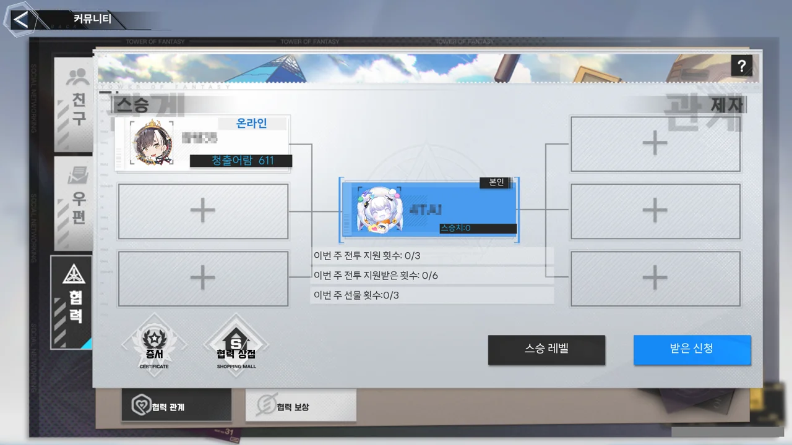
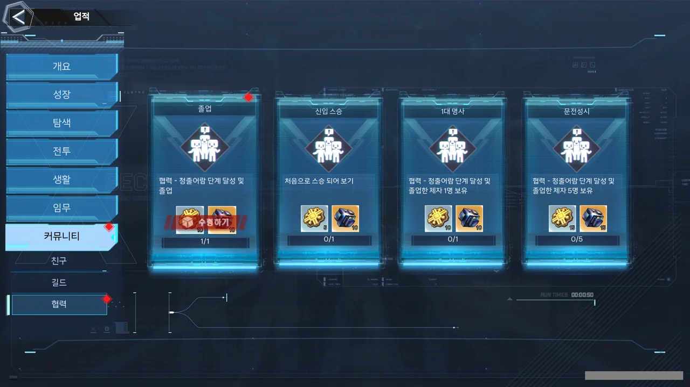
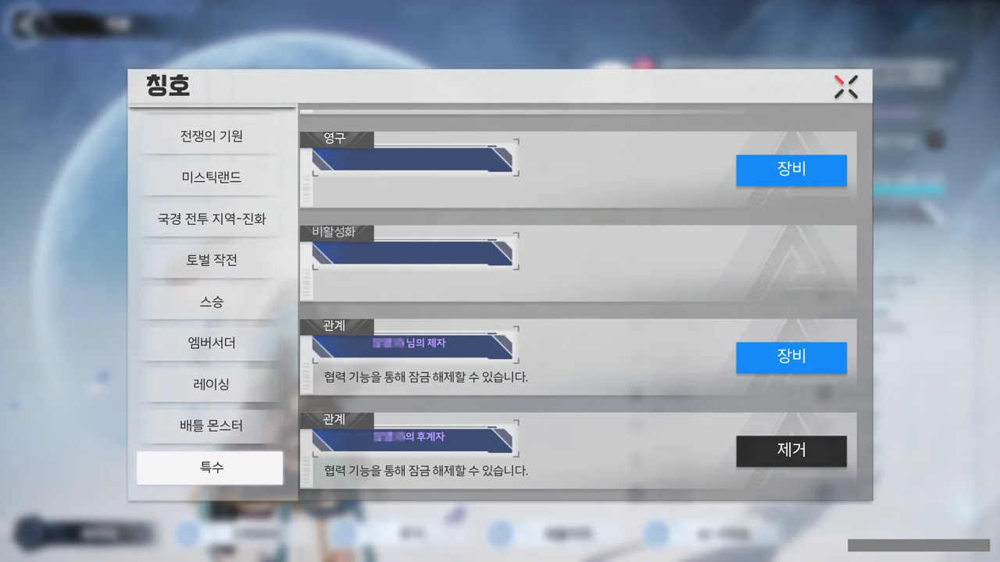

환탑에는 '협력'이라는 시스템이 있다. 자신보다 기어 스코어와 레벨이 낮은 플레이어를 제자로 받은 후, 함께 활동하면 점수가 쌓이는, 그런 시스템이다.



뭐, 대충 이런 식이다.

제자가 받는 보상도 괜찮지만, 이렇게 제자를 '청출어람' 단계로 만들고 졸업시킬 시, 스승이 얻는 보상도 짭짤하다. 무엇보다 협력 상점 재화는 스승일 때만 얻을 수 있기도 하고.

&nbsp;

환탑을 시작하고 처음 맺은 스승이 오늘 '이제 졸업할 때가 다 되었으니, 졸업을 해봅시다'라고 했다.



그래서 졸업했다. 아쉽지만, 스승이 하자고 하니 해야지.

졸업하니 업적도 깨지더라고.

제자가 되었을 때는 '\[스승]의 제자' 칭호를 얻었고, 졸업을 하니 '\[스승]의 후계자' 칭호를 얻었다.

&nbsp;

졸업을 하면 사제관계가 완전히 종료되는 줄 알았는데, 여전히 유지가 되고 있더라.

아까 아쉬워했던 이유가 졸업을 하면 사제관계가 완전히 종료되어 더 이상 스승으로부터 장비를 받을 수 없을 거라 생각해서였는데, 이렇게 관계가 계속 유지된다면 앞으로도 계속 스승으로부터 장비를 받을 수 있을 수 있을 것 같다.

사실, 내가 계속 스승에게서 장비를 받고자 하는 이유도 별 것 없다.

나보다 한참 먼저 시작한 스승을 따라잡는 건 절대 불가능하지만, 그렇다고 언제까지 스승의 버스만 탈 수는 없지 않은가. 최소한 나도 다른 사람들 버스 태울 수 있을 정도는 커야지.

***

갑자기 궁금해진 것.

과연 '스승의 스승', '제자의 제자'는 어떻게 불러야 할까? 무협지에선 '스승의 스승'을 '사조(師祖)' 혹은 '대사부(大師父)'라 부르고 '제자의 제자'는 '사손(師孫)'이라 부른다고 하던데.

ChatGPT에게 물어보니, '스승의 스승'은 '대스승', '제자의 제자'는 '조제자'라고 부른다고 한다. 하지만 ChatGPT를 믿을 수 있어야지.
