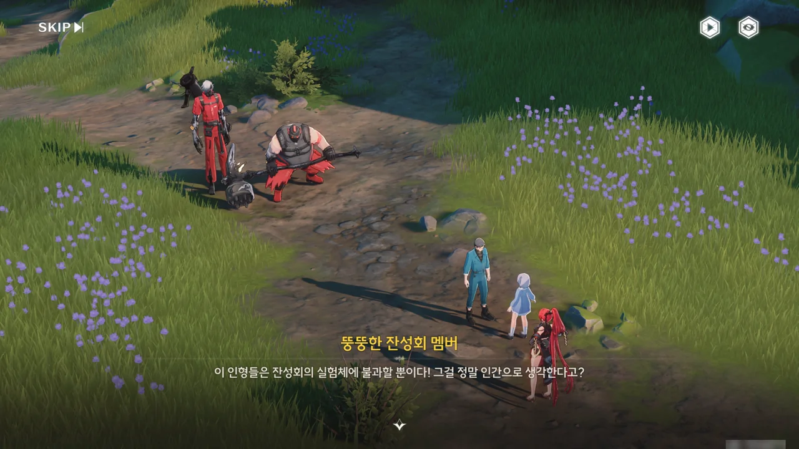
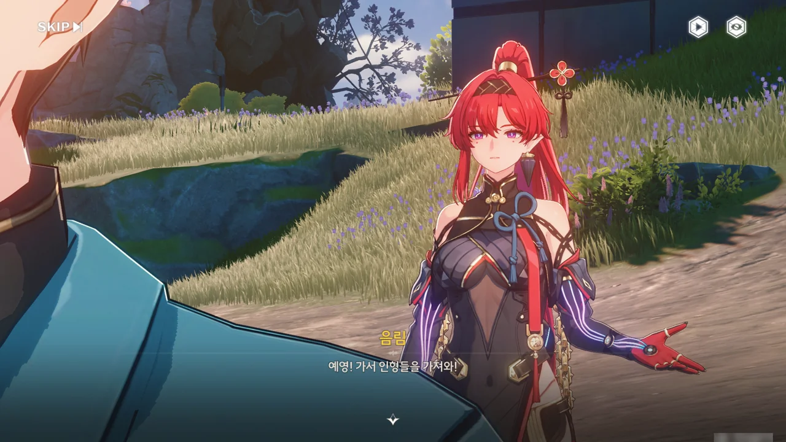
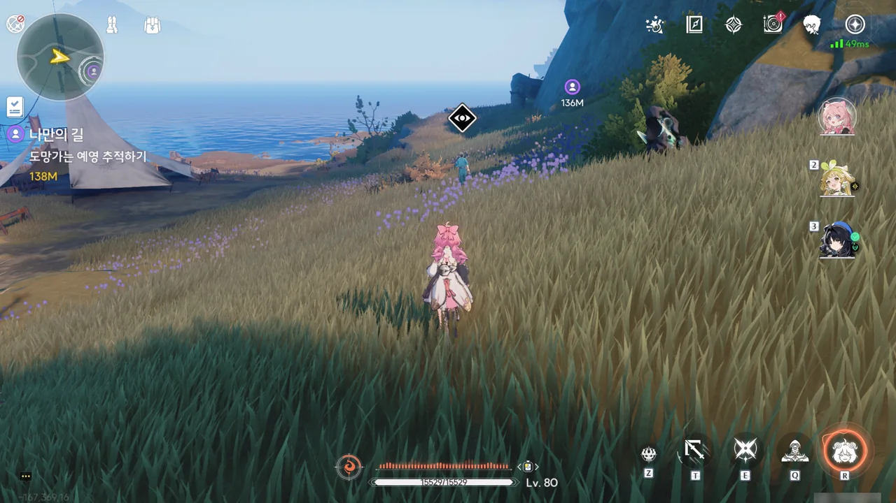
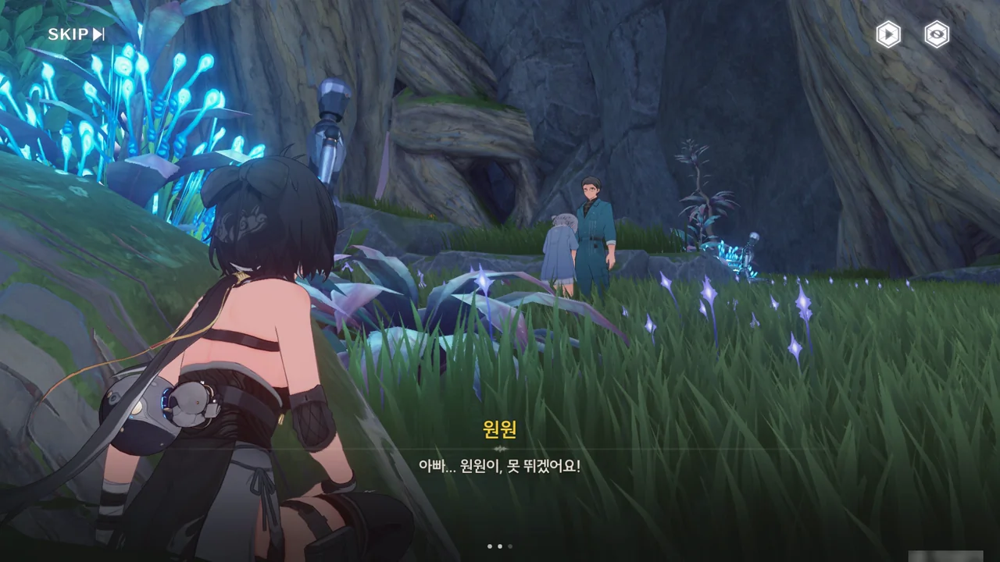
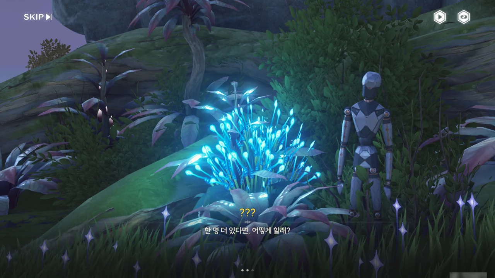
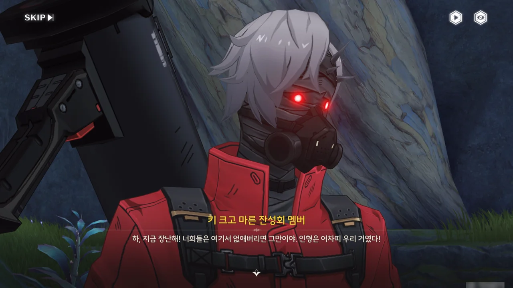
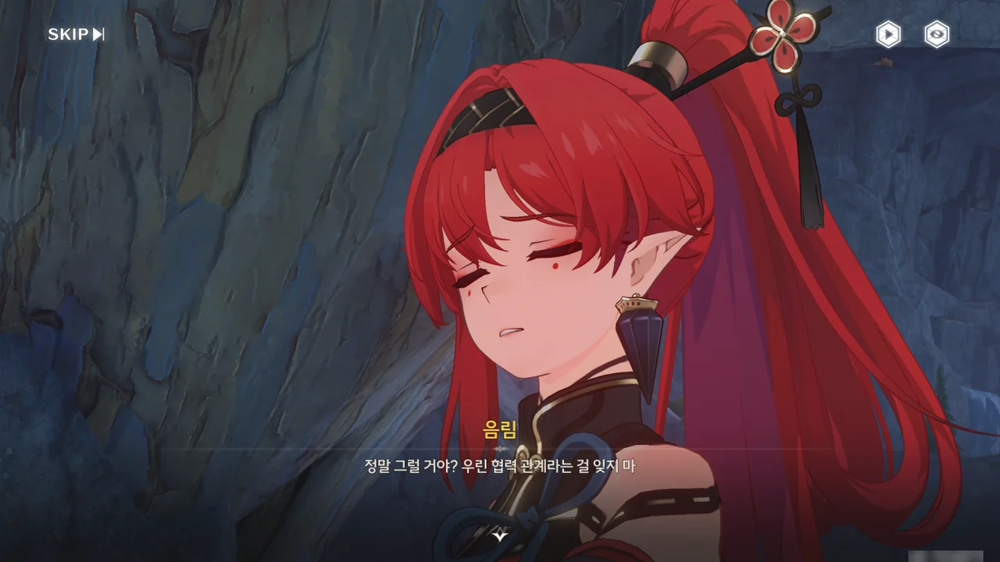
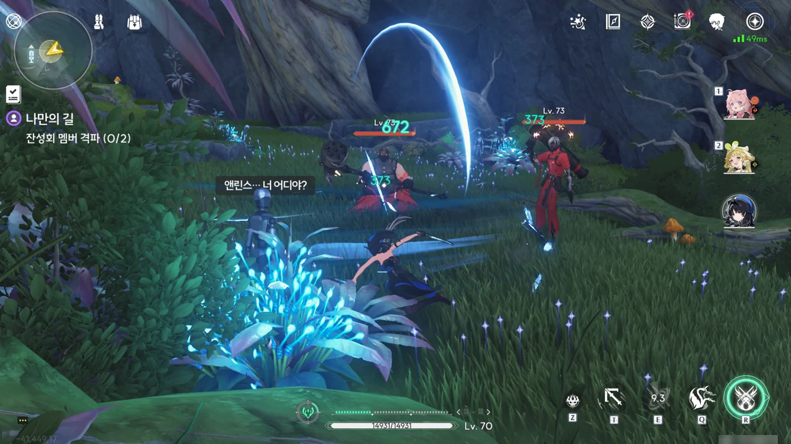
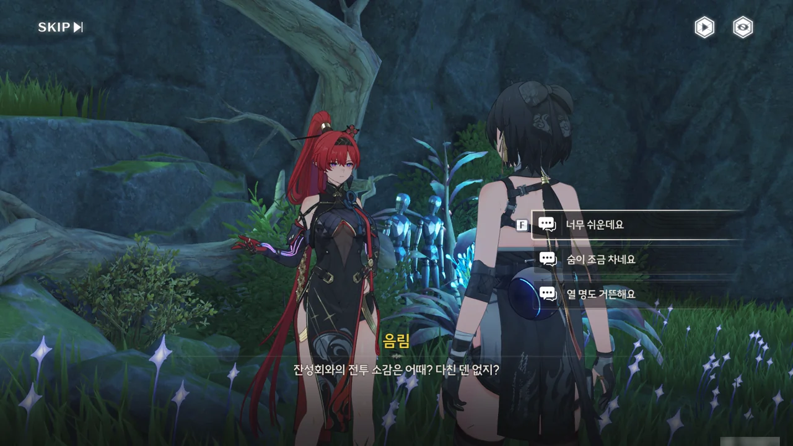
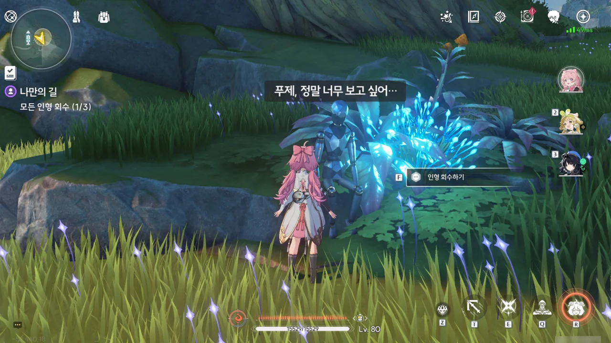







치샤가 최근 금주성 내에 목격자 없는 실종자 신고가 많아졌다며, 이에 대해 조사하는 걸 도와달라고 한다. 일반인뿐만 아니라 실력 있는 공명자, 군 전역자 등이 실종된 것으로 보아, 단순한 사건은 아닌 것 같다.

귀혼상조회? 설마 '귀혼'이 歸魂은 아니겠지...? 치샤가 조사에 참고하라고 보낸 메일은 아닌 것 같은데, 메일이 도착한 시기가 너무 공교롭다.

얽힌 별 임무 · 음림 \[나만의 길\] 오픈!

&nbsp;

음림의 얽힌 별 임무에 관한 이야기가 하나 있다. 바로 명조 1.0 버전 픽업인 기염과 음림의 픽업 순서가 출시 직전 갑작스레 바뀌었다는 추측이다.

기염의 얽힌 별 임무 해금 시점은 '조수 임무 황룡 제1장 제6막 완료'인데 반해, 음림의 얽힌 별 임무 해금 시점은 그보다 한참 이전인 '연각 레벨 11 달성'이다. 나중에 나온 캐릭터의 얽힌 별 임무는 이전에 나온 캐릭터의 얽힌 별 임무보다 나중에 열리는 게 일반적인데 말이다.

이를 이상하게 생각하던 사람들은 한가지 가설을 내놓았다. 원래 쿠로 게임즈의 의도는 황룡 제1장 제3막을 완료한 플레이어가 음림 얽힌 별 임무와 기타 활동을 통해 연각 레벨 경험치를 쌓아, 황룡 제1막 제4장이 요구하는 연각 레벨 14를 자연스럽게 달성하는 것이었지만, 출시 직전 음림과 기염의 픽업 순서가 갑자기 바뀐 탓에 얽힌 별 임무가 해금되는 시점이 꼬였다는 것이다.

그래서 음림 얽힌 별 임무를 할 때에는 방랑자에 대한 주변인물의 평가나 묘사가 조금 어색할 거란 이야기를 들었다.



그래. 의심스러우면 일단 확인해보면 되는 것이다.









방랑자에게 귀혼상조회 메일을 보낸 건 예영이라는 이름의 남자였다.

"상조회에 가입만 하면 소중한 사람을 다시 만날 수 있다"라니, 다단계에서나 들어볼 말을 여기서 듣게 될 줄은 몰랐다. 일단 수상쩍음 1 스택 적립.

예영의 말에서 짐작할 수 있는, 그의 딸 원원이 한 번 죽었다 *다시 되돌아온* 사람이라는 것 역시 귀혼상조회가 수상쩍은 조직임을 알려준다. 죽은 사람이 어떻게 다시 살아 돌아와? 그건 시간이라도 돌리지 않는 이상 불가능한 일이라고.

그걸 지적하니 예영이 불같이 화를 낸다. 저 반응은 마치 머릿속으로는 죽은 사람이 살아 돌아올 리 없다는 걸 알고 있으면서도 눈 앞에 있는 '딸'의 존재를 부정하고 싶지 않아하는 것 같아 보이는데... 대체 뭘까?





아, 이게 오버클럭의 징조인 건가? 공명 어빌리티가 마음의 상태에 영향을 받는다고는 들었지만, 이런 식일 줄은 몰랐는데. 지금 예영의 모습은... 곱게 말해 불안장애나 PTSD의 모습을 보이고 있고, 나쁘게 말하면 그냥 미친 것 같다.



예영을 가만히 뒀다간 아이를 해칠수 있겠다 판단한 방랑자가 원원을 예영에게서 떼어놓자, 예영이 극도의 공격성을 보이고 있다. 애 앞에서 참 잘하는 짓이다, 그렇지?







누군가가 끼어들어, 예영에게 아직 할 일이 남아있으니 원원은 자신에게 맡기고 이만 가보라고 명령한다.

일단 예영을 진정시킨 건 좋지만, "원원이를 다시 볼 수 없기를 바라는 건 아니지?"라고 말하는 걸 보면, 역시 귀혼상조회는 이전에 예영이 메일에서 말한 '소중한 사람을 잃은 사람을 돕는 조직'이기만 한게 아님이 틀림없다. 어떤 수를 쓴 건진 몰라도, 상조회에 찾아온 사람이 '죽은 사람이 살아돌아왔다'라고 믿게 만든 다음, 그걸 빌미로 그 사람을 원하는대로 부리는 범죄조직이 아닐까?





도대체 왜 원원이 저 사람 곁으로 아무런 저항 없이 간 거지? 다시 살아돌아왔다는 원원의 정체를 알 수 없으니, 원원이 왜 저 사람 곁으로 간 건지에 대해 고려해야 할 가짓수가 너무 많다.





상관없는 사람은 빠지라며, 그녀가 쏘아보낸 무언가를 방랑자가 고개를 까딱이는 것만으로 가볍게 피한다. 뭐지? 다짜고짜 사람을 공격하다니, 죽고 싶다는 건가?





이 장소로 오고 있는 순찰관에게 원원에 대해 들켜선 안된다며, 귀혼상조회와 원원에 대해 나중에 설명해줄테니 여기서 싸움이 일어난 흔적을 지우는 걸 도와달라고 한다.

말은 도와달라 해놓고서, 정작 현장을 치우는 건 방랑자 혼자 뿐이다. 정말 보면 볼수록 마음에 안들어...

