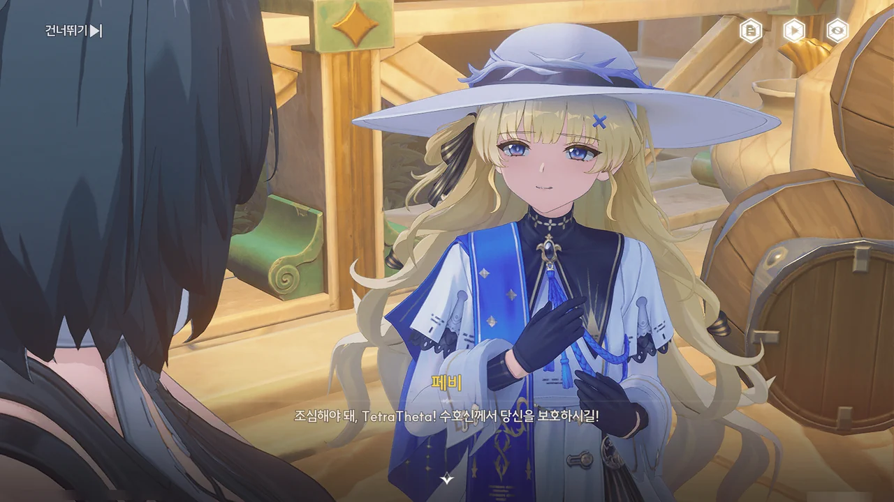









페비가 '리비아', '브레노'에게 '벱페'의 행방을 묻고 있다.
보아하니 '리비아, '브레노', '벱페' 모두 페비가 에코에게 지어준 이름인듯하다.
항구에서 봤던 대로, 정말 에코를 좋아하나 보네.

포포가 페비의 등 뒤에 몰래 다가가 쿡쿡 찌르는, 실없는 장난을 건다.
장난을 걸 정도면 상태가 그럭저럭 괜찮아진 건가?









> 젠니: 젠니라고 합니다, 존경하는 성직자님. 아베라르도 은행에서 일하고 있습니다.
> 페비: ... 처음 보는 얼굴인데.
> 젠니: 아... 그건 제가 성당에 잘 나가지 않아서... 지, 지금은 그보다 상당히 시급한 일이 있습니다.

이 웃긴 대화에서 두 가지 사실을 유추할 수 있다.

1. 젠니는 평소 성당에 잘 나가지 않는다.
2. 페비는 성당에 자주 오는 사람들의 얼굴을 기억하고 있다.

1번은 그렇다 쳐도, 2번은 아주 살짝 소름이 돋는다.
그야, 성당에 자주 오는 사람들의 얼굴을 기억한다는 건 페비가 성당에서 일어나는 모든 행사에 성실하게 참여했으며, 동시에 성당에 방문한 사람들의 얼굴을 하나하나 다 살펴봤다는 말이니까...







페비가 찾고 있는 '벱페'도 다른 에코들처럼 실종된 모양이다.

피살리아 가문의 질베르토가 최근 있었던 에코 실종 및 폭주 사건의 용의자임을 밝히자, 평소 수호신을 아주 경건하게 여기던 피살리아 가문의 사람이 수호신이 하사한 에코를 모욕할 리 없다며 믿기 어려워한다.









페비에게 질베르토가 에코들을 폭주시킬 때 쓴 꽃잎을 보여주자, 알렉시스 사제가 평소 달고 다니던 꽃과 같다며 놀라워한다.

질베르토가 벌인 일은 사람들에게 하늘과 땅, 바다와 식량, 그리고 에코를 하사한 임페라토르를 모욕하는 것이라며, 페비가 자신도 조사에 참여하고 싶다고 밝힌다.

페비가 조사에 참여한다면 피살리아 가문으로선 증거가 조작되었다고 함부로 주장할 수 없게 된다.
아무리 피살리아 가문과 수도회가 뒤에서 커넥션을 갖고 있다고 해도, 표면상 수도회는 중립을 지키고 있는 권위 있는 기관이다.
피살리아 가문이 수도회가 보증한 주장을 정면으로 반박한다는 건 수도회에 반기를 드는 것과 마찬가지이고, 수도회는 입장상 이를 그냥 넘어갈 수 없게 된다.

그나저나 "기도조차 하지 않는 이단자로 취급하면서, 리나시타에서 쫓아내지만 않으면 돼요"라니... 설마 그걸 걱정하고 있었던 거야, 젠니?





황급히 어디론가 도망가는 저 에코의 이름이 바로 '벱페'인가 보다. 대체 저기에 무슨 일이 벌어지고 있는 걸까?











질베르토가 짐더미 앞에서 만반의 준비를 끝냈다며, 누군가에게 기도를 올린다.

임페라토르를 언급하고는 있지만, '심연에 숨은 신', '파도와 비밀의 왕'을 같이 언급하는 걸 보면 질베르토가 말하는 '임페라토르'는 진짜 임페라토르가 아닌 것 같다.

게다가 저 얼굴을 보라. 증오인지 분노인지 모를 것에 가득 차, 라군나 성을 구름 바다로 쓸어버리겠다고 말하는 저 얼굴이 입에 담은 게 임페라토르일리가 없잖아.

뭐... 아무튼, 들켰다.







방랑자가 자신의 뒤를 밟았다는 걸 확인한 질베르토가 방랑자가 지금껏 보아온 것은 '파도 아래 진실'에 비하면 하찮은 것이라며, 자신이 소환한 에코를 잔상을 바꿔버린다.

이야, 참 착한 녀석이네. 교리상 에코를 수호신의 하사품으로 여기며 끔찍하게 여기는 수도회 사람 앞에서 에코를 잔상으로 바꿔버려? 이거 적에게 분노 버프를 주는 꼴 아닌가?

아, 그리고 '피할 수 없는 희생' 운운하는 녀석들 치고 제대로 된 녀석을 내가 지금까지 못 봤다.







"아니, 이럴 수가"라니. 당연한 결과였잖아.

질베르토가 뭔가 더 꿍꿍이를 숨겨놓은 듯하다.









에코들이 무언가에 홀린 듯, 구름 바다 쪽으로 이동하고 있다.
그걸 본 질베르토는 로렐라이가 라군나 성을 구름 바다로 뒤덮을 것이라며 광소한다.

로렐라이는 물의 경지 한가운데에 있는 구름 정원에 살고 있는 강력한 울림 생물로, 과거 베키오 아카데미를 폐허로 만든 구름 바다를 제압했다고 한다.

그러니까 로렐라이가 구름 바다 제어를 확 풀어버리면 억눌려있던 구름 바다가 라군나 성을 뒤덮을 수 있다는 말이다.





젠니는 몬텔리 가문의 사람들이 도착하기 전까지 질베르토를 감시하고 있어야 하고, 페비는 질베르토의 악행에 관해 증언해 피살리아 가문의 반발을 막아야 한다.
결국 로렐라이를 보러 가는 건 방랑자 하나뿐이다.

괜찮아. 원래 이런 건 때리면 고쳐지더라고.
